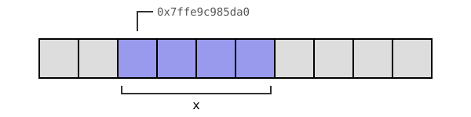
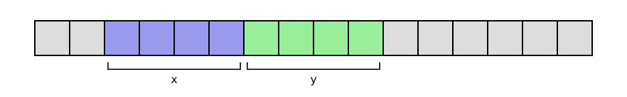
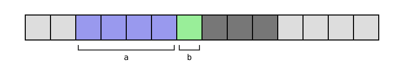
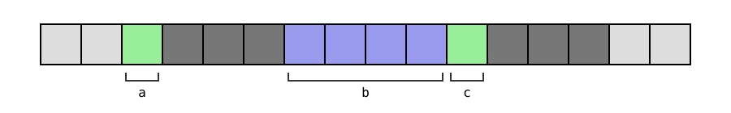
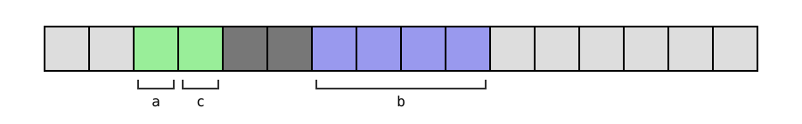
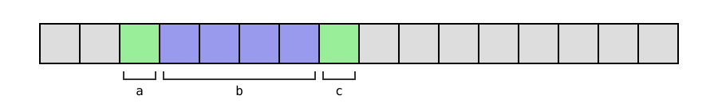

# 2. Tiedon käsittely

Ohjelman käsittelemä tieto esitetään tietokoneen muistissa aina pohjimmiltaan bitteinä ja tavuina. C-kielessä pääsemme suoraan käsiksi tiedon matalan tason esitystapaan: esimerkiksi kun ohjelmassa on muuttuja, pystymme tutkimaan tavu tavulta, miten muuttujan sisältö on tallennettu muistiin.

Tutustumme tässä luvussa erityisesti siihen, miten kokonaisluvut esitetään muistissa. Kokonaisluvun bittien määrä kertoo, miten suuri luku voi olla ja toisaalta paljonko tilaa luku vie muistissa. Esimerkiksi C-kielen `int`-tyyppi on tavallisesti 32-bittinen, jolloin sillä voidaan esittää kokonaisluku väliltä –2<sup>31</sup>...2<sup>31</sup>–1.

## Tietotyypit

Tiedon käsittelyn perusyksiköt ovat _bitti_ (_bit_) ja _tavu_ (_byte_).

- Bitti on 0 tai 1, ja sen avulla voidaan esittää kaksi eri vaihtoehtoa.

- Tavu on 8 bitin yhdistelmä. Esimerkiksi 00100101 ja 11101101 ovat tavuja. Tavun avulla voidaan esittää 256 (2<sup>8</sup>) eri vaihtoehtoa.

C-kielen tavallisia tietotyyppejä ovat kokonaisluvut `char`, `short`, `int` ja `long` sekä liukuluvut `float` ja `double`. Jokaisella tietotyypillä on kiinteä koko, joka vaikuttaa siihen, miten suuren tai tarkan luvun sillä pystyy esittämään.

Pienin tietotyyppi on `char`, jonka kokona on 1 tavu (8 bittiä). Jokaisen muun tietotyypin koko on jokin moninkerta tavuja riippuen käytetystä ympäristöstä. Esimerkiksi 64-bittisessä Linux-ympäristössä `int`-tyypin koko on 4 tavua (32 bittiä) ja `long`-tyypin koko on 8 tavua (64 bittiä).

C-kielen standardi ei määrittele tarkasti tietotyyppien kokoja. Itse asiassa standardi ei tarkasti ottaen edes lupaa tavun olevan 8 bittiä, vaikka näin onkin yleensä aina. Tietotyypeistä `int` ja `long` standardi lupaa, että `int` on ainakin 16 bittiä, `long` on ainakin 32 bittiä ja lisäksi `int` ei saa olla suurempi kuin `long`.

<div class="note" markdown="1">
C-kielen ratkaisu jättää tietotyypin koko osittain avoimeksi eroaa monista muista kielistä. Esimerkiksi Javassa `int`-tyyppi on aina 32-bittinen ja Rustissa tietotyypin nimi (esimerkiksi `i32`) kertoo suoraan sen bittien määrän. C:ssä ajatuksena on, että tietotyyppien koot voidaan valita sopivasti eri ympäristöissä.

C:n standardikirjastoon kuuluu tiedosto `stdint.h`, jossa käytetyn C-kielen toteutuksen on mahdollista määritellä tyypit `int8_t`, `int16_t`, `int32_t` ja `int64_t`. Näissä tyypeissä ohjelmoija voi olla varma tyypin koosta, mutta toisaalta C-kielen toteutuksen ei ole pakko määritellä näitä tyyppejä.
</div>

### Tietotyypin koko

Operaattorin `sizeof` avulla voidaan selvittää tietyn tietotyypin koko käytetyssä ympäristössä. Operaattori antaa tietotyypin koon tavuina. Esimerkiksi seuraava koodi näyttää tietotyyppien `char` ja `int` koot:

```c
printf("%zu\n", sizeof(char));
printf("%zu\n", sizeof(int));
```

Koodin tyypillinen tulostus on:

```
1
4
```

Operaattori `sizeof` palauttaa koon `size_t`-tyyppisenä kokonaislukuna, jota vastaa `printf`-funktiossa käytetty muotoilu `%zu`.

Tietotyypin koko vaikuttaa käytännössä siihen, miten suuria lukuja tietotyypin avulla voidaan käsitellä. Esimerkiksi kun `int`-muuttujan kokona on 4 tavua eli 32 bittiä, siihen voidaan tallentaa 2<sup>32</sup> erilaista kokonaislukua. Tämä tarkoittaa yleensä, että pienin ja suurin sallittu arvo ovat –2<sup>31</sup> ja 2<sup>31</sup>–1.

<div class="note" markdown="1">
Operaattorin `sizeof` lisäksi C:ssä voi selvittää tyyppien kokoa standardikirjaston tiedoston `limits.h` avulla. Tiedostossa määritellään esimerkiksi vakiot `INT_MIN` ja `INT_MAX`, jotka antavat `int`-muuttujan ala- ja ylärajan.

Esimerkiksi koodin

```c
printf("%d %d\n", INT_MIN, INT_MAX);
```

tyypillinen tulostus on seuraava:

```c
-2147483648 2147483647
```
</div>

## Luvut bitteinä

Kaikki ohjelman käsittelemät tiedot tulee esittää tavalla tai toisella bitteinä tietokoneen muistissa. Katsotaan seuraavaksi tarkemmin, miten kokonaisluvut esitetään yleensä bittimuodossa.

### Kokonaisluvun esitystapa

Tavallinen tapa esittää kokonaisluku bittimuodossa on esittää se binäärilukuna eli lukujärjestelmässä, jonka kantaluku on 2.

Esimerkiksi luku 123 on binäärilukuna 1111011, koska luku voidaan esittää seuraavasti 2:n potenssien summana:

<center>
123 = 2<sup>6</sup> + 2<sup>5</sup> + 2<sup>4</sup> + 2<sup>3</sup> + 2<sup>1</sup> + 2<sup>0</sup>
</center>

Kun luku 123 tallennetaan `int`-muuttujaan koodilla

```c
int x = 123;
```

niin se tallennetaan tyypillisesti muistiin 4-tavuisena binäärilukuna seuraavasti:

<center>
00000000 00000000 00000000 01111011
</center>

Tässä tapauksessa luku on sen verran pieni, että se mahtuu yhteen tavuun, jolloin kolme muuta tavua ovat pelkkää nollaa.

### Kahden komplementti

Äsken kuvatulla tavalla pystyy esittämään hyvin nollan ja positiiviset kokonaisluvut, mutta kokonaisluku voi olla myös negatiivinen.

Tavallinen tapa käsitellä negatiivisia kokonaislukuja on sopia, että luvun bittiesityksen ensimmäinen bitti ilmaisee, onko luku positiivinen (0) vai negatiivinen (1). Yleensä käytetään _kahden komplementtia_, jossa luvun etumerkkiä voidaan vaihtaa kääntämällä kaikki bitit ja lisäämällä tulokseen yksi.

Esimerkiksi luku –123 esitetään 4-tavuisena binäärilukuna seuraavasti:

<center>
11111111 11111111 11111111 10000101
</center>

### Lukualueet

C-kielessä on käytettävissä kahdenlaisia kokonaislukuja: _etumerkilliset_ (_signed_) ja _etumerkittömät_ (_unsigned_) kokonaisluvut.

Etumerkillinen luku voi olla positiivinen, negatiivinen tai nolla. Etumerkitön luku voi puolestaan olla vain positiivinen tai nolla. Etumerkki vaikuttaa siihen, miten suuria lukuja voidaan esittää, koska etumerkki vie luvussa yhden bitin tilaa.

Esimerkiksi tyyppi `int` on etumerkillinen, eli siihen voidaan tallentaa sekä positiivisia että negatiivisia lukuja. Tyyppi `unsigned int` sen sijaan on etumerkitön, eli sen kuvaama luku on aina vähintään nolla.

<div class="note" markdown="1">
C-kielessä on vaihtoehtoisia nimiä samalle tietotyypille. Esimerkiksi `int` tarkoittaa samaa kuin `signed int` tai pelkkä `signed`. Vastaavasti `unsigned int` tarkoittaa samaa kuin `unsigned`.
</div>

Tavallinen tyypin `int` lukualue on –2<sup>31</sup>...2<sup>31</sup>–1. Tässä positiivisen luvun suuruuden yläraja on yksi pienempi kuin negatiivisella luvulla, koska etumerkkiä 0 käytetään sekä positiivisen luvun että nollan esittämiseen.

Tavallinen tyypin `unsigned int` lukualue on 0...2<sup>32</sup>–1. Tässä positiivisen luvun suuruuden yläraja on noin kaksinkertainen verrattuna tyyppiin `int`, mutta ei ole mahdollista esittää negatiivista lukua.

### Ylivuoto

Mitä tapahtuu, jos käytetty tietotyyppi on liian pieni lukua varten? Seuraava koodi sijoittaa muuttujaan `x` luvun 2<sup>31</sup>–1, joka on käytetyssä ympäristössä `int`-tyypin lukualueen suurin luku. Tämän jälkeen koodi kasvattaa muuttujan arvoa yhdellä ja tulostaa muuttujan uuden arvon.

```c
int x = 2147483647;
printf("%d\n", x); // 2147483647

x++;
printf("%d\n", x); // -2147483648
```

Tässä tapahtuu _ylivuoto_ (_overflow_), eli luku pyörähtää ympäri ja siitä tulee lukualueen pienin luku. Huomaa, että ylivuoto ei aiheuta virhettä eikä siitä tule ilmoitusta ohjelman suorituksen aikana. Ohjelma toimii sinänsä, mutta ylivuodon takia tulos voi erota halutusta tuloksesta.

Vastaavasti ylivuoto tapahtuu toiseen suuntaan, jos muuttujassa on lukualueen pienin luku ja muuttujan arvoa vähennetään:

```c
int x = -2147483648;
printf("%d\n", x); // -2147483648

x--;
printf("%d\n", x); // 2147483647
```

<div class="note" markdown="1">
C-kielen tyyppi `int` ja Pythonin tyyppi `int` ovat siis hyvin erilaisia. C-kielessä tyypin `int` koko on rajoitettu (usein 4 tavua), minkä takia se kattaa vain tietyn lukualueen. Pythonissa tyypin `int` avulla voi esittää periaatteessa miten tahansa suuren kokonaisluvun, kuten luvun 123<sup>123</sup>, jossa on 258 numeroa:

```python
x = 123**123
```

C-kielessä tyypin `int` käyttäminen on hyvin tehokasta, koska lukujen koko on rajattu ja niitä voi käsitellä suoraan tietokoneen prosessorin komennoilla. Toisaalta koodi voi antaa ylivuodon seurauksena väärän tuloksen, jos käsiteltävä luku menee lukualueen ulkopuolelle.

Pythonin tyypin `int` sisäinen toteutus on monimutkainen, koska suuria lukuja ei voi käsitellä suoraan tietokoneen laitteiston tasolla vaan niiden käsittely on toteutettu erikseen Pythonin suoritusympäristöön. Tämän takia lukujen käsittely Pythonissa on paljon hitaampaa kuin C-kielessä.
</div>

## Bittioperaatiot

Luvun bittejä voidaan käsitellä tehokkaasti bittioperaatioiden avulla.

- Operaatio `a & b` (and) tuottaa luvun, jossa on ykkösbitti niissä kohdissa, joissa on ykkösbitti sekä luvussa `a` että `b`.

- Operaatio `a | b` (or) tuottaa luvun, jossa on ykkösbitti niissä kohdissa, joissa on ykkösbitti ainakin toisessa luvuista `a` ja `b`.

- Operaatio `a ^ b` (xor) tuottaa luvun, jossa on ykkösbitti niissä kohdissa, joissa on ykkösbitti tarkalleen yhdessä luvuista `a` ja `b`.

- Operaatio `~x` (not) tuottaa luvun, jossa jokainen bitti on käänteinen lukuun `x` verrattuna.

- Vasen bittisiirto `x << k` siirtää luvun bittejä `k` askelta vasemmalle.

- Oikea bittisiirto `x >> k` siirtää luvun bittejä `k` askelta oikealle.

### Esimerkkejä

Seuraava koodi esittelee and-, or- ja xor-operaatioita:

```c
int a = 25;
int b = 42;

printf("%d\n", a & b); // 8
printf("%d\n", a | b); // 59
printf("%d\n", a ^ b); // 51
```

Bittimuodossa operaatiot näyttävät seuraavilta:

```
    25 = 00011001        25 = 00011001        25 = 00011001
    42 = 00101010        42 = 00101010        42 = 00101010
and -------------     or -------------    xor -------------
     8 = 00001000        59 = 00111011        51 = 00110011
```

Yllä on esitetty vain luvun viimeisen tavun sisältö bittimuodossa, koska kaikissa muissa tavuissa kaikki bitit ovat nollia.

<div class="note" markdown="1">
Huomaa, että C-kielessä bittioperaattorit (`&` ja `|`) ja loogiset operaattorit (`&&` ja `||`) toimivat eri tavalla. Esimerkiksi `2 & 4` tuottaa tuloksen `0`, koska luvuissa ei ole ykkösbittiä samassa kohdassa, mutta `2 && 4` tuottaa tuloksen `1`, koska molemmat luvut eroavat nollasta eli ne ovat tosia.
</div>

Operaatio not vaikuttaa lukuun näin:

```c
int x = 123;

printf("%d\n", ~x); // -124
```

Tulos on odotusten mukainen, koska kahden komplementissa luvun vastaluku saadaan kääntämällä kaikki bitit ja lisäämällä tulokseen yksi. Tässä vain bitit käännetään, joten tulos on yhden pienempi kuin vastaluku.

Bittimuodossa operaatio näyttää seuraavalta:

```
     123 = 00000000 00000000 00000000 01111011
not ------------------------------------------
    -124 = 11111111 11111111 11111111 10000100
```

Seuraava koodi esittelee bittisiirtoja:

```c
int x = 6;

printf("%d\n", x << 1); // 12
printf("%d\n", x << 2); // 24

printf("%d\n", x >> 1); // 3
printf("%d\n", x >> 2); // 1
```

Vasen bittisiirto `k` askelta vastaa luvun kertomista 2<sup>`k`</sup>:lla ja oikea bittisiirto `k` askelta vastaa luvun jakamista 2<sup>`k`</sup>:lla (pyöristys alaspäin kokonaisluvuksi).

Bittimuodossa operaatiot näyttävät tältä:


```
      6 = 00000110          6 = 00000110
<< 1 -------------    << 2 -------------
     12 = 00001100         24 = 00011000


      6 = 00000110          6 = 00000110
>> 1 -------------    >> 2 -------------
      3 = 00000011          1 = 00000001
```

### Bittiesitys koodilla

Seuraava koodi tulostaa muuttujassa `x` olevan luvun bittiesityksen:

```c
int x = 123;

for (int k = 31; k >= 0; k--) {
    if (x & (1 << k)) {
        printf("1");
    } else {
        printf("0");
    }
}
printf("\n");
```

Koodin tulostus on seuraava:

```
00000000000000000000000001111011
```

Koodi käy läpi luvun bitit vasemmalta oikealle ja tarkastaa jokaisen bitin kohdalla, onko bitti 1 vai 0. Koodi olettaa, että `int`-luku muodostuu 32 bitistä.

Koodissa on käytössä _bittimaski_, joka muodostetaan bittisiirrolla `1 << k`. Tässä bittimaskissa on tasan yksi ykkösbitti ja kaikki muut bitit ovat nollia. Jos operaatio `x & (1 << k)` tuottaa nollasta eroavan tuloksen, tiedetään, että luvussa `x` on ykkösbitti samassa kohdassa kuin luvussa `1 << k`. Muussa tapauksessa luvussa `x` on nollabitti kyseisessä kohdassa.

Esimerkiksi kun `k = 3`, luvun `x` ja bittimaskin `1 << k` and-operaatio näyttää tältä:

```
         x = 00000000000000000000000001111011
    1 << k = 00000000000000000000000000001000
and -----------------------------------------
             00000000000000000000000000001000
```

Tulos on positiivinen, joten luvussa `x` on ykkösbitti kyseisessä kohdassa.

## Tieto muistissa

Hyvä mielikuva tietokoneen muistista on, että siinä on rivi muistipaikkoja, joihin jokaiseen voidaan tallentaa yksi tavu tietoa. Jokaisella muistipaikalla on muistiosoite, jonka kautta siihen voidaan viitata.

```
osoite   | 0        | 1        | 2        | 3        | ...
sisältö  | 01100100 | 00111011 | 11110110 | 00010000 | ...
```

<div class="note" markdown="1">
Todellisuudessa tilanne on monimutkaisempi, koska käyttöjärjestelmä antaa ohjelman käyttöön _virtuaalisia_ muistialueita, joiden muistiosoitteet eroavat tietokoneen laitteiston _fyysisistä_ muistialueista. Tästä huolimatta yllä oleva malli on hyvä lähtökohta muistin käsittelyn ymmärtämiselle.
</div>

### Muuttujan muistiosoite

Tarkastellaan seuraavaa koodia, joka määrittelee muuttujan:

```c
int x = 123;
```

Koodin suorituksen aikana muuttujan arvo on jollakin tavalla tietokoneen muistissa, jotta muuttujaa pystyy käyttämään. C-kielessä muuttujan muistiosoite voidaan selvittää `&`-operaattorilla seuraavaan tapaan:

```c
printf("%p\n", &x);
```

Tässä muotoilu `%p` tarkoittaa, että muistiosoite ilmoitetaan heksalukuna. Koodi voisi tulostaa muuttujan muistiosoitteen esimerkiksi näin:

```
0x7ffe9c985da0
```

<div class="note" markdown="1">
Heksaluku on 16-järjestelmän luku, jossa numeromerkit ovat `0`–`9` ja `a`–`f`. Luvun alkuliite `0x` ilmaisee, että kyseessä on heksaluku.

Esimerkiksi heksaluvun `0x5da0` esitys 10-järjestelmässä on

<p><center>5 &middot; 16<sup>3</sup> + 13 &middot; 16<sup>2</sup> + 10 &middot; 16<sup>1</sup> + 0 &middot; 16<sup>0</sup> = 23968.</center></p>

</div>

Huomaa, että muuttujan muistiosoite riippuu siitä, miten käyttöjärjestelmä antaa ohjelman käyttöön muistia ohjelman suoritushetkellä. Jos kokeilet suorittaa yllä olevan koodin itse, saat lähes varmasti eri tuloksen kuin esimerkissä.

Tarkemmin ottaen muuttujan muistiosoite tarkoittaa, missä muistipaikassa on muuttujan sisällön _ensimmäinen_ tavu. Kaikki muuttujan sisällölle varatut tavut ovat peräkkäin muistissa tästä osoitteesta alkaen.

Tässä tapauksessa muuttuja `x` on `int`-tyyppinen ja vie tilaa 4 tavua, joten tilanne muistissa näyttää seuraavalta:



### Osoittimet

Keskeinen käsite C-ohjelmoinnissa on _osoitin_ (_pointer_), jonka kautta voidaan käsitellä muistin sisältöä muistiosoitteen perusteella.

Esimerkiksi seuraava koodi määrittelee osoittimen `p`, joka osoittaa `int`-tyyppiseen arvoon muistissa:

```c
int *p;
```

Osoitin määritellään siis muuten samalla tavalla kuin tavallinen muuttuja, mutta ennen muuttujan nimeä tulee merkki `*`.

<div class="note" markdown="1">
Osoittimen määrittelyn voi kirjoittaa myös muodossa

```c
int* p;
```

joka korostaa sitä, että muuttujan tyyppi on `int*` eli `int`-osoitin.

Kuitenkin voi pitää parempana tyylinä kirjoittaa `*p`, koska useamman osoittimen määrittelyssä merkki `*` tulee laittaa ennen kunkin muuttujan nimeä.

Esimerkiksi määrittely

```c
int* a, b;
```

tarkoittaa, että `a` on `int`-osoitin kun taas `b` on tavallinen `int`-muuttuja. Tässä siis `int*` ei tarkoita, että kaikki seuraavat muuttujat ovat osoittimia.

Selkeä tapa määritellä `int`-osoittimet `a` ja `b` on seuraava:

```c
int *a, *b;
```
</div>

Osoittimen määrittelyn jälkeen osoittimen arvoksi voidaan asettaa jokin muistiosoite, kuten jonkin muuttujan osoite muistissa. Esimerkiksi seuraava koodi asettaa osoittimen `p` arvoksi muuttujan `x` muistiosoitteen:

```c
p = &x;
```

On myös mahdollista määritellä osoitin ja asettaa muistiosoite samalla kertaa:

```c
int *p = &x;
```

Kun osoitin `p` viittaa johonkin kohtaan muistissa, syntaksilla `*p` voidaan käsitellä kyseisessä kohdassa olevaa tietoa. Esimerkiksi kun osoitin `p` sisältää muuttujan `x` muistiosoitteen, `*p` viittaa muuttujan `x` sisältöön.

Seuraava koodi näyttää tarkemmin, miten osoitinta voidaan käyttää. Koodi määrittelee muuttujan `x` ja osoittimen `p`, joka osoittaa muuttujaan `x`. Tämän jälkeen koodi muuttaa muuttujan `x` arvoa osoittimen `p` kautta.

```c
int x = 123;
int *p = &x;

printf("%d\n", *p); // 123

*p = 42;
printf("%d\n", *p); // 42
printf("%d\n", x); // 42
```

### Muistin käsittely

Katsotaan seuraavaksi, miten voimme käsitellä muistin sisältöä tavu kerrallaan osoittimen avulla.

Seuraava koodi määrittelee osoittimen `p`, joka osoittaa muuttujan `x` muistiosoitteeseen. Osoittimen tyyppinä on `unsigned char`, eli osoitin osoittaa yksittäiseen tavuun muistissa ja tavun sisältö tulkitaan etumerkittömänä kokonaislukuna (kokonaisluku väliltä 0–255).

```c
int x = 123456;
unsigned char *p;
p = (unsigned char*)&x;
```

Koska `&x` antaa `int`-osoittimen, koodissa on tyyppimuunnos `(unsigned char*)`, joka muuttaa osoittimen `unsigned char` -tyyppiseksi.

Tämän jälkeen voimme lukea muistista muuttujan `x` sisällön tavu kerrallaan. Koska kyseessä on `int`-muuttuja, siinä on yhteensä 4 tavua. Ensimmäinen tavu on muistissa kohdassa `p`, toinen tavu on kohdassa `p + 1` jne.

```c
printf("%d\n", *p);
printf("%d\n", *(p + 1));
printf("%d\n", *(p + 2));
printf("%d\n", *(p + 3));
```

Kun suoritamme koodin, saamme seuraavan tuloksen:

```
64
226
1
0
```

Tästä näkee, että luku 123456 on tallennettu muistiin neljänä tavuna 64, 226, 1 ja 0. Tämä vastaa luvun esittämistä seuraavasti:

<center>
2<sup>24</sup> &middot; 0 + 2<sup>16</sup> &middot; 1 + 2<sup>8</sup> &middot; 226 + 2<sup>0</sup> &middot; 64 = 123456
</center>

<div class="note" markdown="1">
Tässä käytössä on _little endian_ -tavujärjestys, jossa tavut ovat muistissa "käänteisessä" järjestyksessä: ensimmäisenä vähiten merkitsevä tavu ja viimeisenä eniten merkitsevä tavu. Tätä tavujärjestystä käytetään yleisesti esimerkiksi tietokoneiden prosessoreissa.
</div>

Seuraava koodi näyttää luvun kunkin tavun sisällön bittimuodossa. Koodi hakee kunkin tavun sisällön muuttujaan `byte` ja tulostaa sen bitit.

```c
for (int i = 0; i < 4; i++) {
    char byte = *(p + i);
    printf("byte %d: ", i);
    for (int k = 7; k >= 0; k--) {
        if (byte & (1 << k)) {
            printf("1");
        } else {
            printf("0");
        }
    }
    printf("\n");
}
```

Koodin tulostus on seuraava:

```
byte 0: 01000000
byte 1: 11100010
byte 2: 00000001
byte 3: 00000000
```

Luvun 123456 bittiesitys on siis:

<center>
00000000 00000001 11100010 01000000
</center>

## Rakenteinen tieto

Avainsana `struct` määrittelee rakenteisen tietotyypin, joka muodostuu nimetyistä kentistä. Struct-tyyppiä voi käyttää koodissa varsin samalla tavalla kuin yksittäisen lukuarvon sisältävää perustietotyyppiä.

Esimerkiksi seuraava koodi määrittelee tietotyypin `struct Position`, jonka kentät ovat `int`-tyyppiset koordinaatit `x` ja `y`:

```c
struct Position {
    int x, y;
};
```

Voimme käyttää tietotyyppiä koodissa seuraavasti:

```c
struct Position pos = {2, 3};
printf("%d %d\n", pos.x, pos.y); // 2 3
pos.x = 4;
printf("%d %d\n", pos.x, pos.y); // 4 3
```

### Esimerkki

Seuraava koodi esittelee struct-tyypin käyttämistä hieman laajemmassa ohjelmassa. Koodi määrittelee muuttujat `p1` ja `p2` ja laskee sitten niiden etäisyyden Pythagoraan lauseella funktiolla `distance`.

```c
#include <stdio.h>
#include <math.h>

struct Position {
    int x, y;
};

double distance(struct Position a, struct Position b) {
    double dx = a.x - b.x;
    double dy = a.y - b.y;
    return sqrt(dx * dx + dy * dy);
}

int main(void) {
    struct Position p1 = {2, 3};
    struct Position p2 = {5, 4};

    printf("%d %d\n", p1.x, p1.y); // 2 3
    printf("%d %d\n", p2.x, p2.y); // 5 4

    printf("%lf\n", distance(p1, p2)); // 3.162278
}
```

Koodi käyttää neliöjuuren laskemiseen funktiota `sqrt`, joka on esitelty standardikirjaston otsikkotiedostossa `math.h`. Linuxissa tämän otsikkotiedoston kanssa käännöskomennossa tulee olla mukana lippu `-lm`:

```console
$ gcc points.c -o points -lm
```

<div class="note" markdown="1">
Otsikkotiedosto `math.h` on poikkeuksellinen, koska koodia kääntäessä tulee käyttää lippua `-lm`. Muissa standardikirjaston otsikkotiedostoissa ei tarvitse käyttää erillistä lippua käännöskomennossa.

Lippu `-lm` tarkoittaa, että ohjelman käännöksessä linkitetään mukaan matematiikkakirjasto. Vaikka matematiikkakirjasto kuuluu standardikirjastoon, se on haluttu historiallisista syistä pitää erillisenä kirjastona käännösvaiheessa.
</div>

### Kopiointi ja osoittimet

Struct-tyypin sisältö kopioidaan muuttujan sijoituksessa ja funktion parametrina. Esimerkiksi seuraava koodi kopioi muuttujan `a` sisällön muuttujaan `b` ja muuttaa sen jälkeen muuttujan `b` kenttää.

```c
struct Position a = {1, 2};
struct Position b;

b = a;
b.x = 5;

printf("%d %d\n", a.x, a.y); // 1 2
printf("%d %d\n", b.x, b.y); // 5 2
```

Usein kuitenkin struct-muuttujaa käsitellään osoittimen kautta, jos ei ole erityisesti tarvetta tehdä kopiota sen sisällöstä. Tämä tehostaa muuttujan käsittelyä, koska muuttujan kenttiä ei tarvitse kopioida vaan riittää välittää osoitin muuttujaan.

Seuraavassa koodissa `p` on osoitin, joka osoittaa muuttujaan `a`. Koodi muuttaa muuttujan `a` kentän `x` sisältöä osoittimen `p` kautta. Merkintä `->` on lyhyt tapa viitata tietotyypin kenttään osoittimen kautta. Tässä merkinnät `p->x` ja `p->y` tarkoittavat samaa kuin `(*p).x` ja `(*p).y`.

```c
struct Position a = {1, 2};
struct Position *p;

p = &a;
p->x = 5;

printf("%d %d\n", a.x, a.y); // 5 2
printf("%d %d\n", p->x, p->y); // 5 2
```

Seuraavassa on aiemman funktion `distance` uusi toteutus, jossa parametreja ei kopioida vaan ne välitetään osoittimina. Tämä muutos tehostaa funktion toimintaa, koska tietoa ei tarvitse kopioida.

```c
double distance(struct Position *a, struct Position *b) {
    double dx = a->x - b->x;
    double dy = a->y - b->y;
    return sqrt(dx * dx + dy * dy);
}
```

Nyt funktiolle tulee antaa parametrina muuttujien osoitteet:

```c
printf("%lf\n", distance(&p1, &p2));
```

### Kentät muistissa

Struct-tyypin kenttien sisällöt tallennetaan muistiin samassa järjestyksessä kuin kentät esiintyvät tietotyypin määrittelyssä. Kunkin kentän sisältö tallennetaan muistiin samalla tavalla kuin yksittäisen muuttujan sisältö.

Esimerkiksi seuraava koodi esittelee tyypin `struct Position` muistinkäyttöä:

```c
struct Position pos;
printf("%zu\n", sizeof(pos)); // 8
printf("%p\n", &pos.x); // 0x7ffe5d3fc070
printf("%p\n", &pos.y); // 0x7ffe5d3fc074
```

Tässä tilanne on selkeä: `sizeof(struct Position)` antaa tuloksen 8, koska tietotyypissä on kaksi `int`-tyyppistä kenttää, jotka on sijoitettu peräkkäin muistissa ja kumpikin kenttä vie tilaa 4 tavua. Tilanne muistissa näyttää tältä:



Kuitenkin muistinvaraus monimutkaistuu, jos struct-tyypin osana on eri kokoisia kenttiä. Tällöin kääntäjä yleensä _kohdistaa_ kentät muistissa seuraavasti:

- Kunkin kentän muistiosoitteen tulee olla jaollinen kentän koolla. Esimerkiksi `int`-kentän tulee sijaita 4:llä jaollisessa osoitteessa.

- Muistialueen yhteiskoon tulee olla jaollinen suurimman kentän koolla. Esimerkiksi jos `int`-kenttä on suurin, yhteiskoon tulee olla jaollinen 4:llä.

Kohdistus tehostaa koodin toimintaa, koska tietokoneen prosessorin kannalta on helpompaa käsitellä muistissa olevaa tietoa kohdistettuna. Esimerkiksi prosessori pystyy lukemaan muistista `int`-arvon tehokkaammin, kun se sijaitsee kohdistettuna 4:llä jaollisessa muistiosoitteessa.

**Esimerkki 1**

```c
struct Test {
    int a;
    char b;
};
```

Tässä `sizeof(struct Test)` on 8. Muistialueen lopussa on 3 täytetavua, joiden ansiosta muistialueen yhteiskoko on jaollinen 4:llä (tyypin `int` koko).



**Esimerkki 2**

```c
struct Test {
    char a;
    int b;
    char c;
};
```

Tässä `sizeof(struct Test)` on 12. Kummankin `char`-kentän jälkeen on 3 täytetavua, koska `int`-kentän tulee sijaita 4:llä jaollisessa osoitteessa ja lisäksi muistialueen yhteiskoon tulee olla 4:llä jaollinen.



**Esimerkki 3**

```c
struct Test {
    char a;
    char c;
    int b;
};
```

Tässä `sizeof(struct Test)` on 8. Kentät ovat samat kuin edellisessä esimerkissä, mutta ne on mahdutettu pienempään tilaan järjestämällä ne toisella tavalla.




<div class="note" markdown="1">
Voisiko kääntäjä etsiä automaattisesti kenttien järjestyksen, jossa muistia kuluu mahdollisimman vähän? Tämä ei ole mahdollista, koska kääntäjän ei ole sallittua muuttaa kenttien järjestystä muistissa, vaan ohjelmoija voi luottaa kenttien olevan samassa järjestyksessä kuin tietotyypin määrittelyssä.
</div>

**Esimerkki 4**

```c
struct __attribute__((__packed__)) Test {
    char a;
    int b;
    char c;
};
```

Tässä `sizeof(struct Test)` on 6, koska olemme ohjeistaneet `gcc`-kääntäjää pakkaamaan kentät tiiviisti ilman kohdistusta.



Tämä ei ole kuitenkaan koodin tehokkuuden kannalta hyvä ratkaisu, koska kenttää `b` ei ole kohdistettu oikealla tavalla.

### Union-tyyppi

Avainsana `union` määrittelee union-tyypin, jossa kenttien sisältö tallennetaan _päällekkäin_ muistiin. Esimerkiksi seuraava koodi määrittelee tyypin `union Test`, jossa on päällekkäin `int`-muuttuja `a` ja `float`-muuttuja `b`.

```c
union Test {
    int a;
    float b;
};
```

Seuraava koodi esittelee tyypin käyttämistä:

```c
union Test x;
x.b = 3.14159;
printf("%d\n", x.a); // 1078530000
printf("%f\n", x.b); // 3.141590
```

Tässä kentän `b` arvon asettaminen vaikuttaa myös kentän `a` arvoon, koska kentät ovat päällekkäin muistissa. Tästä näkee, miltä sama muistin sisältö näyttää kokonaisluvuksi ja liukuluvuksi tulkittuna.

<div class="note" markdown="1">
Tässä liukuluku 3.14159 on tallennettu IEEE 754 -standardin mukaisena yksinkertaisen tarkkuuden liukulukuna, joka muodostuu seuraavista osista:

- Etumerkki: 1 bitti (0 = positiivinen, 1 = negatiivinen)
- Eksponentti: 8 bittiä (lisättynä 127)
- Mantissa: 23 bittiä (desimaaliosa binäärilukuna)

Luvun bittiesitys on seuraava:

<center>
01000000 01001001 00001111 11010000
</center>

Tässä tapauksessa osat ovat:

- Etumerkki: 0 (positiivinen)
- Eksponentti: 10000000 (vastaa lukua 128)
- Mantissa: 10010010000111111010000

Luvun suuruus saadaan kaavalla

<center>
2<sup>128–127</sup> &middot; (1 + 2<sup>–1</sup> + 2<sup>–4</sup> + 2<sup>–7</sup> + 2<sup>–12</sup> + 2<sup>–13</sup> + 2<sup>–14</sup> + 2<sup>–15</sup> + 2<sup>–16</sup> + 2<sup>–17</sup> + 2<sup>–19</sup>),
</center>

joka antaa tuloksena noin 3.14159.

</div>

Union-tyyppi tarjoaa vaihtoehtoisen tavan tutkia muuttujan sisältöä tavutasolla. Seuraavassa tietotyypissä on päällekkäin `int`-muuttuja ja `unsigned char` -taulukko, jossa on neljä alkiota:

```c
union Test {
    int a;
    unsigned char b[4];
};
```

Pystymme nyt tutkimaan seuraavasti, miten `int`-luku muodostuu tavuista:

```c
union Test x;
x.a = 123456;
printf("%d\n", x.b[0]); // 64
printf("%d\n", x.b[1]); // 226
printf("%d\n", x.b[2]); // 1
printf("%d\n", x.b[3]); // 0
```
