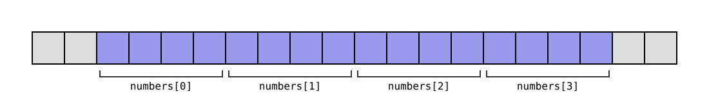

# 3. Taulukko

## Taulukon yleiskuva

C-kielen taulukko on tietorakenne, joka muodostuu peräkkäisistä muistissa olevista alkioista. Taulukon määrittelyssä ilmoitetaan taulukon alkioiden määrä ja kunkin alkion tyyppi sekä mahdollisesti myös taulukon alkusisältö.

Taulukko on tehokas matalan tason tietorakenne, joka vastaa suoraan tiedon tallennustapaa tietokoneen muistissa. Toisaalta taulukko on selvästi rajoittuneempi tietorakenne kuin esimerkiksi Python-kielen lista, koska alkioiden määrää ei voi muuttaa määrittelyn jälkeen ja jokaisen alkion tulee olla saman tyyppinen.

### Taulukon määrittely

Seuraava koodi määrittelee taulukon, joka sisältää 8 alkiota ja kukin alkio on `int`-tyyppinen luku:

```c
int numbers[8];
```

Koska taulukon alkusisältöä ei ole annettu, taulukko on alustamaton eli sen alkusisältönä voi olla mitä tahansa muistissa ollutta tietoa.

Seuraava koodi määrittelee taulukon alkusisällön kanssa:

```c
int numbers[8] = {3, 1, 4, 1, 5, 9, 2, 6};
```

Tässä tapauksessa taulukon voi myös määritellä lyhyemmin ilmoittamatta taulukon kokoa, koska sen voi päätellä alkusisällöstä:

```c
int numbers[] = {3, 1, 4, 1, 5, 9, 2, 6};
```

Taulukon alkusisältö voidaan myös antaa vain _osittain_:

```c
int array[8] = {1, 2, 3};
```

Tässä määrittelyssä annetut alkiot sijoitetaan taulukon alkuun ja kaikki muut alkiot saavat alkuarvon 0. Yllä oleva määrittely tarkoittaa siis samaa kuin:

```c
int array[8] = {1, 2, 3, 0, 0, 0, 0, 0};
```

<div class="note" markdown="1">
Tähän syntaksiin liittyy yksi C-kielen sudenkuopista. Kun tarkoituksena on alustaa koko taulukko luvulla 0, seuraava syntaksi toimii:

```c
int array[8] = {0};
```

Kuitenkin seuraava syntaksi _ei_ alusta koko taulukkoa luvulla 1:

```c
int array[8] = {1};
```

Tässä vain taulukon ensimmäinen alkio saa arvon 1 ja kaikki muut alkiot saavat arvon 0 eli taulukko onkin alustettu näin:

```c
int array[8] = {1, 0, 0, 0, 0, 0, 0, 0};
```
</div>

Perinteinen rajoitus taulukon määrittelyssä C-kielessä on ollut, että taulukon koon tulee olla käännöshetkellä tiedossa oleva vakioarvo. Kuitenkin C99-standardi sallii myös seuraavan määrittelyn, missä `n` on muuttuja:

```c
int array[n];
```

<div class="note" markdown="1">
Tilanne muuttui uudestaan C11-standardissa, jossa taulukon koon antaminen muuttujana on _valinnainen_ ominaisuus eikä C-kielen toteutuksen tarvitse sallia sitä. Tässä on taustalla, että joissakin ympäristöissä tällainen taulukon määrittely on hankalaa toteuttaa.

C++-standardi ei salli taulukon koon antamista muuttujana taulukon määrittelyssä. Tämä on esimerkki melko harvinaisesta tilanteesta, jossa C-kielessä sallittu syntaksi ei ole sallittu C++:ssa.
</div>

### Taulukon indeksointi

Taulukkoa indeksoidaan kokonaisluvuilla nollasta alkaen samaan tapaan kuin yleensäkin ohjelmoinnissa. Esimerkiksi:

```c
int numbers[8] = {3, 1, 4, 1, 5, 9, 2, 6};

printf("%d\n", numbers[0]); // 3
printf("%d\n", numbers[1]); // 1
printf("%d\n", numbers[2]); // 4
```

Seuraava for-silmukka tulostaa koko taulukon sisällön:

```c
for (int i = 0; i < 8; i++) {
    printf("%d\n", numbers[i]);
}
```

<div class="note" markdown="1">
Kun C-kieli kehitettiin 1970-luvulla, nollaindeksointi oli itse asiassa uutta ajattelua. Monessa vanhan ajan ohjelmointikielessä indeksointi alkaa ykkösestä tai ensimmäisen indeksin saa valita itse.

Esimerkiksi Fortran-kielessä taulukon indeksointi alkaa oletuksena ykkösestä. Pascal-kielessä puolestaan taulukon määrittelyssä tulee aina ilmoittaa sekä ensimmäinen että viimeinen indeksi.

C:n suosiolla on saattanut olla suuri vaikutus siihen, että nollaindeksointi on nykyään vakiintunut tapa ohjelmoinnissa.
</div>

Ohjelman suorituksen aikana _ei_ tarkasteta, että käytetty taulukon indeksi todella osuu taulukon alueelle. Esimerkiksi seuraavan koodin voi kääntää ja suorittaa:

```c
int numbers[8];
numbers[8] = 42;
printf("%d\n", numbers[8]);
```

Tässä `numbers[8]` on taulukon ulkopuolella, koska taulukon viimeisen alkion indeksi on 7. Tämän seurauksena koodi kirjoittaa muistiin ja lukee muistia taulukon ulkopuolelta. Tämä on vakava bugi koodissa, mikä voi johtaa esimerkiksi siihen, että koodi toimii oudosti tai kaatuu (_undefined behavior_).

<div class="note" markdown="1">
Miksi C-kieli sallii taulukon käsittelyn sen rajojen ulkopuolelta? Syynä on _tehokkuus_: koodi toimii nopeammin, kun taulukon käsittelyn yhteydessä ei tarvitse tarkastaa, että käytetty indeksi on taulukon rajojen sisällä.

C-kielessä oletuksena on, että ohjelmoija tietää mitä on tekemässä, mutta tämä oletus ei usein pidä paikkaansa. Hyvin yleinen syy C-ohjelmassa olevaan bugiin on, että koodi käsittelee muistia väärästä paikasta.

Rust-kielen kehittäjät ovat päätyneet toisenlaiseen ratkaisuun: vaikka kielen on tarkoitus olla tehokas matalan tason ohjelmointikieli, siinä kuitenkin tarkastetaan, että taulukkoa indeksoidaan oikealla tavalla.
</div>

### Taulukon koko

Taulukon koko on mahdollista selvittää seuraavasti:

```c
int size = sizeof(array) / sizeof(array[0]);
```

Tässä `sizeof(array)` antaa koko taulukon koon tavuina ja `sizeof(array[0])` on taulukon ensimmäisen alkion koko.

Koska yllä oleva kaava on melko hankala, on usein kätevää säilyttää taulukon kokoa muuttujassa, jotta taulukon koko on helposti saatavilla.

<div class="note" markdown="1">
Seuraava direktiivi määrittelee makron `ARRAY_SIZE`, joka laskee parametrina annetun taulukon koon:

```c
#define ARRAY_SIZE(a) (sizeof(a) / sizeof(a[0]))
```

Makroa voi käyttää koodissa esimerkiksi näin:

```c
int size = ARRAY_SIZE(array);
```

Esikääntäjä muuttaa yllä olevan koodin seuraavaan muotoon:

```c
int size = (sizeof(array) / sizeof(array[0]));
```
</div>

### Moniulotteinen taulukko

Moniulotteista taulukkoa voi käyttää melko vastaavasti kuin yksiulotteista taulukkoa. Esimerkiksi seuraava koodi määrittelee kaksiulotteisen taulukon, jossa on kolme riviä ja neljä saraketta:

```c
int array[3][4];
```

Seuraava määrittely antaa valmiiksi taulukon alkusisällön:

```c
int array[3][4] = {
    {1, 2, 3, 4},
    {5, 6, 7, 8},
    {9, 10, 11, 12}
};
```

Seuraava koodi tulostaa taulukon sisällön:

```c
for (int i = 0; i < 3; i++) {
    for (int j = 0; j < 4; j++) {
        printf("%d ", array[i][j]);
    }
    printf("\n");
}
```

## Taulukon käsittely osoittimella

Taulukon alkiot tallennetaan muistiin peräkkäin yhtenäiselle muistialueelle. Esimerkiksi taulukko

```c
int numbers[4] = {1, 2, 3, 4};
```

tallennetaan muistiin seuraavasti:



Koska taulukon alkiot ovat muistissa peräkkäin, minkä tahansa alkion muistiosoite voidaan laskea, kun tiedetään taulukon ensimmäisen alkion muistiosoite sekä yksittäisen taulukon alkion koko tavuina.

Taulukon `array` ensimmäisen alkion muistiosoite voidaan hakea lyhyesti syntaksilla `array`, joka tarkoittaa samaa kuin `&array[0]`. Seuraavassa koodissa molemmat rivit tulostavat saman muistiosoitteen.

```c
printf("%p\n", array);
printf("%p\n", &array[0]);
```

Syntaksi `array` tarkoittaakin useissa yhteyksissä osoitinta, joka osoittaa taulukon `array` ensimmäiseen alkioon. Yleisemmin `array + i` antaa muistiosoitteen taulukon alkioon indeksissä `i` ja syntaksin `array[i]` voi ajatella olevan lyhennysmerkintä osoitinta käyttävälle syntaksille `*(array + i)`. Esimerkiksi:

```c
int numbers[4] = {1, 2, 3, 4};

printf("%d\n", *numbers); // 1
printf("%d\n", *(numbers + 1)); // 2
printf("%d\n", *(numbers + 2)); // 3
printf("%d\n", *(numbers + 3)); // 4
```

### Osoitinaritmetiikka

Kun `array` on taulukko, mitä oikeastaan tarkoittaa `array + i`? Kun osoitinta kasvatetaan tai vähennetään, jokainen askel muuttaa muistiosoitetta osoittimen tyypin koon eli taulukon alkion koon verran. Tämä on hyödyllistä, koska näin osoittimen avulla voidaan käsitellä kätevästi taulukossa olevia alkioita.

Esimerkiksi kun taulukko on `int`-tyyppinen ja taulukossa olevan alkion koko on 4 tavua, merkintä `array + i` tarkoittaa, että taulukon ensimmäisen alkion muistiosoitetta kasvatetaan `i` kertaa 4 tavua. Tämän ansiosta saadaan muistiosoite, jossa sijaitsee taulukon alkio indeksissä `i`.

Sama logiikka pätee myös silloin, kun osoitinmuuttujaa kasvatetaan tai vähennetään. Esimerkiksi seuraavassa koodissa kasvatus `pointer++` tarkoittaa, että siirrytään eteenpäin seuraavaan kohtaan taulukossa:

```c
int numbers[4] = {1, 2, 3, 4};

int *pointer = numbers;
printf("%d", *pointer); // 1
pointer++;
printf("%d", *pointer); // 2
pointer++;
printf("%d", *pointer); // 3
pointer++;
printf("%d", *pointer); // 4
```

### Taulukko parametrina

Kun funktion parametrina on taulukko, funktiokutsussa välitetään osoitin taulukon ensimmäiseen alkioon. Näin on esimerkiksi seuraavassa funktiossa, joka laskee taulukossa olevien lukujen summan:

```c
int sum(int numbers[], int n) {
    int s = 0;
    for (int i = 0; i < n; i++) {
        s += numbers[i];
    }
    return s;
}
```

Funktiota voi käyttää esimerkiksi seuraavasti:

```c
int numbers[] = {1, 2, 3, 4};
printf("%d\n", sum(numbers, 4)); // 10
```

Tässä on oleellista on, että funktion toinen parametri `n` kertoo, montako alkiota taulukossa on. Funktiokutsussa välitetään vain osoitin taulukon ensimmäiseen alkioon eikä muuta tietoa taulukosta.

<div class="note" markdown="1">
Syntaksia `sizeof(numbers)` ei voi käyttää selvittämään, kuinka suuri on parametrina `numbers` annettu taulukko. Taulukosta välitetään vain osoitin ensimmäiseen alkioon ja `sizeof(numbers)` antaisi osoittimen koon.

Merkinnän `numbers[]` sijasta parametrina voidaan käyttää myös merkintää `*numbers`, joka tuo paremmin esille, että funktiolle annetaan osoitin.
</div>

Koska taulukko välitetään funktiolle osoittimena, funktio voi myös muuttaa taulukon sisältöä niin, että muutos välittyy kutsukohtaan. Esimerkiksi seuraava funktio kasvattaa jokaista taulukossa olevaa lukua yhdellä.

```c
void add_one(int numbers[], int n) {
    for (int i = 0; i < n; i++) {
        numbers[i]++;
    }
}
```

Taulukon välittäminen funktiolle osoittimen kautta on _tehokasta_, koska taulukon sisältöä ei kopioida. C-kielessä ei ole suoraa tapaa välittää taulukon kopioita funktiolle, minkä voi ajatella kannustavan tekemään tehokasta koodia.

Jos funktion ei ole tarkoitus muuttaa taulukon sisältöä, tämän voi tuoda esille avainsanalla `const`, joka estää muutokset osoittimen kautta. Esimerkiksi seuraava funktio saa vain lukea taulukkoa `numbers` mutta ei muuttaa taulukon sisältöä:

```c
int sum(const int numbers[], int n) {
    int s = 0;
    for (int i = 0; i < n; i++) {
        s += numbers[i];
    }
    return s;
}
```

### Moniulotteinen taulukko

C-kielen moniulotteinen taulukko on pohjimmiltaan vain yksiulotteinen taulukko, jonka käsittelyyn on erityinen syntaksi. Esimerkiksi taulukko

```c
int array[3][4] = {
    {1, 2, 3, 4},
    {5, 6, 7, 8},
    {9, 10, 11, 12}
};
```

tallennetaan muistiin samalla tavalla kuin seuraava taulukko:

```c
int array[12] = {1, 2, 3, 4, 5, 6, 7, 8, 9, 10, 11, 12};
```

<div class="note" markdown="1">
Tähän liittyen myös seuraava sekamäärittely on sallittu:

```c
int array[3][4] = {1, 2, 3, 4, 5, 6, 7, 8, 9, 10, 11, 12};
```

Tässä taulukko on kaksiulotteinen, mutta alkusisältö on annettu yksiulotteisena listana, jonka sisältö jaetaan taulukon riveiksi.
</div>

Seuraavat koodit toimivat samalla tavalla:

```c
for (int i = 0; i < 3; i++) {
    for (int j = 0; j < 4; j++) {
        printf("%d ", array[i][j]);
    }
}
```

```c
int *base = (int*)array;
for (int i = 0; i < 3 * 4; i++) {
    printf("%d ", *(base + i));
}
```

Kumpikin koodi antaa seuraavan tuloksen:

```console
1 2 3 4 5 6 7 8 9 10 11 12
```

Ensimmäinen koodi käy taulukon alkiot läpi taulukkosyntaksin avulla. Toinen koodi puolestaan hakee ensin osoittimen taulukon ensimmäiseen alkioon ja käy sitten taulukon läpi osoittimen kautta.

## Taulukon sisällön käsittely

C-kielessä ei ole syntaksia taulukon sisällön käsittelyyn kokonaisuutena. Esimerkiksi `=`-syntaksilla ei voi kopioida taulukkoa eikä `==`-syntaksilla voi vertailla taulukoita. Funktiokutsun parametrina oleva taulukko välitetään aina osoittimena, eikä taulukon sisältöä voi välittää kopiona.

<div class="note" markdown="1">
C:ssä seuraava koodi ei ole lainkaan sallittu taulukoilla:

```c
int a[4];
int b[4] = {3, 1, 4, 1};
a = b;
```

Tämä koodi ei kopioi taulukon `b` sisältöä taulukkoon `a` eikä myöskään aseta taulukkoa `a` osoittamaan taulukon `b` kohtaan muistissa. Taulukon määrittelyn jälkeen ei voi muuttaa, mihin kohtaan taulukko osoittaa muistissa.

Toisaalta koodi toimii, jos `a` onkin määritelty osoittimena:

```c
int *a;
int b[4] = {3, 1, 4, 1};
a = b;
```

Tässä koodissa `a` osoittaa muistissa taulukkoon `b`, eli osoittimen `a` kautta voi käsitellä taulukon `b` sisältöä.

Java-kielessä taulukolla ei ole kiinteää kokoa tai muistiosoitetta, vaan taulukko vastaa enemmänkin C-kielen osoitinta. Esimerkiksi seuraava Java-koodi asettaa taulukot `a` ja `b` viittaamaan samaan taulukkoon:

```java
int[] a;
int[] b = {3, 1, 4, 1};
a = b;
```
</div>

Perusperiaate C-kielessä on, ettei kielen syntaksi tee ohjelmoijalta salassa mitään raskasta, kuten taulukon kopiointia tai läpikäyntiä. Jos jokin C-kielen operaatio _näyttää_ kevyeltä, se myös yleensä on kevyt. Toisin on esimerkiksi Python-kielessä, jossa lista-operaatioissa `a == b`, `a[1:]` ja `x in a` on kevyt syntaksi mutta operaatiot ovat raskaita, koska ne käyvät läpi listan sisällön.

Taulukon sisällön käsittely tulee C-kielessä toteuttaa esimerkiksi käymällä alkiot läpi yksi kerrallaan silmukalla tai kutsumalla standardikirjaston funktioita.

### Matalan tason muistinkäsittely

Standardikirjaston otsikkotiedostossa `string.h` on muistia tavutasolla käsitteleviä funktioita, joita voi hyödyntää taulukoiden käsittelyssä.

Esimerkiksi funktio `memcpy` kopioi muistialueen sisällön ja funktio `memcmp` vertailee kahden muistialueen sisältöä. Funktioille annetaan osoittimet muistialueisiin sekä käsiteltävän tiedon määrä tavuina.

Seuraava koodi kopioi ensin taulukon `b` sisällön taulukkoon `a` ja tarkastaa sitten, onko taulukoilla samat sisällöt.

```c
int a[4];
int b[4] = {1, 2, 3, 4};

memcpy(a, b, sizeof(a));

if (memcmp(a, b, sizeof(a)) == 0) {
    printf("a and b are equal\n");
}
```

<div class="note" markdown="1">
Funktio `memcpy` ei varaa muistia, vaan muisti tulee olla varattu etukäteen. Yllä olevassa koodissa asia on kunnossa, koska taulukolle `a` on varattu riittävästi muistia sen määrittelyssä.

Funktio `memcpy` olettaa lisäksi, että muistialueet eivät osu toistensa päälle. Jos ne osuvat, tulee käyttää funktiota `memmove`, joka voi olla hitaampi mutta toimii oikein myös tässä tilanteessa.
</div>

Funktio `memset` asettaa muistialueen sisällön halutuksi. Esimerkiksi seuraava koodi nollaa taulukon `a` sisällön:

```c
int a[4];
memset(a, 0, sizeof(a));
```

Tämä koodi toimii, koska jokaisen tavun sisällöksi tulee 0. Huomaa kuitenkin, ettei seuraava koodi toimi luultavasti halutulla tavalla:

```c
int a[4];
memset(a, 123, sizeof(a));
```

Tämä koodi ei aseta jokaisen taulukon alkion arvoksi 123 vaan jokaisen muistialueella olevan _tavun_ arvoksi 123. Koska `int`-luku muodostuu useasta tavusta, taulukon alkioiden sisällöksi tulee jotain muuta:

```c
printf("%d\n", numbers[0]); // 2071690107
```

<div class="note" markdown="1">
Tavun 123 sisältö on bittimuodossa 01111011, joten neljästä tavusta muodostuvan `int`-luvun sisällöksi tulee

<center>01111011 01111011 01111011 01111011,</center>

joka vastaa lukua 2071690107.
</div>

### Taulukko vs. struct-tyyppi

C-kielen taulukko ja struct-tyyppi eroavat toisistaan merkittävästi. Taulukon sisältöä ei kopioida sijoituksessa tai funktion parametrina, kun taas struct-muuttujan sisältö kopioidaan. Mutta mitä tapahtuu, jos struct-tyypin _sisällä_ on taulukko?

```c
struct Array {
    int values[4];
};
```

Tässä tapauksessa struct-muuttujan sisällön voi kopioida `=`-syntaksilla ja välittää funktion parametrina siitä huolimatta, että sen sisällä on taulukko. Esimerkiksi:

```c
struct Array a = {3, 1, 4, 1};
struct Array b;
b = a;
printf("%d\n", b.values[0]); // 3
```

Tämä on tavallaan C-kielen porsaanreikä, joka johtuu siitä ristiriidasta, että struct-tyyppi käyttäytyy samalla tavalla kuin perustietotyypit, mutta toisaalta sen sisällä voi olla taulukko kenttänä. Kuitenkaan ole hyvää ohjelmointityyliä laittaa taulukkoa struct-tyypin sisään sen takia, että sitä pystyisi kopioimaan.

## Merkkijono

C-kielessä ei ole erillistä merkkijonotyyppiä, vaan käytäntönä on esittää merkkijono yhtenäisenä muistialueena, jossa jokainen merkkijonon merkki kuvataan `char`-tavuna. Merkkijonon viimeisen merkin jälkeen on vielä nollatavu, joka ilmaisee merkkijonon loppumisen.

Esimerkiksi seuraava koodi määrittelee taulukon, jonka sisältönä on merkkijono "aybabtu". Jokainen taulukon alkio on `char`-tavu, jonka sisältö on annettu merkkinä `'`-syntaksia käyttäen.

```c
char word[] = {'a', 'y', 'b', 'a', 'b', 't', 'u', '\0'};
```

Tässä `'\0'` tarkoittaa nollatavua, jonka voisi esittää myös lukuna `0`.

Vastaavan taulukon voi määritellä myös lyhemmin antamalla merkkijonon sisällön seuraavasti `"`-syntaksia käyttäen:

```c
char word[] = "aybabtu";
```

Tätä syntaksia käyttäen merkkijonon loppuun tulee automaattisesti nollatavu eikä sitä tarvitse kirjoittaa itse.

<div class="note" markdown="1">
Useissa ohjelmointikielissä `'`-syntaksi ja `"`-syntaksi ovat vaihtoehtoisia tapoja merkkijonon esittämiseen. Esimerkiksi Pythonissa `'aybabtu'` ja `"aybabtu"` tarkoittavat samaa merkkijonoa.

C-kielessä kuitenkin `'`-syntaksilla esitetään aina yksittäinen merkki ja `"`-syntaksilla nollatavuun päättyvä merkkijono. Huomaa, että myös `'a'` ja `"a"` tarkoittavat eri asiaa, koska merkkijono `"a"` muodostuu merkeistä `'a'` ja `'\0'`.
</div>

Merkkijonon sisällön voi tulostaa seuraavasti funktiolla `printf`:

```c
printf("%s\n", word); // aybabtu
```

Seuraava silmukka puolestaan tulostaa merkkijonon merkit omille riveilleen:

```c
for (int i = 0; word[i]; i++) {
    printf("%i %c\n", i, word[i]);
}
```

Tässä silmukan jatkumisen ehtona on `word[i]`, mikä tarkoittaa, että merkkijonon kohdassa `i` tulee olla jotain muuta kuin merkkijonon päättävä nollatavu.

Koodin tuloksena on seuraava:

```
0 a
1 y
2 b
3 a
4 b
5 t
6 u
```

### Merkkien esittäminen

Tietotyypillä `char` on siis useita käyttötarkoituksia C-kielessä: se voi tarkoittaa tavun kokoista kokonaislukua tai siihen voi tallentaa tavun kokoisen merkin.

Itse asiassa `'`-syntaksia voi ajatella vaihtoehtoisena tapana esittää tavun mittainen kokonaisluku. Esimerkiksi ASCII-merkistössä merkin `'A'` merkkikoodi on 65, mikä tarkoittaa, että `'A'` tarkoittaa samaa kuin kokonaisluku 65.

Seuraavat koodit tuovat esille yhteyden merkkien ja lukujen välillä:

```c
char c = 65;
printf("%c\n", c); // A
printf("%d\n", c); // 65
```

```c
char c = 'A';
printf("%c\n", c); // A
printf("%d\n", c); // 65
```

Huomaa, että yllä oleva koodi olettaa merkin `'A'` merkkikoodin olevan 65. Tämä oletus pätee monissa ympäristöissä, mutta ei kaikissa ympäristöissä. C-standardi ei määrittele koodissa käytettävää merkistöä.

<div class="note" markdown="1">
C-standardi ei muutenkaan kerro paljonkaan merkistöstä. Kuitenkin standardi lupaa, että numeromerkit `0`–`9` ovat _peräkkäin_ merkistössä. Tämän ansiosta voi luottaa siihen, että seuraava koodi muuttaa muuttujassa `c` olevan numeromerkin kokonaisluvuksi.

```c
int x = c - '0';
```

Esimerkiksi kun `c` sisältää merkin `'2'`, tässä lasketaan `'2' - '0'`, jonka tuloksena on 2. Esimerkiksi ASCII-merkistössä merkin `'0'` merkkikoodi on 48 ja merkin `'2'` merkkikoodi on 50, jollon lasketaan 50 – 48 = 2.

C-standardi ei kuitenkaan lupaa, että aakkoset `A`–`Z` ja `a`–`z` olisivat peräkkäin merkistössä, vaikka näin onkin useimmissa merkistöissä.
</div>

### Merkkijonon pituus

C-kielen standardikirjaston otsikkotiedostossa `string.h` on useita funktioita, jotka liittyvät merkkijonojen käsittelemiseen. Esimerkiksi funktion `strlen` avulla voidaan laskea merkkijonon pituus seuraavasti:

```c
char word[] = "aybabtu";
printf("%zu\n", strlen(word)); // 7
```

<div class="note" markdown="1">
Koska C-kielen merkkijonoon ei tallenneta pituutta, funktion `strlen` täytyy käydä läpi merkkijonon merkit alusta loppuun, kunnes vastaan tulee nollatavu. Funktion suoritus vie siis aikaa O(_n_), missä _n_  on merkkijonon pituus.

Monissa muissa kielissä merkkijonoon tallennetaan pituus, jolloin pituuden saa selville ajassa O(1). Tämä on perinteinen Pascal-kielen toteutustapa, joka on käytössä myös esimerkiksi C++:ssa, Javassa, Pythonissa ja Rustissa.
</div>

Funktion `strlen` toimintaan liittyy merkittävä oletus: jotta funktio antaa oikean tuloksen, jokaisen merkin tulee olla yhden tavun mittainen. Tämä ei päde esimerkiksi yleisesti käytetyssä UTF-8-merkistössä, jossa koodi toimii seuraavasti:

```c
char word[] = "säätiö";
printf("%zu\n", strlen(word)); // 9
```

Sanassa "säätiö" on 6 merkkiä, mutta koodi antaa tuloksen 9. Miksi näin tapahtuu?

Voimme tutkia asiaa seuraavalla koodilla, joka näyttää merkkijonon sisällön tavu kerrallaan. Koodi tulostaa jokaisen tavun kohdan, tavun sisällön merkkinä sekä tavun sisällön etumerkittömänä lukuna.

```c
char word[] = "säätiö";
for (int i = 0; word[i]; i++) {
    printf("%d %c %d\n", i, word[i], (unsigned char)word[i]);
}
```

Koodin tulostus on seuraava:

```console
0 s 115
1 � 195
2 � 164
3 � 195
4 � 164
5 t 116
6 i 105
7 � 195
8 � 182
```

Tästä näkee, että merkit "ä" ja "ö" on esitetty todellisuudessa kahden tavun yhdistelmänä. Merkkiä "ä" vastaa tavupari (195, 164) ja merkkiä "ö" vastaa tavupari (195, 182). Tulostusasu � tarkoittaa merkkiä, jota ei pystytä esittämään, koska tämä tavu on todellisuudessa merkin osa.

<div class="note" markdown="1">
Tarkasti ottaen `char`-tavu ei siis vastaa merkkijonon merkkiä vaan merkkijonossa olevaa tavua, joka voi olla merkin osa.

Entä mitä tapahtuu, jos yritämme tallentaa `char`-muuttujaan merkin "ä" ja tutkia sitten muuttujan sisältöä?

```c
char c = 'ä';
printf("%c %d\n", c, (unsigned char)c);
```

Koodin pystyy kääntämään gcc-kääntäjällä, mutta kääntäjä antaa useita varoituksia. Koodin tulostus on seuraava:

```console
� 164
```

Tässä vaikuttaa siltä, että `char`-muuttujan arvoksi tulee toinen merkin tavuista ja toinen tavu puolestaan menetetään.

</div>

### Merkkijonojen vertailu

Oletetaan nyt, että meillä on merkkijonot `a` ja `b` ja haluamme tarkastaa, onko niillä sama sisältö. Seuraava koodi _ei_ toimi halutulla tavalla:

```c
char a[] = "abc";
char b[] = "abc";
if (a == b) {
    printf("equal strings\n");
}
```

Tässä ongelmana on, että `a == b` vertailee taulukoiden muistiosoitteita eikä merkkijonojen sisältöä. Tässä merkkijonoilla on sama sisältö, mutta ne on tallennettu eri paikkoihin muistissa.

Toimiva tapa vertailla merkkijonoja on käyttää standardikirjaston funktiota `strcmp` seuraavasti:

```c
char a[] = "abc";
char b[] = "abc";
if (strcmp(a, b) == 0) {
    printf("equal strings\n");
}
```

Funktiokutsu `strcmp(a, b)` vertailee merkkijonoja merkki kerrallaan ja palauttaa kokonaisluvun, joka antaa tietoa merkkijonojen järjestyksestä.

- Paluuarvo 0 tarkoittaa, että merkkijonot ovat samat.
- Negatiivinen paluuarvo tarkoittaa, että ensimmäisen eroavan tavun kohdalla `a`:ssa on pienempi arvo kuin `b`:ssä.
- Positiivinen paluuarvo tarkoittaa, että ensimmäisen eroavan tavun kohdalla `a`:ssa on suurempi arvo kuin `b`:ssä.

<div class="note" markdown="1">
Korkeamman tason kieliin tottuneelle voi olla vaikea muistaa, että C-kielessä syntaksi `a == b` ei toimi halutulla tavalla merkkijonojen kanssa.

Java-kielessä merkkijonoja voi muuten käsitellä melko kevyellä syntaksilla, mutta siinäkin sudenkuoppana on, että vertailu `a == b` ei toimi oikein merkkijonoilla vaan tulee käyttää syntaksia `a.equals(b)`.
</div>

### Merkkijonon kopiointi

C-kielessä merkkijonoja ei voi yleensäkään käsitellä samalla tavalla kuin lukuja. Esimerkiksi luvuilla `b = a` kopioi luvun muuttujasta `a` muuttujaan `b` ja `a + b` laskee yhteen kaksi lukua, mutta merkkijonoja ei voi kopioida eikä yhdistää näin.

C:n standardikirjaston funktio `strcpy` kopioi merkkijonon sisällön. Esimerkiksi seuraava koodi kopioi taulukkoon `b` taulukossa `a` olevan merkkijonon:

```c
char a[] = "abc";
char b[4];
strcpy(b, a);
printf("%s\n", b); // abc
```

Tässä on oleellista, että taulukolle `b` on varattu muistia riittävästi kopioitavaa merkkijonoa varten. Tässä tapauksessa muistia tarvitaan 4 tavua, koska merkkijonossa on 3 tavua sisältöä sekä lopussa nollatavu.

Seuraava koodi puolestaan muodostaa kahdesta merkkijonosta kolmannen merkkijonon käyttäen standardikirjaston funktiota `strcat`, joka kopioi merkkijonon toisen merkkijonon perään:

```c
char a[] = "ayb";
char b[] = "abtu";
char c[8] = "";
strcat(c, a);
strcat(c, b);
printf("%s\n", c); // aybabtu
```

Alussa merkkijono `c` on tyhjä. Ensin kutsu `strcat(c, a)` kopioi merkkijonon `c` perään merkkijonon `a`, minkä jälkeen kutsu `strcat(c, b)`kopioi merkkijonon `c` perään merkkijonon `b`.

Yllä olevassa koodissa on jälleen oleellista, että taulukolle `c` on varattu riittävästi muistia. Tässä muistia tarvitaan 8 tavua, koska taulukoiden `a` ja `b` merkkijonojen sisältöjen yhteispituus on 7 tavua ja lisäksi loppuun tulee nollatavu.

Funktioiden `strcpy` ja `strcat` käyttäminen on vaarallista, jos ei tiedetä, että kopioitava merkkijono mahtuu varattuun muistialueeseen. Funktioista on olemassa myös turvallisemmat versiot `strncpy` ja `strncat`, joissa annetaan lisäparametrina suurin sallittu kopioitavien tavujen määrä.

<div class="note" markdown="1">
Tässä vaiheessa lienee tullut selväksi, että merkkijonojen käsitteleminen C-kielessä on vaivalloista. Esimerkiksi Pythonissa äskeiset koodit voisi toteuttaa yksinkertaisesti näin:

```python
a = "abc"
b = a
```

```python
a = "ayb"
b = "abtu"
c = a + b
```

Kuitenkin C-kielessä ohjelmoijalla on kontrolli siitä, mitä koodissa tapahtuu matalalla tasolla. Kun merkkijono kopioidaan, muistia täytyy varata ja merkit täytyy kopioida paikasta toiseen. Myös Python tekee näin sisäisesti koodin suoritusympäristössä, mutta ohjelmoija ei saa tietää asiasta.
</div>

### Merkkijono käyttäjältä

Seuraava koodi kysyy käyttäjän nimen ja tallentaa sen taulukkoon merkkijonona:

```c
char name[16];
printf("Enter name: ");
scanf("%s", name);
printf("Your name is %s\n", name);
```

Tässä formaatti `%s` tarkoittaa, että luetaan merkkijono, joka päättyy tyhjään tilaan kuten rivinvaihtoon tai lainausmerkkiin.

Koodi vaikuttaa päältä päin toimivalta:

```
Enter name: Antti
Your name is Antti
```

Koodissa on kuitenkin paha bugi: taulukon kooksi on määritelty 16 tavua, mutta mikään ei estä käyttäjää antamasta pidempää nimeä:

```
Enter name: aaaaaaaaaaaaaaaaaaaaaaaaaaaaaa
```

Nyt osa käyttäjän antamasta merkkijonosta menee taulukolle varatun muistialueen ulkopuolelle, mikä on vaarallinen tilanne, koska käyttäjä pystyy muuttamaan ohjelman muistia taulukon ulkopuolelta. Tämä on yleinen tietoturva-aukko, josta käytetään nimeä _puskuriylivuoto_ (_buffer overflow_).

Tilanne on sikäli hankala, että vaikka taulukon määrittelisi suuremmaksi, käyttäjä voi myös aina antaa pidemmän merkkijonon. Parempi lähestymistapa on rajoittaa käyttäjän antaman merkkijonon pituutta. Tämän voi tehdä esimerkiksi antamalla merkkijonon maksimipituus `scanf`-funktiossa:

```c
scanf("%15s", name);
```

Tässä formaatti `%15s` tarkoittaa merkkijonoa, jonka pituus on enintään 15 tavua. Tämä on sopiva pituus, koska taulukon kokona on 16 tavua ja siihen täytyy mahtua myös nollatavu merkkijonon loppuun. Tämän muutoksen jälkeen ylimittaisesta merkkijonosta tallennetaan taulukkoon vain alkuosa:

```
Enter name: aaaaaaaaaaaaaaaaaaaaaaaaaaaaaa
Your name is aaaaaaaaaaaaaaa
```

<div class="note" markdown="1">
Formaattia `%s` ei tulisi käyttää `scanf`-funktiossa oikeastaan koskaan, koska se ei rajoita luettavan merkkijonon pituutta. Tämän takia formaatin `%s` käyttämiseen liittyy aina riski puskuriylivuodosta.

C:n standardikirjasto syntyi aikana, jolloin turvallisuuteen ei kiinnitetty huomiota samaan tapaan kuin nykyään. Standardikirjastossa on ollut aiemmin myös erityisen vaarallinen funktio `gets`, joka lukee käyttäjältä merkkijonon ja tallentaa sen annettuun kohtaan muistissa:

```c
gets(name);
```

Tässä funktiossa ei ole tapaa rajoittaa merkkijonon pituutta, minkä takia mikä tahansa tapa käyttää funktiota on oikeastaan vaarallinen. Koska funktio on niin vaarallinen, sen käyttöä ei suositella missään tilanteessa ja se on poistettu standardikirjastosta C11:stä alkaen.
</div>

### Merkkijonoliteraali

Seuraavat kaksi määrittelyä näyttävät lähes samanlaisilta:

```c
char word[] = "aybabtu";
```

```c
char *word = "aybabtu";
```

Kuitenkin erona on, että ensimmäinen tapa määrittelee merkkijonon taulukkona, jonka sisältöä pystyy muuttamaan, kun taas toinen tapa luo osoittimen merkkijonoliteraaliin, jota ei ole sallittua muuttaa.

Seuraava koodi toimii oikein vain ensimmäisen määrittelyn kanssa:

```c
word[0] = 'x';
printf("%s\n", word); // xybabtu
```

Toisen määrittelyn kanssa koodi yrittää muokata muistia kielletyllä tavalla, mikä saattaa johtaa esimerkiksi ohjelman kaatumiseen.

Käytännössä merkkijonoliteraali voi sijaita ohjelman suorituksen aikana muistialueella, jossa ei ole sallittua muuttaa muistin sisältöä.

## Taulukkoalgoritmit

Standardikirjaston otsikkotiedosto `stdlib.h` sisältää kahden taulukkoalgoritmin toteutuksen: funktio `qsort` järjestää taulukon tehokkaasti ja funktio `bsearch` etsii alkiota binäärihaulla järjestetystä taulukosta.

### Taulukon järjestäminen

Taulukon järjestämiseen voidaan käyttää standardikirjaston funktiota `qsort`. Funktion esittely on seuraava:

```c
void qsort(void* base, size_t n, size_t size,
           int (*cmp)(const void*, const void*));
```

Funktion parametrit ovat:

- `base` on osoitin järjestettävän taulukon alkuun
- `n` on taulukon alkioiden määrä
- `size` on yksittäisen taulukon alkion koko tavuina
- `cmp` on osoitin funktioon, joka vertailee kahta taulukon alkiota

C-kielessä haasteena on, kuinka toteuttaa tällainen algoritmi yleisesti niin, että se soveltuu eri tyyppisten alkioiden käsittelemiseen. Tässä ratkaisuna on käyttää parametrissa `base` ja funktion `cmp` parametreissa tyyppiä `void*`, joka viittaa määrittelemättömän tyyppiseen osoittimeen.

Funktion `cmp` tulee palauttaa kokonaisluku, joka ilmaisee kahden taulukon alkion järjestyksen. Kun funktiolle annetaan parametrit `a` ja `b`, sen tulee palauttaa

- negatiivinen luku, jos `a` on pienempi kuin `b`,
- nolla, jos `a` ja `b` ovat yhtä suuria,
- positiivinen luku, jos `a` on suurempi kuin `b`.

Funktio `qsort` kutsuu funktiota `cmp` aina, kun sen täytyy selvittää kahden alkion järjestys taulukon järjestämisen aikana.

Katsotaan seuraavaksi, miten funktiota `qsort` voi käyttää käytännössä `int`-taulukon järjestämiseen. Määritellään ensin funktio `cmp`, joka vertailee kahta taulukon alkiota eli kahta `int`-lukua:

```c
int cmp(const void *a, const void *b) {
    int x = *(int*)a, y = *(int*)b;
    if (x < y) return -1;
    if (x == y) return 0;
    if (x > y) return 1;
}
```

Funktio hakee ensin luvut, joihin osoittimet viittaavat. Tässä tarvitaan tyyppimuunnosta `(int*)`, koska funktion parametrit ovat tyyppiä `(void*)` ja ne osoittavat tässä tapauksessa `int`-lukuihin. Tämän jälkeen funktio palauttaa halutunlaisen arvon, joka ilmaisee lukujen järjestyksen.

Nyt taulukon alkiot voidaan järjestää seuraavasti pienimmästä suurimpaan:

```c
int numbers[] = {4, 2, 8, 3, 7, 1, 6, 5};

qsort(numbers, 8, sizeof(int), cmp);
```

<div class="note" markdown="1">
Funktion nimi `qsort` viittaa pikajärjestämiseen (_quick sort_), joka on perinteinen tehokas järjestämisalgoritmi.

Pikajärjestämisalgoritmi valitsee järjestettävästä taulukosta jakoalkion ja siirtää jakoalkiota pienemmät alkiot taulukon vasempaan osaan ja suuremmat alkiot taulukon oikeaan osaan. Tämän jälkeen algoritmi järjestää vasemman ja oikean osan rekursiivisesti.

C-standardi ei kuitenkaan vaadi, että funktion `qsort` tulee käyttää algoritmina pikajärjestämistä, vaan kirjain `q` nimessä on historiallinen jäänne.
</div>

### Binäärihaku taulukosta

Standardikirjastossa on myös funktio `bsearch`, joka etsii tehokkaasti alkion järjestetystä taulukosta. Funktion esittely on seuraava:

```c
void* bsearch(const void* key, const void* base, size_t n, size_t size,
              int (*cmp)(const void*, const void*));)
```

Funktion parametrit ovat:

- `key` on osoitin haettava alkioon
- `base` on osoitin taulukon alkuun
- `n` on taulukon alkioiden määrä
- `size` on yksittäisen taulukon alkion koko tavuina
- `cmp` on osoitin funktioon, joka vertailee kahta taulukon alkiota

Jos haettava alkio on taulukossa, funktio palauttaa osoittimen siihen, ja jos alkiota ei ole taulukossa, funktio palauttaa `NULL`-osoittimen. Kuten funktiossa `qsort`, funktiota `cmp` käytetään vertailemaan alkioita algoritmin suorituksen aikana.

Seuraava koodi etsii funktiolla `bsearch` taulukosta alkiota käyttäen samaa `cmp`-funktiota kuin funktion `qsort` esimerkissä:

```c
int numbers[] = {2, 4, 4, 5, 7, 8, 9, 9};
int key = 8;

int *pointer = bsearch(&key, numbers, 8, sizeof(int), cmp);

if (pointer == NULL) {
    printf("not found");
} else {
    int pos = pointer - numbers;
    printf("found at position %d\n");
}
```

<div class="note" markdown="1">
Funktion nimi `bsearch` viittaa binäärihakuun (_binary search_), joka etsii tehokkaasti alkion järjestetystä taulukosta.

Binäärihaku aloittaa haun taulukon keskeltä ja jatkaa hakua vasempaan tai oikeaan puoliskoon riippuen keskellä olevan alkion suuruudesta. Sama jatkuu rekursiivisesti, kunnes alkio on löytynyt tai haettava väli on tyhjä.

Tässäkään algoritmissa C-standardi ei vaadi funktion nimestä huolimatta binäärihaun käyttämistä, joskin se lienee yleinen tapa toteuttaa funktio.
</div>
