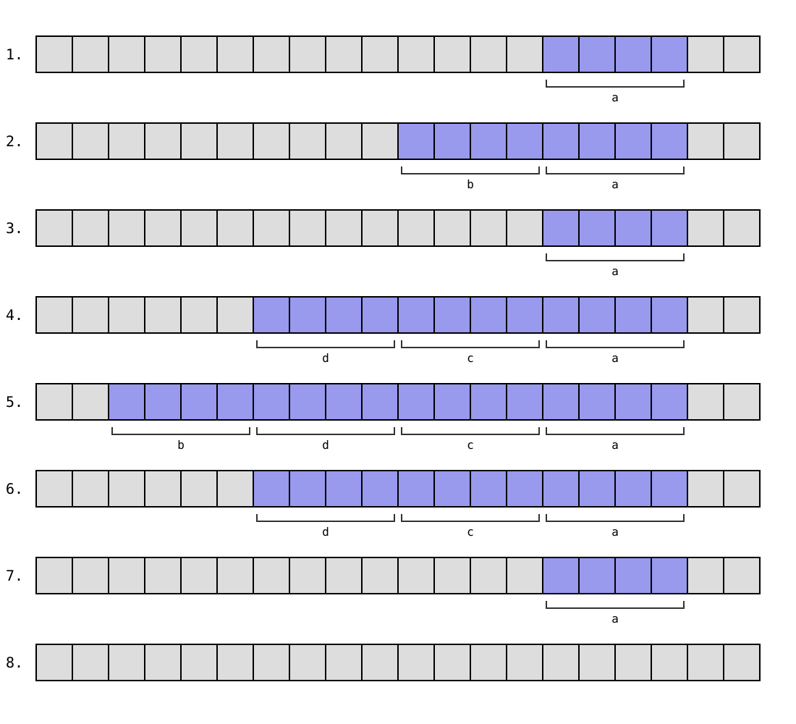

# 4. Muistinhallinta

Tässä luvussa tutustumme tarkemmin siihen, miten muistia varataan C-ohjelman suorituksen aikana. Kolme tavallista tapaa muistin varaamiseen ovat:

- _Automaattinen muistinvaraus_: Muistia varataan funktion paikallisille muuttujille muistialueelta nimeltä pino. Muisti varataan ja vapautetaan automaattisesti funktion suorituksen aikana.

- _Staattinen muistinvaraus_: Muistia varataan globaaleille ja staattisille muuttujille koko ohjelman suorituksen ajaksi. Muisti varataan ja vapautetaan automaattisesti ohjelman suorituksen aikana.

- _Dynaaminen muistinvaraus_: Muistia varataan C:n standardikirjaston funktioilla (kuten `malloc`) muistialueelta nimeltä keko. Ohjelmoija huolehtii itse muistin varaamisesta ja vapauttamisesta.

## Automaattinen muistinvaraus

Automaattinen muistinvaraus on C-kielen tavallinen tapa varata muistia paikallisille muuttujille eli funktion sisällä määritellyille muuttujille.

Muistia varataan muistialueelta nimeltä _pino_ (_stack_), jonka toiminta muistuttaa samannimistä tietorakennetta. Ohjelmoijan kannalta hyvä mielikuva asiasta on, että kun funktion suoritus alkaa, funktion muuttujille varataan muistia pinosta. Sitten kun funktion suoritus päättyy, muuttujille varattu muisti vapautetaan.

TODO: tarkemmin lohkon alku/loppu?

Automaattinen muistinvaraus on tarkoitettu väliaikaiseen melko pienen muistimäärän varaamiseen funktioissa. Pinomuistin käyttäminen on tehokasta, mutta siihen liittyy myös joitakin rajoituksia, joihin tutustumme pian.

### Pinomuistin käyttäminen

Tarkastellaan esimerkkinä seuraavaa koodia:

```c
void test_1(void) {
    int a = 1;
    test_2();
    test_3();
}

void test_2(void) {
    int b = 2;
}

void test_3(void) {
    int c = 3;
    int d = 4;
    test_2();
}
```

Kun funktiota `test_1` kutsutaan, ohjelman suoritus etenee seuraavasti:

1. Funktio `test_1` varaa muistia muuttujalle `a`.
2. Funktio `test_2` varaa muistia muuttujalle `b`.
3. Funktio `test_2` vapauttaa muuttujalle `b` varatun muistin.
4. Funktio `test_3` varaa muistia muuttujille `c` ja `d`.
5. Funktio `test_2` varaa muistia muuttujalle `b`.
6. Funktio `test_2` vapauttaa muuttujalle `b` varatun muistin.
7. Funktio `test_3` vapauttaa muuttujille `c` ja `d` varatun muistin.
8. Funktio `test_1` vapauttaa muuttujalle `a` varatun muistin.

Pinomuisti on toteutettu yleensä niin, että pino kasvaa oikealta vasemmalle. Yllä olevassa tilanteessa muuttujille voisi varata muistia seuraavaan tapaan:



<div class="note" markdown="1">
Tämä esimerkki on yksinkertaistus siitä, miten pinomuistia varataan ohjelman suorituksen aikana. Todellisuudessa tilanne on monimutkaisempi, koska pinomuistia käytetään muuhunkin kuin funktion muuttujien tilanvaraukseen. Tutustumme asiaan myöhemmin tarkemmin.
</div>

### Muistialueen käyttöaika

Funktiossa varattu muisti on käytettävissä vain funktion suorituksen aikana, koska muisti vapautetaan automaattisesti funktion suorituksen päättyessä. Esimerkiksi seuraava koodi _ei_ ole toimiva:

```c
int* create_array(int n) {
    int array[n];
    for (int i = 0; i < n; i++) {
        array[i] = i;
    }
    return array; // VIRHE
}

int main(void) {
    int n = 10;
    int *range = create_array(n);
    for (int i = 0; i < n; i++) {
        printf("%d ", range[i]);
    }
}
```

Funktiossa `create_array` on ideana luoda `n`-kokoinen taulukko ja palauttaa osoitin taulukkoon funktion palautusarvona.

Tässä on kuitenkin ongelmana, että taulukolle `array` varattu muistialue vapautuu automaattisesti funktion päättyessä. Tämän takia on virhe funktiossa `create_array` palauttaa osoitin taulukon muistialueeseen, koska varattu muisti ei ole enää käytettävissä funktion suorituksen päätyttyä.

Yllä olevan koodin voi kääntää, mutta `gcc` antaa seuraavan varoituksen:

```
test.c: In function ‘create_array’:
test.c:9:12: warning: function returns address of local variable [-Wreturn-local-addr]
    9 |     return array;
      |            ^~~~~
```

Tällaisen koodin suorittaminen johtaa määrittelemättömään toimintaan, esimerkiksi "Segmentation fault" -virheeseen.

### Pinomuistin rajallisuus

Automaattisen muistinvarauksen rajoituksena on myös, että saatavilla oleva pinomuistin määrä on usein melko pieni. Esimerkiksi Linux-ympäristössä on tavallista, että ohjelman käytössä oleva pinomuistin määrä on oletuksena vain 8 megatavua.

Seuraava koodi tuo esille pinomuistin rajallisuuden:

```c
int main(void) {
    int n = 10000000;
    int array[n];
}
```

Koodi koettaa varata funktion sisällä taulukon, jossa on 10 miljoonaa `int`-lukua. Kun jokainen `int`-luku vie tilaa 4 tavua, koko taulukko vie tilaa noin 40 megatavua muistia. Tämä on selvästi enemmän kuin tavallinen käytettävissä olevan pinomuistin määrä Linux-ympäristössä.

Yritys suorittaa yllä oleva koodi johtaa tyypillisesti siihen, että taulukkoa ei pystytä varaamaan ja ohjelman suoritus päättyy kaatumiseen.

<div class="note" markdown="1">
Linuxissa komennolla `ulimit` voi tarkastaa ohjelman käytettävissä olevan pinomuistin määrän sekä myös muuttaa sitä.

Seuraava komento tarkastaa pinomuistin määrän:

```console
$ ulimit -s
8192
```

Tässä tuloksena on 8192 kilotavua eli 8 megatavua, mikä on pinomuistin tavallinen määrä Linux-ympäristössä.

Seuraava komento suurentaa pinomuistin määrää:

```console
$ ulimit -s 102400
```

Komennon suorituksen jälkeen pinomuistia on käytettävissä 102400 kilotavua eli 100 megatavua, jolloin pinoon mahtuu selvästi enemmän tietoa.

Kuitenkaan pinomuistin määrän suurentaminen _ei_ ole yleensä ottaen hyvä ratkaisu. Pinomuisti on tarkoitettu melko pienen tietomäärän väliaikaiseen tallentamiseen, eikä ohjelman toimintaa ole järkevää rakentaa sen varaan, että pinomuistin määrää on kasvatettu.
</div>

### Pinomuisti funktiokutsuissa

Pinomuistia voidaan käyttää funktion muuttujien tilanvarauksen lisäksi myös funktiokutsuihin liittyvään tiedonvälitykseen. Tähän sisältyy esimerkiksi funktioiden parametrien ja paluuarvojen välittäminen muistissa.

Käytännössä tämä asia saattaa tulla vastaan silloin, kun funktiota kutsutaan rekursiivisesti. Tällöin ongelmaksi saattaa tulla, että sisäkkäiset funktiokutsut kuluttavat liikaa pinomuistia.

Tarkastellaan esimerkkinä seuraavaa rekursiivista funktiota `sum`, joka laskee positiivisten lukujen summan lukuun `n` asti:

```c
long sum(int n) {
    if (n == 0) return 0;
    return sum(n - 1) + n;
}
```

Kun tätä funktiota kutsutaan, pinoon tallennetaan tyypillisesti tietoa sisäkkäisistä funktiokutsuista. Tämän takia funktion kutsuminen suurella `n`:n arvolla (esimerkiksi miljoona) voi johtaa pinomuistin loppumiseen ja ohjelman kaatumiseen.

<div class="note" markdown="1">
C-ohjelmoijan näkökulmasta on vaikeaa saada tietoa, miten ohjelma tarkalleen käyttää pinomuistia suorituksen aikana. Tutustumme asiaan syvällisemmin myöhemmin kurssilla konekielisen ohjelmoinnin yhteydessä.
</div>

## Staattinen muistinvaraus

Staattisessa muistinvarauksessa tietty muistialue varataan ohjelman käyttöön koko ohjelman suorituksen ajaksi. Näin tehdään silloin, kun koodissa määritellään globaali muuttuja tai funktion sisällä määritellään staattinen muuttuja.

### Globaali muuttuja

Globaali muuttuja on funktioiden ulkopuolella määritelty muuttuja, joka on näkyvissä kaikissa funktioissa. Esimerkiksi seuraavassa koodissa on globaali muuttuja `counter`, jota käytetään funktiossa `test`:

```c
int counter = 0;

void test(void) {
    counter++;
    printf("%d\n", counter);
}

int main(void) {
    test();
    test();
    test();
}
```

Koodin tulostus on seuraava:

```
1
2
3
```

Toisin kuin paikalliset funktion sisällä määritellyt muuttujat, globaalit muuttujat alustetaan aina määrittelyn yhteydessä. Jos muuttujan alkuarvoa ei ole annettu, muuttuja saa automaattisesti alkuarvon 0. Seuraavat määrittelyt tarkoittavat siis samaa, kun `counter` on globaali muuttuja:

```c
int counter = 0;
```

```c
int counter;
```

Huomaa, että globaali muuttuja tulee määritellä _ennen_ kuin sitä käytetään missään funktiossa. Esimerkiksi seuraava koodi ei toimi, koska muuttujaa `counter` yritetään käyttää funktiossa ennen sen määrittelemistä:

```c
void test(void) {
    counter++;
    printf("%d\n", counter);
}

int counter = 0;
```

### Staattinen muuttuja

Kun muuttujan määrittelyssä funktion sisällä on avainsana `static`, muuttujasta tulee staattinen, jolloin sen arvo säilyy pysyvästi muistissa funktion eri kutsukertojen välillä. Seuraava koodi esittelee asiaa:

```c
void test(void) {
    static int counter = 0;
    counter++;
    printf("%d\n", counter);
}

int main(void) {
    test();
    test();
    test();
}
```

Koodin tulostus on seuraava:

```
1
2
3
```

Tässä funktion `test` muuttuja `counter` on staattinen, minkä takia sen arvo kasvaa yhdellä jokaisella funktion suorituskerralla.

<div class="note" markdown="1">
Avainsanan `static` lisäksi C-kielessä on myös avainsana `auto`, joka ilmaisee, että muuttuja ei ole staattinen vaan sille varataan automaattisesti muistia funktiossa. Tämä on oletustapa muuttujan määrittelyssä, eli seuraavat määrittelyt tarkoittavat samaa funktion sisällä:

```c
int counter = 0;
```

```c
auto int counter = 0;
```

Koska muuttujalle varataan oletuksena muistia automaattisesti, avainsana `auto` on käytännössä melko tarpeeton.
</div>

## Dynaaminen muistinvaraus

Dynaamisessa muistinvarauksessa muistia varataan muistialueelta nimeltä _keko_ (_heap_) kutsumalla C:n standardikirjaston funktioita. Tämä antaa ohjelmoijalle sekä enemmän vapautta että vastuuta muistin käyttämiseen liittyen.

Dynaamisessa muistinvarauksessa ohjelmoija päättää itse, milloin muistia varataan ja vapautetaan. Tämän ansiosta varattu muistialue ei ole sidoksissa tietyn muuttujan näkyvyysalueeseen, vaan esimerkiksi funktiossa varattua muistia voidaan käyttää funktion päättymisen jälkeen.

Kekomuistin määrässä ei ole pinomuistin kaltaisia rajoituksia, minkä ansiosta ohjelma voi varata dynaamisesti suurenkin määrän muistia ilman ongelmia.

Dynaaminen muistinvaraus on kuitenkin monimutkaisempaa sekä muistinhallinnan että ohjelmoijan kannalta. Jos varattua muistialuetta ei vapauteta, sitä ei voida käyttää myöhemmin uudestaan toiseen tarkoitukseen.

### Kekomuistin käyttäminen

C:n standardikirjaston otsikkotiedosto `stdlib.h` sisältää funktioita dynaamiseen muistinvaraukseen. Tavallisin muistia varaava funktio on `malloc`, jolle annetaan varattavan muistin määrä. Funktio varaa muistin keosta ja palauttaa osoittimen varatun muistialueen alkuun.

Esimerkiksi seuraava koodi varaa muistia `n` alkion `int`-taulukolle:

```c
int n = 100;
int *data = malloc(n * sizeof(int));
```

Funktiolle annetaan parametrina varattavan muistin määrä tavuina. Tässä tarvittava muistin määrä saadaan kaavalla `n * sizeof(int)`, koska taulukkoon tulee `n` alkiota ja jokainen alkio vie tilaa `sizeof(int)` tavua.

Kun funktiota `malloc` kutsutaan, se joko varaa muistin ja palauttaa osoittimen varattuun muistialueeseen tai palauttaa `NULL`-osoittimen merkkinä siitä, että muistin varaaminen ei onnistunut. Jälkimmäinen voi tapahtua esimerkiksi silloin, kun saatavilla ei ole riittävästi vapaata muistia.

Ohjelmoijan vastuulla on käsitellä tilanne, jossa muistin varaaminen ei onnistunut. Tämän voi havaita tarkastamalla, palauttiko funktio `NULL`-osoittimen:

```c
if (data == NULL) {
    // varaus ei onnistunut
}
```

Jos muistin varaaminen onnistui, ohjelma voi käyttää varattua muistialuetta haluamallaan tavalla saamansa osoittimen kautta. Varattua muistialuetta ei ole alustettu, vaan sen alkusisältö on määrittämätön. Muistialuetta voi käyttää käytännössä samalla tavalla kuin taulukkoa, esimerkiksi seuraavasti:

```c
for (int i = 0; i < n; i++) {
    data[i] = i;
}
```

Ohjelmoijan vastuulla on myös vapauttaa varattu muisti, kun sitä ei enää tarvita. Muisti voidaan vapauttaa kutsumalla standardikirjaston funktiota `free`, jolle annetaan parametriksi osoitin varatulle muistialueelle:

```c
free(data);
```

Muistin vapauttaminen on tärkeää, koska jos muistia ei vapauteta, ohjelmassa on _muistivuoto_ (_memory leak_) eli ohjelma kuluttaa muistia mutta ei vapauta sitä. Tämä voi johtaa siihen, että muistia ei ole riittävästi ohjelmalle tai muille samaan aikaan käyttöjärjestelmässä käynnissä oleville ohjelmille.

### Muistinvaraus funktiossa

Seuraavassa on esimerkki funktiosta, joka varaa muistia dynaamisesti ja palauttaa osoittimen varattuun muistialueeseen. Koska muistialue varataan dynaamisesti, sitä voidaan käyttää funktion päättymisen jälkeen.

```c
int* create_array(int n) {
    int *array = malloc(n * sizeof(int));
    if (array == NULL) return NULL;
    for (int i = 0; i < n; i++) {
        array[i] = i;
    }
    return array;
}

int main(void) {
    int n = 10;
    int *range = create_array(n);
    if (range) {
        for (int i = 0; i < n; i++) {
            printf("%d ", range[i]);
        }
    }
    free(range);
}
```

Koodin tulostus on seuraava:

```
0 1 2 3 4 5 6 7 8 9
```

Koodi varautuu kahdessa kohdassa siihen, että muistinvaraus ei onnistunut. Jos `malloc`-kutsun jälkeen osoitin `array` on `NULL`-osoitin eli muistinvaraus ei onnistunut, funktio `create_array` palauttaa `NULL`-osoittimen. Pääfunktiossa taulukon sisältö puolestaan tulostetaan vain, jos osoitin ei ole `NULL`-osoitin.

Koska funktio `create_array` varaa muistia mutta ei vapauta sitä, funktiota kutsuneen koodin vastuulla on hoitaa muistin vapauttaminen. Tämä tehdään pääfunktion viimeisellä rivillä kutsumalla funktiota `free`.

Huomaa, että funktiota `free` voidaan käyttää myös `NULL`-osoittimelle. Tämän ansiosta funktiota `free` voidaan kutsua pääfunktion lopussa riippumatta siitä, onnistuiko muistin varaaminen vai ei.

### Kekomuistin hallinnointi

Muistin dynaaminen varaaminen keosta on selvästi hankalampaa kuin automaattinen muistinvaraus pinosta. Kun ohjelma käyttää pinomuistia, sen riittää varata ja vapauttaa muistia pinon päältä. Sen sijaan kekomuistia käytettäessä funktioiden `malloc` ja `free` tulee käsitellä seuraavia pyyntöjä:

1. Varaa annettu määrä muistia ja palauta osoitin muistialueen alkuun.
2. Vapauta muistialue annetun osoittimen perusteella.

Tässä on haasteena toisaalta, kuinka löytää sopivan kokoinen muistialue varattavaksi, ja toisaalta, kuinka toteuttaa muistinhallinta tehokkaasti.

Esimerkiksi Linuxissa muistin varaaminen dynaamisesti on monimutkainen prosessi, jossa muistia voidaan varata usealla eri tavalla riippuen varattavan muistin määrästä sekä eri tavoilla saatavilla olevasta muistista.

## Valgrind-työkalu

Valgrind on Linux-työkalu, joka havaitsee monessa tilanteessa, jos ohjelma käsittelee muistia virheellisesti suorituksensa aikana. Valgrind suorittaa ohjelman, tarkkailee sen muistinkäyttöä ja ilmoittaa havaitsemistaan ongelmista.

Valgrind on hyödyllinen työkalu erityisesti dynaamisen muistinvarauksen virheiden etsimisessä. Valgrind hallinnoi ohjelman muistinvarausta itse niin, että se pystyy havaitsemaan tarkasti siihen liittyviä ongelmia.

Ennen Valgrindin käyttämistä ohjelma kannattaa kääntää seuraavasti:

```console
$ gcc -g test.c -o test
```

Tässä lippu `-g` tarkoittaa, että ohjelman binääritiedostoon tulee debug-tietoa, jonka avulla voidaan esimerkiksi näyttää virheellisen rivin rivinumero.

Tämän jälkeen ohjelman voi käynnistää näin Valgrindin kautta:

```console
$ valgrind ./test
```

Katsotaan seuraavaksi, miten Valgrind käytännössä havaitsee dynaamisen muistin käsittelyyn liittyviä ongelmia.

### Esimerkki 1

Seuraava ohjelma varaa muistia dynaamisesti ja yrittää sitten käyttää muistia varatun alueen ulkopuolelta:

```c
#include <stdlib.h>

int main() {
    int n = 100;
    int *data = malloc(n * sizeof(int));
    data[n] = 42;
    free(data);
}
```

Valgrind antaa tästä seuraavan raportin:

```console
Invalid write of size 4
   at 0x1091A5: main (test.c:7)
 Address 0x4ab01d0 is 0 bytes after a block of size 400 alloc'd
   at 0x4846828: malloc (in /usr/libexec/valgrind/vgpreload_memcheck-amd64-linux.so)
   by 0x10918C: main (test.c:6)
```

Tämä tarkoittaa, että ohjelma kirjoittaa rivillä 7 virheellisesti 4 tavua tietoa varatun muistialueen jälkeiseen kohtaan muistissa.

### Esimerkki 2

Seuraavassa ohjelmassa on muistivuoto, koska ohjelma varaa muistia dynaamisesti mutta ei koskaan vapauta sitä:

```c
#include <stdlib.h>

int main() {
    int n = 100;
    int *data = malloc(n * sizeof(int));
    data[0] = 42;
}
```

Valgrind antaa tästä seuraavan raportin:

```console
LEAK SUMMARY:
   definitely lost: 400 bytes in 1 blocks
   indirectly lost: 0 bytes in 0 blocks
     possibly lost: 0 bytes in 0 blocks
   still reachable: 0 bytes in 0 blocks
        suppressed: 0 bytes in 0 blocks
```

Tässä näkyy, että ohjelmassa on menetetty muistivuodon takia 400 tavua muistia.

## TODO

- virtuaalinen muisti vs. fyysinen muisti
- optimointilipun käyttäminen käännöksessä
- gcc -fsanitize=address -g test.c -o test
- gcc -Wall -Wextra -O2 test.c
