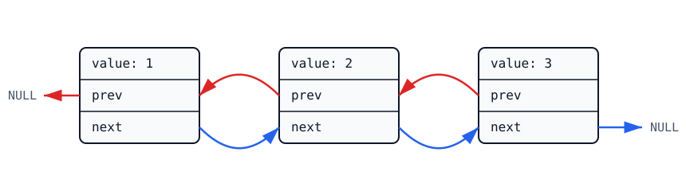
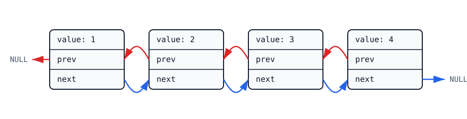
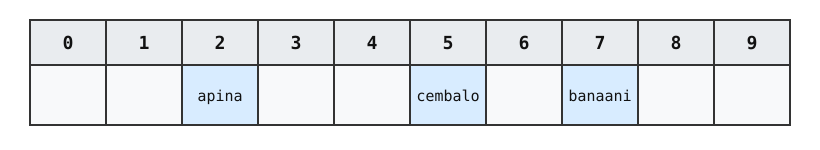

# 5. Tietorakenteet

C-kielen ainoa valmiina saatavilla oleva tietorakenne on taulukko. Kielen standardikirjastossa ei ole esimerkiksi listaa tai hajautustaulua, kuten monissa muissa ohjelmointikielissä. Kuitenkin taulukon ja dynaamisen muistinhallinnan avulla voi toteuttaa minkä tahansa tietorakenteen.

Tässä luvussa toteutamme C-kielellä kolme tietorakennetta: taulukkolistan, linkitetyn listan ja hajautustaulun. Nämä toteutukset tuovat esille tekniikoita, joita voidaan käyttää tietorakenteiden toteuttamisessa C-kielellä.

## Taulukkolista

_Taulukkolista_ (_array list_) on taulukon avulla toteutettu muuttuvan kokoinen listarakenne, jossa voi lisätä tehokkaasti uuden alkion listan loppuun. Taulukkolistaa voi käyttää esimerkiksi seuraavasti:

- Listan sisältö on alussa tyhjä.
- Lisätään listalle alkio 1, jolloin listan sisältö on [1].
- Lisätään listalle alkio 2, jolloin listan sisältö on [1, 2].
- Lisätään listalle alkio 3, jolloin listan sisältö on [1, 2, 3].
- Lisätään listalle alkio 4, jolloin listan sisältö on [1, 2, 3, 4].
- Lisätään listalle alkio 5, jolloin listan sisältö on [1, 2, 3, 4, 5].

Taulukkolista toteutetaan tallentamalla listan sisältö taulukkoon, jonka alkuosa sisältää listan alkiot ja loppuosassa on tilaa tuleville alkioille. Esimerkiksi seuraavassa kuvassa on taulukkolista, jonka sisältö on [1, 2, 3]. Lista on tallennettu taulukkoon, jossa on tilaa kaikkiaan neljälle alkiolle.


Lisätään nyt tälle listalle uusi alkio 4. Koska taulukossa on tilaa, uusi alkio voidaan tallentaa suoraan nykyiseen taulukkoon:


Lisätään sitten listalle vielä uusi alkio 5. Taulukko on tullut täyteen, minkä takia listalle tulee varata uusi suurempi taulukko ja kopioida siihen vanhan taulukon sisältö. Seuraavassa kuvassa on varattu uusi taulukko, johon mahtuu kahdeksan alkiota.


Taulukon suurentaminen on hidas operaatio, ja taulukkolistan tehokkuuden kannalta on oleellista, ettei tätä operaatiota tehdä liian usein. Käytämme tässä tavallista toteutusta, jossa taulukon koko _kaksinkertaistetaan_ uuden taulukon varaamisen yhteydessä. Tällöin listan suurentaminen tapahtuu riittävän harvoin ja alkioita on käytännössä tehokasta lisätä listan loppuun.

<div class="note" markdown="1">
Tarkemmin sanoen tässä toteutuksessa alkion lisäämisen _tasoitettu_ (_amortized_) aikavaativuus on O(1). Tämä tarkoittaa, että jos listaan lisätään yhteensä _n_ alkiota, kaikkien alkioiden lisääminen vie yhteensä aikaa O(_n_), vaikka yksittäiset lisäykset voivat olla hitaita taulukon suurentamisen takia.
</div>

### Tietorakenteen toteutus

Seuraava koodi toteuttaa taulukkolistan, johon tallennetaan `int`-tyyppisiä alkioita. Listan sisältö tallennetaan `ArrayList`-rakenteeseen, jonka kentät ovat:

- Kenttä `size` sisältää alkioiden määrän listassa.
- Kenttä `capacity` sisältää listan taustalla olevan taulukon koon.
- Kenttä `items` on osoitin muistialueelle, johon taulukko on tallennettu.

Listaa käsitellään seuraavilla funktioilla:

- Funktio `array_list_create` luo uuden listan ja varaa sille tilaa muistista. Lista on alussa tyhjä ja taulukossa on tilaa 4 alkiolle.
- Funktio `array_list_insert` lisää uuden alkion listan loppuun. Funktio kasvattaa taulukon kokoa, jos uusi alkio ei mahdu nykyiseen taulukkoon.
- Funktio `array_list_print` tulostaa listan sisällön.
- Funktio `array_list_free` vapauttaa listalle varatun muistin.

```c
typedef struct ArrayList ArrayList;

struct ArrayList {
    int size;
    int capacity;
    int *items;
};

ArrayList* array_list_create(void) {
    ArrayList *list = malloc(sizeof(ArrayList));
    list->size = 0;
    list->capacity = 4;
    list->items = malloc(sizeof(int) * list->capacity);
    return list;
}

void array_list_insert(ArrayList *list, int value) {
    if (list->capacity == list->size) {
        list->capacity *= 2;
        list->items = realloc(list->items, sizeof(int) * list->capacity);
    }
    list->items[list->size] = value;
    list->size++;
}

void array_list_print(ArrayList *list) {
    printf("[");
    for (int i = 0; i < list->size; i++) {
        if (i != 0) printf(", ");
        printf("%d", list->items[i]);
    }
    printf("]\n");
}

void array_list_free(ArrayList *list) {
    free(list->items);
    free(list);
}
```

<div class="note" markdown="1">
C-kieli ei ole olio-ohjelmointikieli, eikä ole esimerkiksi mahdollista määritellä luokkaa, jossa olisi tietorakenteen kentät ja metodit. Kuitenkin voimme yllä olevalla tavalla määritellä struct-tyypin ja funktiot sen käsittelemiseen. Tämä on melko lähellä olio-ohjelmoinnin luokan määrittelyä.
</div>

Seuraava koodi esittelee taulukkolistan käyttämistä:

```c
ArrayList *list = array_list_create();
for (int x = 1; x <= 10; x++) {
    array_list_insert(list, x);
    array_list_print(list);
}
array_list_free(list);
```

Koodi luo ensin tyhjän taulukkolistan ja sitten silmukan jokaisella kierroksella lisää listalle uuden alkion ja tulostaa listan sisällön. Lopuksi koodi vapauttaa listaa varten varatun muistin. Koodin tulostus on seuraava:

```console
[1]
[1, 2]
[1, 2, 3]
[1, 2, 3, 4]
[1, 2, 3, 4, 5]
[1, 2, 3, 4, 5, 6]
[1, 2, 3, 4, 5, 6, 7]
[1, 2, 3, 4, 5, 6, 7, 8]
[1, 2, 3, 4, 5, 6, 7, 8, 9]
[1, 2, 3, 4, 5, 6, 7, 8, 9, 10]
```

### Tietotyypin nimeäminen

Tietorakenteen toteutuksen alussa on seuraava `typedef`-komento:

```c
typedef struct ArrayList ArrayList;
```

Tämä tarkoittaa, että tietotyyppiin `struct ArrayList` voidaan viitata lyhyemmin nimellä `ArrayList`. Tämä on kätevää, koska tietotyypin nimi esiintyy koodissa usein ja on luontevampaa kirjoittaa `ArrayList` kuin `struct ArrayList`.

Voisimme myös yhdistää `typedef`-komennon ja `struct`-määrittelyn seuraavasti:

```c
typedef struct ArrayList {
    int size;
    int capacity;
    int *items;
} ArrayList;
```

Tämä koodi samaan aikaan määrittelee tietotyypin `struct ArrayList` ja antaa sille lyhyemmän nimen `ArrayList`.

### Taulukon suurentaminen

Seuraava koodi havaitsee tilanteen, jossa taulukko tulee täyteen, ja suurentaa taulukon koon kaksinkertaiseksi:

```c
if (list->capacity == list->size) {
    list->capacity *= 2;
    list->items = realloc(list->items, sizeof(int) * list->capacity);
}
```

Koodi käyttää kirjastofunktiota `realloc`, jonka avulla voi suurentaa aiemmin varattua muistialuetta. Funktiolle annetaan osoitin muistialueeseen ja haluttu uusi muistialueen koko. Funktio joko laajentaa nykyistä muistialuetta tai varaa uuden muistialueen ja kopioi nykyisen muistialueen sisällön sinne. Tämän jälkeen funktio palauttaa osoittimen laajennettuun muistialueeseen.

### Virheenkäsittely

Toteuttamamme tietorakenne on sinänsä toimiva, mutta listaa käsittelevissä funktioissa ei ole virheenkäsittelyä.

Tietorakenteen toteutuksessa on oletuksena, että funktiot `malloc` ja `realloc` saavat varmasti varattua annetun kokoisen muistialueen. Kuitenkin on mahdollista, ettei muistinvaraus onnistu ja funktiot palauttavat `NULL`-osoittimen.

Koodia voisi kehittää tarkastamalla eri kohdissa, ettei osoitin ole `NULL`-osoitin. Jos muistia ei voi varata, tietorakenne ei voi toimia halutulla tavalla, mutta koodi voisi ainakin antaa tästä selkeän virheviestin eikä kaatua oudosti.

## Linkitetty lista

_Linkitetty lista_ (_linked list_) on toinen listan toteuttava tietorakenne, jossa jokainen listan alkio tallennetaan muistiin erillisenä solmuna. Toisin kuin taulukkolistassa, linkitetyn listan alkiot eivät ole peräkkäin muistissa, vaan solmuissa on osoittimia, joiden avulla voidaan löytää seuraava tai edellinen solmu.

Seuraavassa kuvassa on esimerkkinä linkitetty lista, jonka sisältönä on [1, 2, 3]. Lista on kahteen suuntaan linkitetty, mikä tarkoittaa, että jokaisessa solmussa on osoitin sekä edelliseen (`prev`) että seuraavaan (`next`) solmuun.



Lisätään sitten listalle uusi alkio 4. Tästä alkiosta tulee uusi listan solmu, jolle varataan muistia. Lisäksi osoittimia päivitetään niin, että uusi solmu liittyy mukaan listaan oikealla tavalla.



Yleensä linkitetty lista toteutetaan niin, että tietorakenteessa on muistissa osoitin listan ensimmäiseen ja viimeiseen solmuun. Muihin solmuihin tulee kulkea askel kerrallaan lähtien listan alusta tai lopusta.

Linkitetyssä listassa alkion voi lisätä tehokkaasti mihin tahansa listan kohtaan, koska riittää varata muistia uudelle alkiolle ja päivittää osoittimet. Toisaalta on hidasta etsiä tietyssä kohdassa listaa oleva alkio, koska listan solmun sijaintia muistissa ei voi laskea tehokkaasti vaan tulee seurata osoittimia.

<div class="note" markdown="1">
Taulukkolistan ja linkitetyn listan keskeinen ero on siinä, että taulukkolistassa alkiot ovat peräkkäin muistissa, kun taas linkitetyssä listassa näin ei ole.

Taulukkolistassa voi laskea tehokkaasti minkä tahansa alkion sijainnin muistissa, koska alkiot ovat peräkkäin. Toisaalta listaa voi laajentaa tehokkaasti vain lopusta, jolloin olemassa olevia alkioita ei tarvitse yleensä siirtää muistissa.

Linkitetyssä listassa alkion sijainnin selvittäminen on hidasta, koska tulee seurata osoittimia solmusta toiseen listan alusta tai lopusta lähtien. Toisaalta uuden alkion voi lisätä tehokkaasti mihin tahansa listan kohtaan.

| Operaatio | Taulukkolista | Linkitetty lista |
| --- | --- | --- |
| Alkion haku indeksin perusteella | O(1) | O(_n_) |
| Alkion lisäys listan loppuun | O(1) | O(1) |
| Yleinen alkion lisäys listalle | O(_n_) | O(1) |

</div>

### Tietorakenteen toteutus

Seuraava koodi toteuttaa linkitetyn listan, johon tallennetaan `int`-tyyppisiä alkioita. Listan sisältö tallennetaan `LinkedList`-rakenteeseen, jonka kentät ovat:

- Kenttä `size` sisältää alkioiden määrän listassa.
- Kentät `first` ja `last` osoittavat listan ensimmäiseen ja viimeiseen solmuun.

Kukin listan solmu tallennetaan `ListNode`-rakenteeseen, jonka kentät ovat:

- Kenttä `value` sisältää solmussa olevan arvon.
- Kenttä `prev` on osoitin edelliseen solmuun listalla.
- Kenttä `next` on osoitin seuraavaan solmuun listalla.

Listaa käsitellään seuraavilla funktioilla:

- Funktio `linked_list_create` luo uuden listan ja varaa sille tilaa muistista. Lista on alussa tyhjä, eikä siinä ole yhtään solmua.
- Funktio `linked_list_insert` lisää uuden alkion listan loppuun. Funktio varaa muistia uudelle alkiolle ja päivittää osoittimia sopivasti.
- Funktio `linked_list_print` tulostaa listan sisällön.
- Funktio `linked_list_free` vapauttaa listalle varatun muistin.

```c
typedef struct ListNode ListNode;

struct ListNode {
    int value;
    ListNode *prev, *next;
};

typedef struct LinkedList LinkedList;

struct LinkedList {
    int size;
    ListNode *first, *last;
};

LinkedList* linked_list_create(void) {
    LinkedList *list = malloc(sizeof(LinkedList));
    list->size = 0;
    list->first = NULL;
    list->last = NULL;
    return list;
}

void linked_list_insert(LinkedList *list, int value) {
    ListNode *node = malloc(sizeof(ListNode));

    node->value = value;
    node->next = NULL;

    if (list->size == 0) {
        node->prev = NULL;
        list->first = node;
    } else {
        node->prev = list->last;
        list->last->next = node;
    }

    list->last = node;
    list->size++;
}

void linked_list_print(LinkedList *list) {
    printf("[");
    ListNode *node = list->first;
    int start = 1;
    while (node) {
        if (!start) printf(", ");
        start = 0;
        printf("%d", node->value);
        node = node->next;
    }
    printf("]\n");
}

void linked_list_free(LinkedList *list) {
    ListNode *node = list->first;
    while (node) {
        ListNode *next = node->next;
        free(node);
        node = next;
    }
    free(list);
}
```

Seuraava koodi esittelee tietorakenteen käyttämistä:

```c
LinkedList *list = linked_list_create();
for (int x = 1; x <= 10; x++) {
    linked_list_insert(list, x);
    linked_list_print(list);
}
linked_list_free(list);
```

Koodin tulostus on seuraava:

```console
[1]
[1, 2]
[1, 2, 3]
[1, 2, 3, 4]
[1, 2, 3, 4, 5]
[1, 2, 3, 4, 5, 6]
[1, 2, 3, 4, 5, 6, 7]
[1, 2, 3, 4, 5, 6, 7, 8]
[1, 2, 3, 4, 5, 6, 7, 8, 9]
[1, 2, 3, 4, 5, 6, 7, 8, 9, 10]
```

### Listalle lisääminen

Linkitetyn listan toteutuksen monimutkaisin funktio on `linked_list_insert`, joka lisää uuden alkion listan loppuun:

```c
void linked_list_insert(LinkedList *list, int value) {
    ListNode *node = malloc(sizeof(ListNode));

    node->value = value;
    node->next = NULL;

    if (list->size == 0) {
        node->prev = NULL;
        list->first = node;
    } else {
        node->prev = list->last;
        list->last->next = node;
    }

    list->last = node;
    list->size++;
}
```

Funktio varaa ensin muistia uudelle solmulle `node` ja päivittää sitten osoittimia niin, että uusi solmu liitetään listan loppuun:

- Uudella solmulla ei ole seuraavaa solmua (`node->next = NULL`).
- Jos uusi solmu lisätään tyhjälle listalle:
  - Uudella solmulla ei ole edellistä solmua (`node->prev = NULL`).
  - Uudesta solmusta tulee listan ensimmäinen solmu (`list->first = node`).
- Jos listalla on ennestään solmuja:
  - Uuden solmun edellinen solmu on aiempi listan viimeinen solmu (`node->prev = list->last`)
  - Aiemman listan viimeisen solmun seuraava solmu on uusi solmu (`list->last->next = node`).
- Uudesta solmusta tulee listan viimeinen solmu (`list->last = node`).

### Listan läpikäynti

Usein tarvittava tekniikka linkitetyn listan käsittelyssä on listan läpikäynti. Tässä linkitetyn listan toteutuksessa funktiot `linked_list_print` ja `linked_list_free` käyvät listan läpi alusta loppuun. Funktiot perustuvat seuraavaan logiikkaan:

```c
ListNode *node = list->first;
while (node) {
    // käsittele node
    node = node->next;
}
```

Tässä osoitin `node` viittaa aluksi listan ensimmäiseen solmuun. Silmukan ehto `node` tarkoittaa, että `node` on jotain muuta kuin `NULL`-osoitin eli se osoittaa johonkin listassa olevaan solmuun. Silmukan kierroksen päätteeksi `node = node->next` siirtyy listan seuraavaan solmuun.

Tällainen läpikäynti on tarpeen myös silloin, kun halutaan käsitellä tietyssä kohdassa listaa olevaa alkiota. Koska halutun solmun sijaintia muistissa ei voi päätellä ensimmäisen tai viimeisen solmun sijainnista, lista täytyy käydä läpi solmun löytämiseksi solmuissa olevia osoittimia seuraten.

## Hajautustaulu

_Hajautustaulu_ (_hash table_) on tietorakenne, jossa alkion sijainti lasketaan hajautusfunktion avulla. Esimerkiksi seuraavassa kuvassa on hajautustaulu, johon on tallennettu kolme merkkijonoa:



Tässä merkkijonojen hajautusarvot ovat:

- Merkkijonon `apina` hajautusarvo on 2
- Merkkijonon `banaani` hajautusarvo on 7
- Merkkijonon `cembalo` hajautusarvo on 5

Hajautustaulun toteutuksen haasteena ovat _törmäykset_, joissa kahdella eri alkiolla on sama hajautusarvo. Luomme tässä avointa hajautusta käyttävän hajautustaulun, jossa alkion paikka hajautustaulussa etsitään kokeilujonon avulla.

Hajautustaulun avulla voidaan pitää yllä alkioiden kokoelmaa, jossa pystyy tehokkaasti lisäämään alkion sekä etsimään alkiota. Kun hajautustaulun koko, hajautusfunktio ja kokeilujono on valittu sopivasti, alkioiden lisäykset ja haut ovat käytännössä O(1)-aikaisia.

<div class="note" markdown="1">
Hajautustaulu on monimutkaisempi tietorakenne kuin taulukkolista ja linkitetty lista, emmekä käsittele tässä tarkemmin hajautustaulun toimintaa ja aiheeseen liittyvää teoriaa. Tarkempaa tietoa hajautustaulusta on esimerkiksi kirjan [Tietorakenteet ja algoritmit](https://www.cs.helsinki.fi/u/ahslaaks/tirakirja/) luvussa 5.
</div>

### Tietorakenteen toteutus

Seuraava koodi toteuttaa hajautustaulun merkkijonojen tallentamista varten. Hajautustaulun sisältö tallennetaan `HashTable`-rakenteeseen, jonka kentät ovat:

- Kenttä `size` sisältää hajautustaulun taulukon koon
- Kenttä `array` on merkkijonotaulukko, joka sisältää hajautustaulun sisällön. Koska tyyppi `char*` tarkoittaa yhtä merkkijonoa, tyyppi `char**` tarkoittaa vastaavasti merkkijonojen taulukkoa.

Hajautustaulua käsitellään seuraavilla funktioilla:

- Funktio `hash_table_create` luo uuden hajautustaulun ja varaa sille tilaa muistista. Funktion parametrina annetaan hajautustaulun koko.
- Funktio `hash_value` laskee annetun merkkijonon hajautusarvon.
- Funktio `hash_table_insert` lisää merkkijonon hajautustauluun.
- Funktio `hash_table_contains` tarkastaa, onko hajautustaulussa merkkijonoa.
- Funktio `hash_table_free` vapauttaa hajautustaululle varatun muistin.

```c
typedef struct HashTable HashTable;

struct HashTable {
    int size;
    char **array;
};

HashTable* hash_table_create(int size) {
    HashTable *table = malloc(sizeof(HashTable));
    table->size = size;
    table->array = malloc(sizeof(char*) * table->size);

    for (int i = 0; i < table->size; i++) {
        table->array[i] = NULL;
    }

    return table;
}

unsigned long hash_value(const char *string) {
    unsigned long value = 0;
    for (int i = 0; string[i]; i++) {
        value = value * 41 + string[i];
    }
    return value;
}

void hash_table_insert(HashTable *table, const char *string) {
    int start = hash_value(string) % table->size;

    for (int i = 0; i < table->size; i++) {
        int pos = (start + i) % table->size;
        if (table->array[pos] == NULL) {
            table->array[pos] = strdup(string);
            return;
        }
        if (strcmp(table->array[pos], string) == 0) {
            return;
        }
    }
}

int hash_table_contains(HashTable *table, const char *string) {
    int start = hash_value(string) % table->size;

    for (int i = 0; i < table->size; i++) {
        int pos = (start + i) % table->size;
        if (table->array[pos] == NULL) {
            return 0;
        }
        if (strcmp(table->array[pos], string) == 0) {
            return 1;
        }
    }

    return 0;
}

void hash_table_free(HashTable *table) {
    for (int i = 0; i < table->size; i++) {
        free(table->array[i]);
    }
    free(table->array);
    free(table);
}
```

Seuraava koodi esittelee hajautustaulun käyttämistä:

```c
HashTable *table = hash_table_create(100);

hash_table_insert(table, "apina");
hash_table_insert(table, "banaani");
hash_table_insert(table, "cembalo");

printf("%d\n", hash_table_contains(table, "banaani")); // 1
printf("%d\n", hash_table_contains(table, "faarao")); // 0

hash_table_free(table);
```

Koodi luo hajautustaulun ja lisää sinne ensin merkkijonot "apina", "banaani" ja "cembalo". Tämän jälkeen koodi tarkastaa, ovatko merkkijonot "banaani" ja "faarao" hajautustaulussa.

### Hajautusarvon laskeminen

Merkkijonon hajautusarvo lasketaan seuraavasti:

```c
unsigned long value = 0;
for (int i = 0; string[i]; i++) {
    value = value * 41 + string[i];
}
```

<div class="note" markdown="1">
Tämä menetelmä on _polynominen hajautus_, joka on käytännössä hyvin toimiva tapa merkkijonon hajautusarvon laskemiseen. Javassa metodi `hashCode` laskee merkkijonon hajautusarvon juuri tällä tavalla, tosin kertoimella 31 eikä 41.
</div>

Hajautusarvo on siis `unsigned long` -tyyppinen luku, jonka arvo on summa merkkijonon merkkien koodeista tietyillä kertoimilla. Esimerkiksi merkkijonon "apina" hajautusarvo on

<center>97 &middot; 41<sup>4</sup> + 112 &middot; 41<sup>3</sup> + 105 &middot; 41<sup>2</sup> + 110 &middot; 41 + 97 = 281999081,</center>

kun merkkien koodit ovat seuraavat ASCII-koodit:

a | p | i | n | a
97 | 112 | 105 | 110 | 97

Huomaa, että kun käytetään `unsigned long` -tyyppiä, hajautusarvo lasketaan automaattisesti modulo 2<sup>_b_</sup>, missä _b_ on tyypin `long` bittien määrä. Tyypillisesti _b_ = 64, jolloin hajautusarvo lasketaan modulo 2<sup>64</sup>.

### Kokeilujono

Hajautustaulussa alkion paikka lasketaan kaavalla

```c
int pos = (start + i) % table->size;
```

missä `start` on hajautusarvon antama aloituskohta ja `i` on kokeilujonon kohta (0, 1, 2, jne.). Tätä kokeilujonoa kutsutaan _lineaariseksi_ kokeilujonoksi.

Kun funktio `hash_table_insert` lisää alkion hajautustauluun, alkion kohdaksi tulee ensimmäinen kokeilujonon antama kohta, jossa ei ole vielä alkiota. Jos alkio on jo lisätty hajautustauluun, samaa alkiota ei lisätä uudestaan. Jos koko hajautustaulu on täynnä eikä alkio mahdu hajautustauluun, alkiota ei myöskään lisätä.

Kun funktio `hash_table_contains` etsii alkiota hajautustaulusta, alkiota etsitään kokeilujonon antamista kohdista. Jos alkio löytyy, funktio palauttaa arvon 1. Jos tulee vastaan tyhjä kohta tai koko hajautustaulu käydään läpi, alkiota ei löytynyt ja funktio palauttaa arvon 0.

### Merkkijonon kopiointi

Funktiossa `hash_table_insert` merkkijonosta tehdään kopio standardikirjaston funktiolla `strdup`. Tämä funktio varaa merkkijonolle tilaa keosta, minkä ansiosta merkkijonon voi tallentaa pysyvästi hajautustauluun. Merkkijonolle varattu tila tulee vapauttaa kutsumalla `free`-funktiota.

Merkkijonon kopiointi on tässä tärkeää, koska muuten funktiolle annettu osoitin merkkijonoon voisi esimerkiksi viitata muistialueelle, joka ei ole käytössä myöhemmässä vaiheessa ohjelman suorituksessa.

## Yleiskäyttöiset tietorakenteet

Tietorakenteen toteutus on hyödyllisimmillään silloin, kun se on _yleiskäyttöinen_ eli sitä voidaan käyttää minkä tahansa tyyppisten alkioiden kanssa. Tässä luvussa olemme toteuttaneet tietorakenteita, joissa näin ei ole vaan tietorakenteen toteutuksessa on valittu kiinteä alkion tyyppi.

Esimerkiksi C++:ssa taulukkolistan toteuttavaa tietorakennetta `vector` voidaan käyttää `int`-tyypin kanssa muodossa `vector<int>` ja `double`-tyypin kanssa muodossa `vector<double>`. C++:ssa tällainen tietorakenne voidaan toteuttaa template-tekniikan avulla, joka ei kuitenkaan ole käytettävissä C:ssä.

Tutustumme seuraavaksi kahteen lähestymistapaan, joiden avulla C:ssä pystyy toteuttamaan yleiskäyttöisen tietorakenteen. Toteutamme esimerkkinä taulukkolistan, johon voi tallentaa minkä tahansa tyyppisiä alkioita.

### Toteutus void-osoittimilla

Seuraavassa toteutuksessa listan alkiot tallennetaan muistialueelle, johon viitataan `void`-osoittimella. Tämä tarkoittaa, ettei osoittimen tyyppiä ole määritelty vaan muistialueella voi olla vaihtelevan tyyppistä tietoa.

Tietorakenteen kenttä `item_size` kertoo, kuinka suuri kukin listan alkio on. Esimerkiksi kun listalle tallennetaan `int`-lukuja, `item_size` saa arvon `sizeof(int)`. Tämän kentän avulla tiedetään, paljonko muistia listalle tulee varata ja missä kohdissa muistissa listan alkiot sijaitsevat.

```c
typedef struct ArrayList ArrayList;

struct ArrayList {
    int size;
    int capacity;
    size_t item_size;
    void *items;
};

ArrayList* array_list_create(size_t item_size) {
    ArrayList *list = malloc(sizeof(ArrayList));
    list->size = 0;
    list->capacity = 4;
    list->item_size = item_size;
    list->items = malloc(list->item_size * list->capacity);
    return list;
}

void array_list_insert(ArrayList *list, void *value) {
    if (list->capacity == list->size) {
        list->capacity *= 2;
        list->items = realloc(list->items, list->item_size * list->capacity);
    }
    void *item = (char*)list->items + (list->size * list->item_size);
    memcpy(item, value, list->item_size);
    list->size++;
}

void* array_list_get(ArrayList *list, int pos) {
    void *item = (char*)list->items + (pos * list->item_size);
    return item;
}

void array_list_free(ArrayList *list) {
    free(list->items);
    free(list);
}
```

Tietorakennetta voi käyttää näin:

```c
ArrayList *list = array_list_create(sizeof(int));

for (int x = 1; x <= 10; x++) {
    array_list_insert(list, &x);
}

for (int i = 0; i < list->size; i++) {
    printf("%d ", *(int*)array_list_get(list, i));
}
printf("\n");

array_list_free(list);
```

Koodin tulostus on seuraava:

```console
1 2 3 4 5 6 7 8 9 10
```

Verrattuna aiempaan taulukkolistan toteutukseen tässä on seuraavat tietorakenteen käyttämiseen liittyvät erot:

- Tietorakenteen luonnissa funktiolle `array_list_create` annetaan parametrina listan alkion koko.
- Kun alkio lisätään listalle funktiolla `array_list_insert`, parametrina annetaan `void`-osoitin alkioon eikä suoraan alkion arvoa. Alkion sisältö kopioidaan listan muistialueelle `memcpy`-funktiolla.
- Alkio haetaan listalta funktiolla `array_list_get`, joka palauttaa `void`-osoittimen halutussa kohdassa listalla olevaan alkioon.

Funktio `array_list_get` laskee alkion sijainnin muistissa seuraavasti:

```c
void *item = (char*)list->items + (pos * list->item_size);
```

Tässä `pos` on alkion indeksi listassa ja `list->item_size` on yksittäisen alkion koko. Laskussa käytetään väliaikaisesti `char`-osoitinta, joka osoittaa yhden tavun kokoiseen alkioon, jotta osoitinaritmetiikka toimii oikein.

<div class="note" markdown="1">
Myös seuraava lyhyempi lauseke _saattaa_ toimia:

```c
void *item = list->items + (pos * list->item_size);
```

Tässä käytetään `void`-osoitinta sellaisenaan `char`-osoittimen sijasta. Tämä toimii ainakin `gcc`-kääntäjässä, mutta C-standardi ei salli osoitinaritmetiikkaa `void`-osoittimilla. Tällainen lauseke _ei_ ole siis sallittu C-standardin mukaan eikä voi olettaa, että se toimii eri C-toteutuksissa.
</div>

Tietorakenteen muistialueen esittäminen `void`-osoittimella on kätevä tekniikka, jota on käytetty myös C:n standardikirjaston funktioissa `qsort` ja `bsearch`. Huonona puolena kuitenkin on, ettei alkioiden tyyppejä esitetä koodissa tarkasti, kun alkioita käsitellään `void`-osoittimien kautta.

### Toteutus makron avulla

Toinen lähestymistapa yleiskäyttöisen tietorakenteen toteuttamiseen on käyttää esikääntäjän makroa, joka luo tietorakenteen halutulle tyypille. Seuraava makro `DEFINE_ARRAYLIST` luo taulukkolistan toteutuksen seuraavilla parametreilla:

- `NAME` on listatyypin nimi (esimerkiksi `IntArrayList`)
- `TYPE` on listan alkion tyyppi (esimerkiksi `int`)
- `FORMAT` on alkion formaatti tulostamisessa (esimerkiksi `"%d"`)

Makro perustuu koodipohjaan, johon täydennetään parametrit `NAME`, `TYPE` ja `FORMAT` oikeisiin kohtiin. Koska makro muodostuu useasta rivistä, kunkin rivin perässä merkki `\` tarkoittaa, että makro jatkuu seuraavalla rivillä.

```c
#define DEFINE_ARRAYLIST(NAME, TYPE, FORMAT)                               \
typedef struct NAME NAME;                                                  \
                                                                           \
struct NAME {                                                              \
    int size;                                                              \
    int capacity;                                                          \
    TYPE *items;                                                           \
};                                                                         \
                                                                           \
NAME* TYPE##_array_list_create(void) {                                     \
    NAME *list = malloc(sizeof(NAME));                                     \
    list->size = 0;                                                        \
    list->capacity = 4;                                                    \
    list->items = malloc(sizeof(TYPE) * list->capacity);                   \
    return list;                                                           \
}                                                                          \
                                                                           \
void TYPE##_array_list_insert(NAME *list, TYPE value) {                    \
    if (list->capacity == list->size) {                                    \
        list->capacity *= 2;                                               \
        list->items = realloc(list->items, sizeof(TYPE) * list->capacity); \
    }                                                                      \
    list->items[list->size] = value;                                       \
    list->size++;                                                          \
}                                                                          \
                                                                           \
void TYPE##_array_list_print(NAME *list) {                                 \
    printf("[");                                                           \
    for (int i = 0; i < list->size; i++) {                                 \
        if (i != 0) printf(", ");                                          \
        printf(FORMAT, list->items[i]);                                    \
    }                                                                      \
    printf("]\n");                                                         \
}                                                                          \
                                                                           \
void TYPE##_array_list_free(NAME *list) {                                  \
    free(list->items);                                                     \
    free(list);                                                            \
}
```

Makrolla voi luoda tietorakenteen esimerkiksi seuraavasti:

```c
DEFINE_ARRAYLIST(IntArrayList, int, "%d")
```

Tämän jälkeen tietorakennetta voi käyttää koodissa näin:

```c
IntArrayList *list = int_array_list_create();
for (int x = 1; x <= 10; x++) {
    int_array_list_insert(list, x);
    int_array_list_print(list);
}
int_array_list_free(list);
```

Tällaisen makrototeutuksen etuna on, että alkioiden tyypit merkitään tarkasti tietorakenteen toteutuksessa. Esimerkiksi funktion `int_array_list_insert` toteutus näyttää seuraavalta:

```c
void int_array_list_insert(IntArrayList *list, int value) {
    if (list->capacity == list->size) {
        list->capacity *= 2;
        list->items = realloc(list->items, sizeof(int) * list->capacity);
    }
    list->items[list->size] = value;
    list->size++;
}
```

Tässä funktion parametrina on `int value` eli listalle lisättävä alkio tulee antaa `int`-tyyppisenä.

Makrototeutuksen huonona puolena on, että on melko vaivalloista esittää pitkä koodi makrona ja kehittää makromuodossa olevaa koodia.

## Liukuvan ikkunan minimi (osa 1)

C-kieli eroaa useista ohjelmointikielistä siinä, ettei sen standardikirjastossa ole kokoelmaa valmiita tietorakenteiden toteutuksia. Esimerkiksi C++:ssa, Javassa ja Pythonissa ohjelmoija on tottunut siihen, että erilaisia tietorakenteita on helposti saatavilla valmiina toteutuksina.

<div class="note" markdown="1">
Asiaa voi myös ajatella niin, että on moderni idea sisällyttää tietorakenteita ohjelmointikielen standardikirjastoon. Kun C-kieli kehitettiin 1970-luvun alussa, muissakaan sen ajan ohjelmointikielissä (kuten Fortranissa ja Pascalissa) ei ollut saatavilla valmiiden tietorakenteiden kokoelmaa.
</div>

Toisaalta valmiin tietorakenteen käyttäminen on usein matalan tason näkökulmasta tarpeettoman monimutkaista ja raskasta. Esimerkiksi yksinkertaiset taulukkoon perustuvat tietorakenteet soveltuvat yllättävän moniin tilanteisiin, kunhan niitä osaa käyttää oikealla tavalla.

Tarkastellaan seuraavaksi _liukuvan ikkunan minimin_ laskemista aineistolle, jossa on _n_ kokonaislukua. Liukuva ikkuna muodostuu _m_ peräkkäisestä luvusta ja kulkee vasemmalta oikealle aineistossa. Jokaisessa ikkunan kohdassa tehtävänä on ilmoittaa pienin ikkunan alueella oleva luku.

Esimerkiksi aineistolla [2, 1, 5, 7, 3, 4, 2, 6] (_n_ = 8) ja ikkunan koolla _m_ = 3 haluttu tulos on [1, 1, 3, 3, 2, 2], koska ikkunan sisällöt ja minimit ovat seuraavat:

- [2, 1, 5] → minimi 1
- [1, 5, 7] → minimi 1
- [5, 7, 3] → minimi 3
- [7, 3, 4] → minimi 3
- [3, 4, 2] → minimi 2
- [4, 2, 6] → minimi 2

### Toteutus 1 (C++:n multiset)

Yksi tehokas tapa laskea liukuvan ikkunan minimi on käyttää tietorakennetta, joka pitää yllä joukkoa ikkunassa olevista luvuista ja tarjoaa operaation, jolla voi selvittää pienimmän luvun. Koska sama luku voi esiintyä ikkunassa useita kertoja, tietorakenteen täytyy sallia saman luvun toistuvat esiintymiset.

C++:ssa voisimme käyttää `multiset`-tietorakennetta, joka sopii hyvin tähän tarkoitukseen. Se pitää yllä järjestettyä alkiojoukkoa, jossa sama alkio voi esiintyä useita kertoja. Voimme lisätä ja poistaa alkion sekä etsiä pienimmän alkion niin, että kukin operaatio vie aikaa O(log _n_).

Seuraavassa on C++-toteutus, joka lukee aineistossa olevat luvut ja ikkunan koon ja tulostaa kunkin ikkunan minimin vasemmalta oikealle:

```cpp
#include <iostream>
#include <set>
#include <vector>

int main() {
    int n, m;
    std::cin >> n >> m;

    std::vector<int> data(n);
    for (int i = 0; i < n; i++) {
        std::cin >> data[i];
    }

    std::multiset<int> window;
    for (int i = 0; i < m - 1; i++) {
        window.insert(data[i]);
    }

    std::vector<int> minima(n - m + 1);
    for (int i = m - 1; i < n; i++) {
        window.insert(data[i]);
        minima[i - (m - 1)] = *window.begin();
        window.erase(window.find(data[i - m + 1]));
    }

    for (int i = 0; i < n - m + 1; i++) {
        std::cout << minima[i] << "\n";
    }
}
```

Koodia voisi käyttää esimerkiksi seuraavasti:

```console
$ ./find_minima
8 3
2 1 5 7 3 4 2 6
1
1
3
3
2
2
```

Tämän algoritmin aikavaativuus on O(_n_ log _n_), koska jokainen aineiston luku lisätään ikkunaan ja poistetaan ikkunasta enintään kerran.

### Toteutus 2 (oma tietorakenne)

C++:n tietorakenne `multiset` on ohjelmoijalle helposti käytettävissä, mutta sen sisäinen toteutus perustuu tasapainoiseen binäärihakupuuhun ja on varsin monimutkainen. Vaikka `multiset` tarjoaa O(log _n_)-aikaiset operaatiot, nämä operaatiot ovat melko raskaita.

Osoittautuu, että voimme laskea liukuvan ikkunan minimit paljon kevyemmin käyttämällä tietorakennetta, joka sisältää nousevan listan ikkunan alueella olevista luvuista. Listan ensimmäinen luku on ikkunan pienin luku, seuraava luku on pienin luku tämän luvun jälkeen, jne.

Esimerkiksi kun ikkunan sisältö on [3, 4, 1, 5, 3, 6, 4, 5], listan sisältö on [1, 3, 4, 5]. Listan ensimmäinen luku kertoo ikkunan pienimmän luvun, ja seuraavat luvut ovat mahdollisia tulevia pienimpiä lukuja ikkunan liikkumisen jälkeen. Pystymme päivittämään listaa näin ikkunan liikkuessa:

- Kun ikkunan oikeaan reunaan lisätään luku _x_, listan lopusta poistetaan kaikki luvut, jotka ovat suurempia tai yhtä suuria kuin luku _x_. Tämän jälkeen luku _x_ lisätään listan loppuun.

- Kun ikkunan vasemmasta reunasta poistetaan luku, se poistetaan myös listan alusta, jos se on vielä listalla.

Voimme toteuttaa tämän algoritmin tehokkaasti deque-rakenteella, jonka avulla voimme lisätä luvun listan loppuun tehokkaasti sekä poistaa luvun sekä listan alusta että lopusta tehokkaasti.

Seuraavassa C-toteutuksessa `deque` on listan sisältävä taulukko. Muuttujat `left` ja `right` osoittavat listan ensimmäisen ja viimeisen alkion kohdan taulukossa `deque`. Taulukko `deque` sisältää alkioiden indeksejä taulukossa `data`, minkä ansiosta voimme havaita tilanteen, kun listan ensimmäinen alkio poistuu ikkunan alueelta.

```c
#include <stdio.h>
#include <stdlib.h>

int main(void) {
    int n, m;
    scanf("%d %d", &n, &m);

    int *data = malloc(sizeof(int) * n);
    for (int i = 0; i < n; i++) {
        scanf("%d", &data[i]);
    }

    int *deque = malloc(sizeof(int) * n);
    int *minima = malloc(sizeof(int) * (n - m + 1));
    int left = 0, right = -1;
    for (int i = 0; i < n; i++) {
        if (i - deque[left] == m) left++;
        while (left <= right && data[deque[right]] >= data[i]) {
            right--;
        }
        deque[++right] = i;
        if (i >= m - 1) {
            minima[i - (m - 1)] = data[deque[left]];
        }
    }

    for (int i = 0; i < n - m + 1; i++) {
        printf("%d\n", minima[i]);
    }

    free(data);
    free(deque);
    free(minima);
}
```

Tällainen tietorakenne on huomattavasti kevyempi kuin C++:n tietorakenteen `multiset` taustalla oleva toteutus. Toteutuksen aikavaativuus on O(_n_), koska alkion lisääminen ja poistaminen vie aikaa O(1).

### Tehokkuusvertailu

Tutkitaan nyt tarkemmin näiden toteutusten tehokkuutta suurella aineistolla, joka on muodostettu seuraavasti:

- Lukujen määrä _n_ on 10<sup>7</sup>
- Jokainen luku on satunnainen kokonaisluku välillä 1...10<sup>9</sup>
- Ikkunan koko _m_ on 10<sup>6</sup>

Vertailua varten käännetään molemmat ohjelmat samaan tapaan käyttäen kääntäjän optimointilippua `-O2`:

```console
$ g++ window_multiset.cpp -o window_multiset -O2
```

```console
$ gcc window_deque.c -o window_deque -O2
```

<div class="note" markdown="1">
Lippu `-O2` ohjeistaa kääntäjää tekemään koodiin erilaisia optimointeja käännösprosessin aikana. Käännös kannattaa tehdä optimoidusti aina, kun ohjelman suoritusajalla on merkitystä. Tutustumme myöhemmin kurssilla tarkemmin kääntäjän tekemiin optimointeihin.
</div>

Tämän jälkeen mitataan kummankin ohjelman suoritusaika seuraavasti:

```console
$ time ./window_multiset < window.in > window.out1
```

```console
$ time ./window_deque < window.in > window.out2
```

Nämä komennot muodostuvat seuraavista osista:

- Komento `time` mittaa ohjelman suoritusajan ja ilmoittaa sen ohjelman suorituksen jälkeen.
- Tiedosto `window.in` sisältää testiaineiston, jonka ohjelma lukee syötteenä.
- Ohjelmien tulostukset menevät tiedostoihin `window.out1` ja `window.out2`.

Ohjelmien suorituksen jälkeen on vielä kätevää tarkastaa komennolla `diff`, että ohjelmat tuottivat saman tuloksen:

```console
$ diff window.out1 window.out2
```

Tässä tapauksessa `diff` ei näytä eroja tiedostoissa, mikä viittaa siihen, että ohjelmat toimivat oikein (tai samalla tavalla väärin, mikä olisi yllättävää).

Ohjelmien suoritusajat testikoneella ovat:

- Toteutus 1 vie aikaa 45.9 sekuntia.
- Toteutus 2 vie aikaa 2.1 sekuntia.

Toteutus 2 on selvästi tehokkaampi, kuten oli odotettuakin. Toteutuksen 1 taustalla on raskas tietorakenne, jonka operaatiot vievät aikaa O(log _n_), kun taas toteutuksen 2 taustalla on kevyt tietorakenne, jonka operaatiot vievät aikaa O(1).

<div class="note" markdown="1">
Toteutus 2 on varsin nopea, koska se käsittelee suuren aineiston 2.1 sekunnissa. Tämä ei kuitenkaan tarkoita, ettei sitä voisi tehostaa enemmän. Palaamme asiaan luvussa 8, jossa koetamme tehostaa koodia matalan tason optimoinneilla.
</div>
