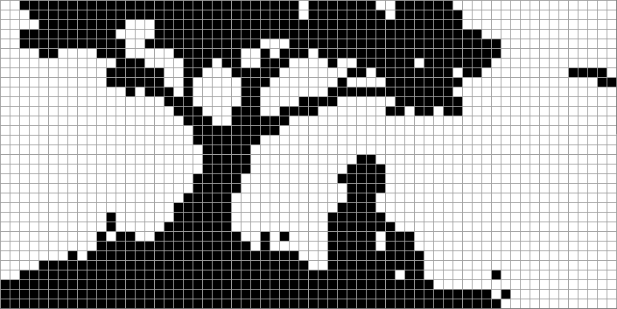

# 6. Tiedostot

## Tiedostojen yleiskuva

Tavallinen tapa käsitellä tiedostoja C-kielessä on käyttää standardikirjaston otsikkotiedostossa `stdio.h` olevia tiedostofunktioita. Tiedoston käsittely muodostuu seuraavista vaiheista:

1. Tiedosto avataan funktiolla `fopen` käsittelyä varten. Funktiolle annetaan tiedoston nimi ja käsittelytapa.
2. Tiedostosta luetaan tietoa tai siihen kirjoitetaan tietoa standardikirjaston funktioilla.
3. Tiedosto suljetaan funktiolla `fclose`, joka lopettaa tiedoston käsittelyn.

Tavalliset tiedoston käsittelytavat ovat:

- `"r"` (_read_): tiedoston lukeminen
- `"w"` (_write_): tiedoston kirjoitus (alkuun)
- `"a"` (_append_): tiedoston kirjoitus (loppuun)

Jos tiedostoon kirjoitetaan tietoa eikä tiedostoa ole olemassa valmiina, uusi tiedosto luodaan automaattisesti.

Käsittelytavoissa `"w"` ja `"a"` erona on, että jos tiedosto on olemassa valmiiksi, `"w"` tyhjentää tiedoston ja kirjoittaa tietoa tiedoston alkuun, kun taas `"a"` ei tyhjennä tiedostoa vaan kirjoittaa tietoa olemassa olevan tiedon perään.

### Tiedoston luku ja kirjoitus

Yksi tapa lukea ja kirjoittaa tiedostoja on käyttää funktioita `fscanf` ja `fprintf`, jotka toimivat samaan tapaan kuin ennestään tutut funktiot `scanf` ja `printf`.

Tarkastellaan esimerkkinä tiedostoa `primes.txt`, joka sisältää ensimmäiset alkuluvut:

```
2 3 5 7 11 13 17 19 23 29 31 37 41 43 47
53 59 61 67 71 73 79 83 89 97
```

Seuraava koodi lukee luvut tiedostosta ja näyttää luetut luvut sekä niiden yhteismäärän:

```c
FILE *file = fopen("primes.txt", "r");

int prime;
int count = 0;
while (fscanf(file, "%d", &prime) == 1) {
    printf("%d ", prime);
    count++;
}
printf("\nTotal count: %d\n", count);

fclose(file);
```

Koodin tulostus on seuraava:

```console
2 3 5 7 11 13 17 19 23 29 31 37 41 43 47 53 59 61 67 71 73 79 83 89 97
Total count: 25
```

Tyyppi `FILE` tarkoittaa osoitinta, joka viittaa avattuun tiedostoon. Yllä olevassa koodissa osoitin tallennetaan muuttujaan `file` ja sen avulla funktioissa `fscanf` ja `fclose` viitataan avattuun tiedostoon.

Funktion `fscanf` palautusarvo kertoo, montako arvoa funktio luki tiedostosta. Tässä tapauksessa funktiolla luetaan yksi luku (`%d`), joten palautusarvo 1 kertoo, että funktio luki halutusti yhden luvun tiedostosta. Kun tiedoston loppu on saavutettu, funktio ei enää pysty lukemaan lukua ja silmukka päättyy.

<div class="note" markdown="1">
Tiedoston lukemisessa `fscanf`-funktiolla on kätevää, että luettavat tiedot voi erotella vapaasti tyhjän tilan avulla. Esimerkiksi äskeinen tiedosto sisältää luvut kahdella rivillä välilyönnein erotettuina.
</div>

Tiedostoon kirjoittaminen tapahtuu vastaavalla tavalla. Esimerkiksi seuraava koodi tulostaa tiedostoon kertotaulun:

```c
FILE *file = fopen("table.txt", "w");

int n = 10;
for (int i = 1; i <= n; i++) {
    for (int j = 1; j <= n; j++) {
        fprintf(file, "%4d", i * j);
    }
    fprintf(file, "\n");
}

fclose(file);
```

Koodi luo seuraavan tiedoston `table.txt`:

```
   1   2   3   4   5   6   7   8   9  10
   2   4   6   8  10  12  14  16  18  20
   3   6   9  12  15  18  21  24  27  30
   4   8  12  16  20  24  28  32  36  40
   5  10  15  20  25  30  35  40  45  50
   6  12  18  24  30  36  42  48  54  60
   7  14  21  28  35  42  49  56  63  70
   8  16  24  32  40  48  56  64  72  80
   9  18  27  36  45  54  63  72  81  90
  10  20  30  40  50  60  70  80  90 100
```

Funktiossa `fprintf` merkintä `%4d` tarkoittaa, että luku tulostetaan neljän merkin levyisenä tasattuna oikealle. Tämän ansiosta luvut tulostetaan kertotaulun muotoon niin, että luvut ovat samoissa kohdissa eri riveillä.

### Rivin lukeminen tiedostosta

Usein on mielekästä lukea tiedostosta tietoa rivi kerrallaan. Tähän voidaan käyttää funktiota `fgets`, joka lukee tiedoston seuraavan rivin sisällön muistiin.

Tarkastellaan esimerkkinä tiedostoa `aybabtu.txt`:

```
Operator: Main screen turn on.
Captain: It's you !!
CATS: How are you gentlemen !!
CATS: All your base are belong to us.
```

Seuraava koodi lukee ja näyttää tiedoston rivien sisällön:

```c
FILE *file = fopen("aybabtu.txt", "r");

char buffer[128];
int count = 0;

while (fgets(buffer, sizeof(buffer), file) != NULL) {
    count++;
    printf("%d: %s", count, buffer);
}

fclose(file);
```

Koodi tulostaa tiedoston sisällön näin:

```console
1: Operator: Main screen turn on.
2: Captain: It's you !!
3: CATS: How are you gentlemen !!
4: CATS: All your base are belong to us.
```

Funktiolle `fgets` annetaan osoitin muistialueeseen, luettavan tiedon maksimimäärä tavuina (mukaan lukien merkkijonon nollatavu) sekä tiedosto-osoitin. Kun tiedosto on luettu loppuun, funktio palauttaa `NULL`-osoittimen ja silmukka päättyy.

Taulukko `buffer` on puskuri, johon kukin tiedoston rivi luetaan yksi kerrallaan. Funktio `fgets` varmistaa, että taulukkoon kirjoitetaan enintään `sizeof(buffer)` tavua eli tässä tapauksessa 128 tavua. Koodissa on siis oletuksena, että luettavan rivin pituus on korkeintaan 128 tavua (mukaan lukien merkkijonon nollatavu).

<div class="note" markdown="1">
Jos tiedoston rivi on pidempi kuin annettu maksimipituus, funktio `fgets` lukee rivin useassa osassa. Voimme tutkia asiaa muuttamalla taulukon `buffer` kokoa. Esimerkiksi jos kooksi muutetaan 8, koodin tulostus on seuraava:

```
1: Operato2: r: Main3:  screen4:  turn o5: n.
6: Captain7: : It's 8: you !!
9: CATS: H10: ow are 11: you gen12: tlemen 13: !!
14: CATS: A15: ll your16:  base a17: re belo18: ng to u19: s.
```

Tässä jokainen `fgets`-kutsu lukee joko riviä eteenpäin 7 merkkiä tai rivin loppuun asti, riippuen kumpi tulee vastaan aiemmin.
</div>

### Tiedostot virtoina

C-kielen ajattelutapa on, että tiedostoa käsitellään _virtana_ (_stream_), jonka kautta voi lukea tai kirjoittaa tietoa. Yleisemmin tiedoston kaltaisesti voidaan käsitellä muutakin tietoa, kuten käyttäjän kirjoittamaa tai käyttäjälle tulostettavaa tietoa.

Tiedostofunktioiden kanssa voidaan käyttää kolmea erityistä virtaa:

- Standardisyötevirta `stdin` tarkoittaa yleensä käyttäjän kirjoittamaa tietoa.
- Standarditulostevirta `stdout` tarkoittaa yleensä käyttäjälle tulostettavaa tietoa.
- Standardivirhevirta `stderr` tarkoittaa virheviestejä sisältävää tietoa, joka myös yleensä tulostetaan käyttäjälle.

Esimerkiksi seuraavat koodit tarkoittavat samaa:

```c
printf("Heipparallaa!");
```

```c
fprintf(stdout, "Heipparallaa!");
```

Voidaankin ajatella, että funktiot `scanf` ja `printf` ovat lyhempiä tapoja kutsua funktioita `fscanf` ja `fprintf` virtojen `stdin` ja `stdout` kanssa.

Erityisen kätevää on käyttää virtaa `stdin` funktion `fgets` kanssa, joka lukee rivin tiedostosta. Seuraava koodi lukee rivin käyttäjältä puskuriin `buffer`:

```c
fgets(buffer, sizeof(buffer), stdin);
```

Funktio `fgets` on tässä hyödyllinen, koska sen avulla pystyy lukemaan rivin käyttäjältä maksimipituuden kanssa. Tämä eroaa funktiosta `gets`, joka on varsinainen funktio rivin lukemiseen käyttäjältä, mutta funktio lukee rivin käyttäjältä ilman maksimipituutta. Tämän takia funktiota `gets` ei kannata käyttää missään tilanteessa puskuriylivuodon riskin takia.

<div class="note" markdown="1">

Standardivirtojen lähdettä ja kohdetta voi muuttaa esimerkiksi ohjelman käynnistyskomennossa. Seuraava komento käynnistää ohjelman niin, että `stdin` tulee tiedostosta `input.txt` ja `stdout` menee tiedostoon `output.txt`:

```console
$ ./test < input.txt > output.txt
```

Seuraava komento puolestaan käynnistää ohjelman niin, että `stderr` menee tiedostoon `errors.txt`:

```console
$ ./test 2> errors.txt
```

</div>

### Virhetilanteet

Tiedoston käsittelyssä voi esiintyä erilaisia virhetilanteita, kuten että ohjelma yrittää lukea tietoa tiedostosta, jota ei ole olemassa. Tällaisia tilanteita voi havaita tutkimalla tiedostofunktioiden palautusarvoja.

Funktio `fopen` palauttaa tiedosto-osoittimen sijasta arvon `NULL`, jos tiedoston avaaminen ei onnistunut. Seuraava koodi havaitsee tilanteen:

```c
FILE *file = fopen("test.txt", "r");
if (file == NULL) {
    printf("Can't read the file\n");
}
```

Funktio `fscanf` palauttaa luettujen arvojen määrän tai erityisen negatiivisen arvon `EOF`, joka ilmaisee tiedoston loppumisen. Seuraava koodi esittelee asiaa:

```c
while (1) {
    int number;
    int res = fscanf(file, "%d", &number);
    printf("Return value %d\n", res);
    if (res == 1) {
        printf("Number %d read\n", number);
    } else {
        break;
    }
}
```

Kun tiedoston sisältönä on `1 2`, silmukka päättyy tiedoston loppumiseen:

```console
Return value 1
Number 1 read
Return value 1
Number 2 read
Return value -1
```

<div class="note" markdown="1">
C-standardi määrittelee, että vakio `EOF` on jokin negatiivinen kokonaisluku. Tavallisesti esimerkiksi Linuxissa vakio on –1, kuten yllä olevassa tulostuksessa.
</div>

Kun tiedoston sisältönä on `1 2 x`, silmukka päättyy tiedostossa olevaan merkkiin `x`, jota ei voida tulkita luvuksi:

```console
Return value 1
Number 1 read
Return value 1
Number 2 read
Return value 0
```

Funktio `fgets` palauttaa `NULL`-osoittimen, jos tiedostosta ei voida lukea riviä. Tämä voi johtua tiedoston loppumisesta tai jostain muusta virheestä. Asiaa voidaan tutkia tarkemmin funktoilla `feof` ja `ferror`:

```c
char *res = fgets(buffer, sizeof(buffer), file);
if (res == NULL) {
    if (feof(file)) {
        printf("End of file reached\n");
    }
    if (ferror(file)) {
        printf("Error when reading the file\n");
    }
}
```

## Tiedoston tavusisältö

Jokaisen tiedoston sisältö matalalla tasolla on jono peräkkäisiä tavuja. Tiedoston sisältöä voi siis ajatella samalla tavalla kuin tietokoneen muistin sisältöä. Tiedoston formaatista riippuu, miten tiedostossa olevat tavut tulkitaan.

Tarkastellaan esimerkiksi seuraavaa tiedostoa `aybabtu.txt`:

```
Operator: Main screen turn on.
Captain: It's you !!
CATS: How are you gentlemen !!
CATS: All your base are belong to us.
```

Tämä tiedosto on _tekstitiedosto_ eli se muodostuu riveistä, jotka sisältävät merkkejä. Matalalla tasolla tiedostossa on tavuja, jotka vastaavat tulostettavia merkkejä sekä rivinvaihtoja ja muita ohjausmerkkejä.

Voimme tutkia Linuxissa tiedoston sisältöä tavumuodossa esimerkiksi `xxd`-komennolla seuraavasti:

```console
$ xxd aybabtu.txt
00000000: 4f70 6572 6174 6f72 3a20 4d61 696e 2073  Operator: Main s
00000010: 6372 6565 6e20 7475 726e 206f 6e2e 0a43  creen turn on..C
00000020: 6170 7461 696e 3a20 4974 2773 2079 6f75  aptain: It's you
00000030: 2021 210a 4341 5453 3a20 486f 7720 6172   !!.CATS: How ar
00000040: 6520 796f 7520 6765 6e74 6c65 6d65 6e20  e you gentlemen
00000050: 2121 0a43 4154 533a 2041 6c6c 2079 6f75  !!.CATS: All you
00000060: 7220 6261 7365 2061 7265 2062 656c 6f6e  r base are belon
00000070: 6720 746f 2075 732e 0a                   g to us..                                  ..
```

Komento näyttää tiedoston sisällön tavuina heksamuodossa ja lisäksi merkkiesitykset niistä tavuista, jotka vastaavat tulostettavia merkkejä. Tiedosto alkaa seuraavasti:

- Ensimmäinen tavu `4f` vastaa merkkiä `O`.
- Toinen tavu `70` vastaa merkkiä `p`.
- Kolmas tavu `65` vastaa merkkiä `e`.

Tavu `0a` tarkoittaa tiedostossa olevaa rivinvaihtoa. Tällä tavulla ei ole merkkiesitystä, vaan sen kohdalla on merkki `.` komennon tulostuksessa.

<div class="note" markdown="1">
Tavu `0a` (`\n`) on käytössä rivinvaihtona POSIX-järjestelmissä, kuten Linuxissa ja Macissa. Sen sijaan Windowsissa rivinvaihto ilmaistaan tavallisesti kahden tavun `0d` ja `0a` yhdistelmänä (`\r\n`).¸

Tässä on historiallisesti taustalla mekaanisen kirjoituskoneen toiminta: tavu `0d` (_carriage return_) siirtää kirjoituskohdan vasempaan reunaan ja tavu `0a` (_line feed_) siirtää paperia ylöspäin seuraavalle riville.
</div>

Tähän mennessä olemme käsitelleet tiedostoja tekstimuodossa, jolloin tiedoston sisältöä voidaan esimerkiksi lukea funktioilla `fscanf` ja `fgets`. Tämä on yleinen tapa käsitellä tiedostoja, koska monet käytännössä ohjelmilla käsiteltävät tiedostot ovat tekstitiedostoja.

Seuraavaksi siirrymme käsittelemään tiedostoja tavutasolla binäärimuodossa funktioilla `fread` ja `fwrite`. Näillä funktioilla pystymme käsittelemään tiedoston sisältöä matalammalla tasolla. Funktio `fread` lukee tiedostosta tietyn määrän tavuja muistiin, ja vastaavasti funktio `fwrite` kirjoittaa muistista tavuja tiedostoon.

<div class="note" markdown="1">
Sana _binääritiedosto_ viittaa tiedostoon, joka on jotain muuta kuin tekstitiedosto ja jonka sisältöä käsitellään tavutasolla. Esimerkiksi kuvat ja käännetyt ohjelmat ovat yleensä binääritiedostoja. Toisaalta myös tekstitiedostoa voi käsitellä binääritiedoston tavoin tavutasolla, kuten teimme äsken.
</div>

Kun tiedostoa käsitellään binäärimuodossa, funktiossa `fopen` käytetään käsittelytapoja `"rb"` ja `"wb"` tiedoston lukemiseen ja kirjoittamiseen. Tämä vaikuttaa joissakin ympäristöissä siihen, että tiedoston tavut esitetään sellaisenaan tiedoston käsittelyn yhteydessä eikä niihin tehdä muutoksia.

<div class="note" markdown="1">
POSIX-järjestelmissä käsittelytavat `"rb"` ja `"wb"` tarkoittavat samaa kuin `"r"` ja `"w"`, mutta Windowsissa nämä käsittelytavat toimivat eri tavalla.

Esimerkiksi kun tiedosto avataan tekstimuodossa `"r"` Windowsissa, tiedostosta luetussa rivissä rivinvaihto näkyy muodossa `\n`, vaikka todellinen rivinvaihto tiedostossa on `\r\n`. Kun taas tiedosto avataan binäärimuodossa `"rb"`, rivinvaihto säilyy muuttumattomana muodossa `\r\n`.
</div>

### Tiedoston sisällön tulostus

Seuraava koodi näyttää tiedoston sisällön kuten komennossa `xxd`: koodi lukee tiedoston sisällön 16 tavun osissa ja tulostaa tavut heksamuodossa.

```c
FILE *file = fopen("aybabtu.txt", "rb");

char buffer[16];
int len;

while (len = fread(buffer, 1, sizeof(buffer), file)) {
    for (int i = 0; i < len; i++) {
        printf("%02x ", buffer[i]);
    }
    printf("\n");
}

fclose(file);
```

Koodi tulostaa tiedoston sisällön näin:

```console
4f 70 65 72 61 74 6f 72 3a 20 4d 61 69 6e 20 73
63 72 65 65 6e 20 74 75 72 6e 20 6f 6e 2e 0a 43
61 70 74 61 69 6e 3a 20 49 74 27 73 20 79 6f 75
20 21 21 0a 43 41 54 53 3a 20 48 6f 77 20 61 72
65 20 79 6f 75 20 67 65 6e 74 6c 65 6d 65 6e 20
21 21 0a 43 41 54 53 3a 20 41 6c 6c 20 79 6f 75
72 20 62 61 73 65 20 61 72 65 20 62 65 6c 6f 6e
67 20 74 6f 20 75 73 2e 0a
```

Funktion `fread` parametrit ovat osoitin puskuriin, tietoyksikön koko, tietoyksiköiden määrä ja tiedosto-osoitin. Tässä tapauksessa tietoyksikön koko on 1 (yksi tavu) ja tietoyksiköiden määrä on taulukon `buffer` koko eli 16.

Funktio palauttaa luettujen tietoyksiköiden määrän (`len`), jonka perusteella luetut tavut tulostetaan heksamuodossa kaksimerkkisinä (`%02x`). Kun kaikki tavut on luettu, funktio palauttaa arvon 0, jolloin silmukka päättyy.

### Tiedoston formaatti

Tiedoston _formaatti_ tarkoittaa, mikä on tiedostossa olevan tiedon järjestys ja esitystapa tavuina. Tiedostossa olevan tiedon tulkitseminen oikealla tavalla vaatii tiedoston formaatin tuntemista. Esimerkiksi tiedostossa oleva tavuyhdistelmä voi esittää lukua, merkkijonoa tai jotain muuta tietoa.

Tarkastellaan esimerkkinä seuraavaa koodia, joka tallentaa tiedostoon tietoa tietyssä formaatissa. Koodi kirjoittaa tiedostoon ensin `int`-taulukon sisällön ja sitten merkkijonon pituuden ja sisällön.

```c
int numbers[] = {1337, 5, 42, 123456789};
char word[] = "saippuakauppias";
size_t len = strlen(word);

FILE *file = fopen("test.bin", "wb");
fwrite(numbers, sizeof(numbers), 1, file);
fwrite(&len, sizeof(len), 1, file);
fwrite(word, sizeof(word), 1, file);
fclose(file);
```

Funktio `fwrite` toimii samalla logiikalla kuin funktio `fread`. Funktiolle annetaan osoitin tiedostoon tallennettavaan tietoon, tietoyksikön koko, tietoyksiköiden määrä ja tiedosto-osoitin.

<div class="note" markdown="1">
Kutsu `fwrite(numbers, sizeof(numbers), 1, file)` tarkoittaa, että tiedostoon tallennetaan yksi tietoyksikkö, jonka kokona on `sizeof(numbers)` eli koko taulukon koko tavuina.

Tässä olisi tarkempaa antaa tietoyksikön kooksi `sizeof(int)` ja tietoyksiköiden määräksi taulukon `numbers` alkioiden määrä. Asialla ei ole kuitenkaan merkitystä, koska oleellista on, että tiedostoon menee oikea määrä tavuja.
</div>

Koodi tuottaa tiedoston `test.bin`, jonka sisältö on seuraava:

```console
$ xxd test.bin
00000000: 3905 0000 0500 0000 2a00 0000 15cd 5b07  9.......*.....[.
00000010: 0f00 0000 0000 0000 7361 6970 7075 616b  ........saippuak
00000020: 6175 7070 6961 7300                      auppias.
```

Tiedoston sisältö rakentuu seuraavista osista:

- Tavut `39 05 00 00` tarkoittavat `int`-lukua 1337.
- Tavut `05 00 00 00` tarkoittavat `int`-lukua 5.
- Tavut `2a 00 00 00` tarkoittavat `int`-lukua 42.
- Tavut `15 cd 5b 07` tarkoittavat `int`-lukua 123456789.
- Tavut `0f 00 00 00 00 00 00 00` tarkoittavat merkkijonon pituutta 15.
- Tavut `73 61 69 70 70 75 61 6b 61 75 70 70 69 61 73 00` kuvaavat merkkijonon `saippuakauppias` nollatavun kanssa.

Kun tiedämme tämän tiedoston formaatin, voimme tehdä vastaavasti koodin, joka lukee tiedoston sisällön muuttujiin:

```c
int numbers[4];
char *word;
size_t len;

FILE *file = fopen("test.bin", "rb");
fread(numbers, sizeof(numbers), 1, file);
fread(&len, sizeof(len), 1, file);
word = malloc(len + 1);
fread(word, len + 1, 1, file);
fclose(file);
```

Tässä koodissa näkyy, miksi on hyödyllistä tallentaa merkkijonon pituus ennen merkkijonon sisältöä. Ennen merkkijonon lukemista tiedostosta sille täytyy varata sopiva määrä tilaa muistista. Tämän voi toteuttaa mukavasti, koska tiedoston formaatin osana on merkkijonon pituus.

<div class="note" markdown="1">
Jos tiedostossa ei olisi tietoa merkkijonon pituudesta, voisimme sinänsä selvittää merkkijonon pituuden lukemalla merkkijonoa, kunnes vastaan tulee merkkijonon päättävä nollatavu. Tämä olisi kuitenkin vaivalloisempaa kuin lukea ensin merkkijonon pituus suoraan tiedostosta.
</div>

## Kuvatiedoston käsittely

Katsotaan seuraavaksi tarkemmin, miten kuvan sisältö voidaan tallentaa tiedostoon ja miten tiedosto voidaan tulkita C-kielellä.

Tutustumme PCX-formaattiin, jossa kuvan sisältö tallennetaan pikseliriveinä. Jokaisen kuvan rivin sisältö on pakattu RLE-koodauksen avulla, jossa toistuvat tavut esitetään lyhennysmerkinnän avulla. Tämä koodaus pienentää kuvan tiedostokokoa, jos riveillä on sopivalla tavalla toistuvia osuuksia.

<div class="note" markdown="1">
PCX on yksinkertainen kuvaformaatti, jota käytettiin erityisesti 1980- ja 1990-luvuilla. Se soveltuu hyvin kurssin esimerkiksi siitä, millaista tietoa kuvatiedoston sisällä voi olla ja miten tietoa kuvan pikseleistä voidaan pakata.

Nykyään samaan tarkoitukseen käytetään usein PNG-formaattia, joka on huomattavasti monimutkaisempi. PNG-formaatin etuna on, että se käyttää parempaa pakkausalgoritmia ja kuvatiedoston koko on yleensä pienempi.
</div>

Tavoitteemme on tehdä C-ohjelma, joka näyttää annetun mustavalkoisen PCX-kuvan sisällön merkkimuodossa. Ohjelman tulee tarkastaa tiedoston formaatti, selvittää kuvan leveys ja korkeus sekä hakea kuvan pikselien värit.

Jotta pystymme tulkitsemaan PCX-formaatissa olevan kuvan sisällön, meidän täytyy tietää, miten tiedosto rakentuu. Hyvää tietoa asiasta löytyy [sivuston FileFormat.Info kuvauksesta](https://www.fileformat.info/format/pcx/egff.htm), joka antaa riittävät ohjeet PCX-formaatin käsittelemiseen.

### PCX-tiedoston rakenne

PCX-tiedoston alussa on 128 tavun pituinen alkuosa (_header_), joka antaa yleiskuvan tiedoston sisällöstä. Alkuosa muodostuu seuraavista kentistä:

Koko tavuina | Kentän kuvaus
--- | ---
1 | PCX-tiedoston tunniste (aina tavu `0a`)
1 | Tiedostoformaatin versio
1 | Kuvadatan koodaustapa (aina 1 = RLE)
1 | Bittien määrä pikseliä kohden
2 | Pienin x-koordinaatti
2 | Pienin y-koordinaatti
2 | Suurin x-koordinaatti
2 | Suurin y-koordinaatti
2 | Vaakasuuntainen resoluutio
2 | Pystysuuntainen resoluutio
48 | EGA-väripaletti
1 | Varattu alue (aina 0)
1 | Bittitasojen määrä
2 | Tavujen määrä kuvan rivillä
2 | Paletin tyyppi
2 | Vaakasuuntainen näytön koko
2 | Pystysuuntainen näytön koko
54 | Varattu alue (aina 0)

Tässä meidän kannaltamme oleellisia kenttiä ovat:

- Tiedoston alussa on aina tunnisteena tavu `0a`. Tämä on hyvä tarkastaa, koska jos tiedoston alussa on jokin muu tavu, tiedosto ei selvästi ole PCX-tiedosto.
- Bittien määrä pikseliä kohden ja bittitasojen määrä kertovat yhdessä, montako eri väriä kuvan pikseleissä voi olla. Oletamme, että kuva on mustavalkoinen, jolloin kummankin kentän arvona tulee olla 1.
- Kuvan leveys ja korkeus selviävät x- ja y-koordinaattien rajoista.
- Tavujen määrä kuvan rivillä kertoo, montako tavua pikselidataa tulee lukea kullakin kuvan rivillä.

<div class="note" markdown="1">
Usein tiedoston sisällön tulkinnassa riittää tarkastella vain osaa kentistä. Esimerkiksi kuvadatan koodaustapa ei ole oleellinen kenttä, koska tämän kentän sisältönä on aina 1, joka tarkoittaa PCX-tiedoston RLE-koodausta.

Tiedostoformaatin suunnittelussa varaudutaan usein siihen, että formaatti saattaa laajentua tulevaisuudessa. PCX-formaattiin olisi _voinut_ tulla jokin toinen koodaustapa RLE-koodauksen lisäksi, mutta sellaista ei koskaan tullut.

Varatut alueet liittyvät myös mahdolliseen tiedostoformaatin laajentamiseen. Niiden ansiosta tiedoston alussa on tilaa, johon voitaisiin tallentaa kuvaan liittyvää lisätietoa tiedostoformaatin uudessa versiossa.
</div>

Alkuosan jälkeen tiedostossa on kuvadata, joka esittää kuvan pikselit rivi kerrallaan RLE-koodattuna. Koodauksen ideana on, että jos rivillä on peräkkäin useita samanlaisia tavuja, ne voidaan esittää lyhyemmin muodossa "toista _n_ kertaa tavua _x_".

Kuvadatassa oleva tavu tulkitaan joko toistomerkintänä tai kuvan pikseleitä esittävänä tavuna. Jos tavun kaksi ensimmäistä bittiä ovat ykkösbittejä, kyseessä on toistomerkintä, jossa tavun muut bitit ilmaisevat toistokertojen määrän. Tällöin seuraava bitti on toistettava kuvan pikseleitä esittävä tavu. Muussa tapauksessa tavu tulkitaan sellaisenaan kuvan pikseleitä esittävänä tavuna.

Tarkastellaan esimerkkinä tavujonoa `91 c4 a5`:

- Ensimmäinen tavu `91` on bittimuodossa `01011011`. Tässä kaksi ensimmäistä bittiä eivät ole ykkösbittejä, joten tavu esittää kuvan pikseleitä.
- Toinen tavu `c4` on bittimuodossa `11000100`. Tässä kaksi ensimmäistä bittiä ovat ykkösbittejä, joten tavu on toistomerkintä. Toistokertojen määrä on bittimuodossa `000100` eli seuraavaa tavua toistetaan 4 kertaa.
- Kolmas tavu `a5` on bittimuodossa `10100101`. Tätä tavua toistetaan 4 kertaa edeltävän toistomerkinnän takia.
- Koko tavujonon tulkinta on siis `01011011 10100101 10100101 10100101 10100101`.

<div class="note" markdown="1">
Jos kuvan pikseleitä esittävän tavun kaksi ensimmäistä bittiä ovat ykkösbittejä, tavua ei voida esittää sellaisenaan, koska tavu tulkittaisiin toistomerkinnäksi. Tällöin käytetään toistomerkintää, jossa toistojen määrä on vain yksi.

Esimerkiksi jos tavu `c4` esittää kuvan pikseleitä, tämä tavu tulee esittää muodossa `c1 c4`, mikä tarkoittaa, että tavua `c4` toistetaan kerran.
</div>

### Esimerkkikuva

Tarkastellaan esimerkkinä kuvaa <a href="../img/tree.pcx">tree.pcx</a>, joka on seuraava 64x32 pikselin kokoinen mustavalkoinen kuva:


Seuraava kuva näyttää tarkemmin kuvassa olevat pikselit:



Tässä on tiedoston sisältö tavumuodossa:

```console
$ xxd tree.pcx
00000000: 0a05 0101 0000 0000 3f00 1f00 6000 6000  ........?...`.`.
00000010: 0000 0000 0000 0000 0000 0000 0000 0000  ................
00000020: 0000 0000 0000 0000 0000 0000 0000 0000  ................
00000030: 0000 0000 0000 0000 0000 0000 0000 0000  ................
00000040: 0001 0800 0100 0000 0000 0000 0000 0000  ................
00000050: 0000 0000 0000 0000 0000 0000 0000 0000  ................
00000060: 0000 0000 0000 0000 0000 0000 0000 0000  ................
00000070: 0000 0000 0000 0000 0000 0000 0000 0000  ................
00000080: c1c0 c200 c201 81c2 ffc1 e0c2 0001 0080  ................
00000090: c2ff c1f0 07c4 00c2 ffc1 c00f c400 3fc1  ..............?.
000000a0: ffc1 c006 001c c200 0fc1 ffc1 f3c1 c7c1  ................
000000b0: c068 8000 0fc1 ffc1 ffc1 f1c1 e263 c1d8  .h...........c..
000000c0: 101f c1ff c1ff c1e0 6707 c1f2 013f c1e1  ........g....?..
000000d0: c1ff c1e0 6f8f c1ef 00c1 ffc1 fcc1 ffc1  ....o...........
000000e0: fa2f 9fc1 c001 c2ff c2ff 8f9e 1f80 c2ff  ./..............
000000f0: c2ff c1c7 187f 24c2 ffc2 ffc1 e303 c4ff  ......$.........
00000100: c2ff c1f0 07c4 ffc2 ffc1 f01f c4ff c2ff  ................
00000110: c1f8 3fc4 ffc2 ffc1 f83f c1f9 c3ff c2ff  ..?......?......
00000120: c1f8 3fc1 f0c3 ffc2 ffc1 f07f c1e0 c3ff  ..?.............
00000130: c2ff c1f0 7fc1 f0c3 ffc2 ffc1 e0c1 ffc1  ................
00000140: f1c3 ffc2 ffc1 c0c1 ffc1 e1c3 ffc1 ffc1  ................
00000150: efc1 c0c1 ffc1 c0c3 ffc1 ffc1 ef80 c1ff  ................
00000160: c1c0 7fc2 ffc1 ffc1 d300 6bc1 c11f c2ff  ..........k.....
00000170: c1ff c1c0 002f c1c1 1fc2 ffc1 fe80 0001  ...../..........
00000180: c1c0 0fc2 ffc1 f0c3 00c1 c00f c2ff c1c0  ................
00000190: c400 4fc1 efc1 ffc5 0007 c2ff c600 17c1  ..O.............
000001a0: ffc6 000f c1ff                           ......
```

Tästä voidaan havaita seuraavia asioita:

- Tiedoston alussa on tavu `0a`, joka on PCX-formaatin tunniste.
- Bittien määrä pikseliä kohden on 1 (`01`) ja samoin bittitasojen määrä on 1 (`01`), joten kuva on mustavalkoinen kuva.
- Kuvan leveys on 64 pikseliä, koska pienin x-koordinaatti on 0 (`00 00`) ja suurin x-koordinaatti on 63 (`3f 00`).
- Kuvan korkeus on 32 pikseliä, koska pienin y-koordinaatti on 0 (`00 00`) ja suurin y-koordinaatti on 31 (`1f 00`).
- Jokainen kuvan rivi muodostuu 8 tavusta pikselitietoa (`08`).

Tarkastellaan sitten tavujonoa `c1 c0 c2 00 c2 01 81 c2 ff`, joka esittää kuvan ensimmäisen rivin pikselit. Tämän tavujonon tulkintana on:

- `c1 c0`: tavu `11000000` kerran
- `c2 00`: tavu `00000000` kahdesti
- `c2 01`: tavu `00000001` kahdesti
- `81`: tavu `10000001` kerran
- `c2 ff`: tavu `11111111` kahdesti

Kuvan ensimmäinen rivi tavujonona on siis seuraava:

`1100000000000000000000000000000100000001100000011111111111111111`

Jokainen bitti vastaa yhtä kuvan pikseliä, ja tämä täsmää yllä olevan kuvan ensimmäiseen riviin (0 = valkoinen, 1 = musta).

### Ohjelman toteutus

Nyt meillä on tarvittavat tiedot, joiden avulla voimme tehdä mustavalkoisen PCX-kuvan näyttävän ohjelman:

```c
#include <stdio.h>

struct PCXHeader {
    char signature;
    char version;
    char encoding;
    char bits_per_pixel;
    short min_x;
    short min_y;
    short max_x;
    short max_y;
    short h_res;
    short v_res;
    char palette[48];
    char reserved1;
    char bit_planes;
    short bytes_per_line;
    short palette_type;
    short h_size;
    short v_size;
    char reserved2[54];
};

int main(int argc, char **argv) {
    if (argc != 2) {
        printf("Invalid number of arguments\n");
        return 1;
    }

    FILE *file = fopen(argv[1], "rb");
    if (file == NULL) {
        printf("Can't open the file\n");
        return 1;
    }

    struct PCXHeader header;
    fread(&header, sizeof(header), 1, file);

    if (header.signature == 0x0a) {
        printf("PCX signature found\n");
    } else {
        printf("Invalid PCX file\n");
        return 1;
    }

    int num_bits = header.bits_per_pixel * header.bit_planes;
    if (num_bits != 1) {
        printf("Only monochrome images supported\n");
        return 1;
    }

    int width = header.max_x - header.min_x + 1;
    int height = header.max_y - header.min_y + 1;
    printf("Image width: %d\n", width);
    printf("Image height: %d\n", height);

    int bytes_per_line = header.bytes_per_line;
    printf("Bytes per line: %d\n", bytes_per_line);

    int total_bytes = 0;
    int pixel_count = 0;
    int line_count = 0;

    while (line_count < height) {
        unsigned char byte;
        fread(&byte, 1, 1, file);

        int repeat;
        if ((byte & 0xc0) == 0xc0) {
            repeat = byte ^ 0xc0;
            fread(&byte, 1, 1, file);
        } else {
            repeat = 1;
        }

        for (int i = 0; i < repeat; i++) {
            for (int pos = 7; pos >= 0; pos--) {
                if (pixel_count == width) {
                    break;
                }
                if (byte & (1 << pos)) {
                    printf(".");
                } else {
                    printf("@");
                }
                pixel_count++;
            }

            total_bytes++;

            if (total_bytes == bytes_per_line) {
                printf("\n");
                total_bytes = 0;
                pixel_count = 0;
                line_count++;
            }
        }
    }

    fclose(file);
}
```

Ohjelmaa voidaan käyttää esimerkiksi seuraavasti:

```console
$ ./readpcx tree.pcx
PCX signature found
Image width: 64
Image height: 32
Bytes per line: 8
..@@@@@@@@@@@@@@@@@@@@@@@@@@@@@.@@@@@@@..@@@@@@.................
...@@@@@@@@@@@@@@@@@@@@@@@@@@@@.@@@@@@@@.@@@@@@@................
....@@@@@@@@@...@@@@@@@@@@@@@@@@@@@@@@@@@@@@@@@@................
..@@@@@@@@@@....@@@@@@@@@@@@@@@@@@@@@@@@@@@@@@@@@@..............
..@@@@@@@@@@@..@@@@@@@@@@@@...@@@@@@@@@@@@@@@@@@@@@@............
....@@....@@@.....@@@@@@@..@.@@@.@@@@@@@@@@@@@@@@@@@............
............@@@....@@@.@@..@@@....@..@@@@@@.@@@@@@@.............
...........@@@@@@..@@...@@@@@.......@@.@@@@@@@@.@@.........@@@@.
...........@@@@@@..@.....@@@.......@....@@@@@@@@..............@@
.............@.@@@.@.....@@.......@@@@@@@@@@@@@.................
.................@@@.....@@....@@@@......@@@@@@@................
..................@@@...@@@..@@@@.......@@.@@.@@................
...................@@@..@@@@@@..................................
....................@@@@@@@@@...................................
....................@@@@@@@.....................................
.....................@@@@@......................................
.....................@@@@@...........@@.........................
.....................@@@@@..........@@@@........................
....................@@@@@..........@@@@@........................
....................@@@@@...........@@@@........................
...................@@@@@............@@@.........................
..................@@@@@@...........@@@@.........................
...........@......@@@@@@..........@@@@@@........................
...........@.....@@@@@@@..........@@@@@@@.......................
..........@.@@..@@@@@@@@@..@.@....@@@@@.@@@.....................
..........@@@@@@@@@@@@@@@@.@......@@@@@.@@@.....................
.......@.@@@@@@@@@@@@@@@@@@@@@@...@@@@@@@@@@....................
....@@@@@@@@@@@@@@@@@@@@@@@@@@@@..@@@@@@@@@@....................
..@@@@@@@@@@@@@@@@@@@@@@@@@@@@@@@@@@@@@@@.@@.......@............
@@@@@@@@@@@@@@@@@@@@@@@@@@@@@@@@@@@@@@@@@@@@@...................
@@@@@@@@@@@@@@@@@@@@@@@@@@@@@@@@@@@@@@@@@@@@@@@@@@@.@...........
@@@@@@@@@@@@@@@@@@@@@@@@@@@@@@@@@@@@@@@@@@@@@@@@@@@@............
```

### Komentoriviparametrit

Ohjelma on toteutettu niin, että sille annetaan kuvatiedoston nimi komentoriviparametrina:

```console
$ ./readpcx tree.pcx
```

Komentoriviparametrit luetaan käyttämällä `main`-funktion laajempaa muotoa, jossa funktiolle annetaan parametrit `argc` ja `argv`:

```c
int main(int argc, char **argv) {
```

Tässä `argc` kertoo komentoriviparametrien määrän ja `argv` on merkkijonotaulukko, joka sisältää komentoriviparametrit. Ensimmäinen "parametri" on ohjelman käynnistyskomento ja sen jälkeen tulevat mahdolliset varsinaiset parametrit.

Yllä olevassa tapauksessa `main`-funktio saa seuraavat tiedot:

- `argc` on 2 eli taulukossa `argv` on kaksi merkkijonoa
- `argv[0]` on ohjelman käynnistyskomento `./readpcx`
- `argv[1]` on ohjelmalle annettu parametri `tree.pcx`

### Ohjelman palautusarvo

Funktion `main` alussa on koodia, joka varautuu erilaisiin virhetilanteisiin. Jos virhe havaitaan, funktio suorittaa komennon `return 1`, joka päättää ohjelman suorituksen ja palauttaa virhearvon 1. Jos ohjelmassa ei tapahdu virhettä, `main`-funktio päättyy tavallisesti ja ohjelman palautusarvo on 0.

<div class="note" markdown="1">
Tässä ei ole erityistä merkitystä sillä, että virhearvoksi on valittu 1. Ohjelman palautusarvo 0 tarkoittaa, että ohjelman suoritus onnistui, ja mikä tahansa muu palautusarvo tarkoittaa virhettä.

Käyttämällä useampia virhearvoja ohjelma voisi ilmaista palautusarvollaan tarkemmin, mistä virheestä on kyse. Tässä kuitenkin käytetään samaa virhearvoa 1 kaikkien virheiden tapauksessa.
</div>

Linux-ympäristössä muuttuja `$?` sisältää ohjelman palautusarvon, joka voidaan tulostaa seuraavasti ohjelman suorituksen jälkeen:

```console
$ ./readpcx gradu.pdf
Invalid PCX file
$ echo $?
1
```

Palautusarvoa voi hyödyntää myös seuraavasti:

```console
$ ./readpcx tree.pcx && echo Success
```

Tässä `&&`-rakenne saa aikaan, että jos ohjelman palautusarvo on 0, suoritetaan myös seuraava komento `echo Success`, ja muuten komentoa ei suoriteta.

### RLE-koodauksen purkaminen

Seuraava koodi lukee seuraavan pikseleitä esittävän tavun tiedostosta:

```c
unsigned char byte;
fread(&byte, 1, 1, file);

int repeat;
if ((byte & 0xc0) == 0xc0) {
    repeat = byte ^ 0xc0;
    fread(&byte, 1, 1, file);
} else {
    repeat = 1;
}
```

Koodi lukee ensin yhden tavun tiedostosta. Jos ehto `(byte & 0xc0) == 0xc0` pätee, tavun kaksi ensimmäistä bittiä ovat ykkösbittejä, jolloin tavun muut bitit (`byte ^ 0xc0`) ilmaisevat toistojen määrän. Tällöin koodi lukee vielä toisen tavun, joka esittää kuvan pikseleitä. Muussa tapauksessa ensin luettu tavu esittää suoraan kuvan pikseleitä ja sitä toistetaan vain kerran.

<div class="note" markdown="1">
Tavu `0xc0` on bittimuodossa `11000000` eli kaksi ensimmäistä bittiä ovat ykkösbittejä. Jos myös tavussa `byte` kaksi ensimmäistä bittiä ovat ykkösbittejä, lauseke `(byte & 0xc0)` tuottaa tuloksen `0xc0`. Lauseke `byte ^ 0xc0` puolestaan muuttaa nolliksi kaksi ensimmäistä ykkösbittiä.
</div>

### Tavut ja pikselit

PCX-tiedoston kenttä `bytes_per_line` ilmaisee, montako tavua pikselidataa tiedosto sisältää jokaisesta kuvan rivistä. Ohjelma pitää kirjaa muuttujassa `total_bytes` rivin tavujen määrästä ja siirtyy seuraavalle riville, kun kaikki rivin tavut on käsitelty.

Muuttuja `pixel_count` kertoo, montako pikseliä nykyiselle riville on tulostettu. Kun `pixel_count` saavuttaa kuvan leveyden (`width`), riville ei tulosteta enempää pikseleitä, vaikka rivin tavuissa olisi enemmän pikselidataa. Tulkintana on, että tämä on ylimääräistä dataa, jota ei tule esittää kuvan pikseleinä.

<div class="note" markdown="1">
Koska tavu muodostuu 8 bitistä ja jokainen bitti vastaa yhtä pikseliä, kaikkia rivin tavuissa olevia bittejä ei voida tulkita kuvan pikseleiksi, jos kuvan leveys ei ole 8:lla jaollinen. Tämän takia on kätevää, että rivin lopussa saa olla ylimääräisiä bittejä, joita ei tulkita kuvan pikseleiksi.
</div>

Muuttuja `line_count` kertoo, montako riviä kuvaa on tulostettu. Kun `line_count` saavuttaa kuvan korkeuden (`height`), kuvan tulostaminen päättyy. Tässä tiedoston lopussa saattaa olla ylimääräistä dataa, jota ei tule esittää kuvan pikseleinä.
