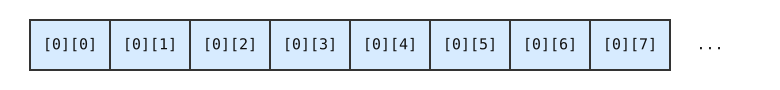

# 8. Koodin tehokkuus

## Tehokkuuden yleiskuva

Koodin tehokkuuteen vaikuttavat koodin toimintalogiikka, koodin toteutuksen yksityiskohdat sekä tietokoneen prosessorin toiminta koodia suorittaessa.

Koodin toimintalogiikka tarkoittaa koodin korkean tason ideaa, kuten mitä algoritmeja ja tietorakenteita koodi käyttää. Tällä tasolla tehokkuutta arvioidaan usein aikavaativuuden avulla. Esimerkiksi O(_n_ log _n_)-aikainen algoritmi toimii  yleensä nopeammin kuin O(_n_<sup>2</sup>)-aikainen algoritmi. Aikavaativuus on hyvä työkalu koodin tehokkuuden arviointiin, mutta se ei kerro kaikkea tehokkuudesta.

Tällä kurssilla kiinnitämme enemmän huomiota koodin matalan tason tehokkuuteen: miten haluttu toimintalogiikka toteutetaan tehokkaasti ja miten prosessori pystyy suorittamaan koodin tehokkaasti. Tällaisilla asioilla voi olla suuri vaikutus koodin tehokkuuteen. Esimerkiksi saman algoritmin eri toteutusten suoritusajoissa voi olla 10- tai 100-kertainen tehokkuusero.

### Kääntäjän toiminta

Suuri vaikutus koodin tehokkuuteen on kääntäjällä, joka kääntää tietyllä ohjelmointikielellä kirjoitetun koodin konekielelle tietokoneen prosessorilla suoritettavaan muotoon. Kääntäjän tehtävänä on saada aikaan konekielinen koodi, jonka toiminta vastaa alkuperäistä koodia ja joka lisäksi toimii tehokkaasti.

Tarkastellaan esimerkkinä seuraavaa C-kielistä koodia:

```c
int result;
if (phase > 5) {
    result = 1;
} else {
    result = 2;
}
```

Kääntäjä voisi kääntää koodin seuraavasti x86-konekielelle:

```nasm
    mov eax, [rbp-16]
    cmp eax, 5
    jle .L2
    mov dword [rbp-12], 1
    jmp .L3
.L2:
    mov dword [rbp-12], 2
.L3:
```

Tämä koodi muodostuu seuraavista konekielen komennoista:

- `mov eax, [rbp-16]` kopioi luvun pinosta kohdasta `-16` rekisteriin `eax`.
- `cmp eax, 5` vertailee rekisterin `eax` sisältöä ja lukua `5`.
- `jle .L2` hyppää kohtaan `.L2`, jos `eax <= 5`.
- `mov dword [rbp-12], 1` asettaa pinoon kohtaan `-12` luvun `1`.
- `jmp .L3` hyppää kohtaan `.L3`.
- `mov dword [rbp-12], 2` asettaa pinoon kohtaan `-12` luvun `2`.

<div class="note" markdown="1">
Tutustumme tarkemmin konekieliseen ohjelmointiin tämän kurssin loppuosassa. Tässä luvussa on joitakin konekielisiä esimerkkejä, mutta ei haittaa, vaikka et ymmärtäisi vielä niiden toimintaa kaikilta osin.
</div>

Kääntäjä tallentaa konekielisen koodin käännöksen tuloksena olevaan ohjelmatiedostoon tavumuodossa, jonka tietokoneen prosessi pystyy suorittamaan. Esimerkiksi äskeinen konekielinen koodi näyttää seuraavalta tavumuodossa:

```
8b 45 f0 83 f8 05 7e 09 c7 45 f4 01 00 00 00 eb 07 c7 45 f4 02 00 00 00
```

Tässä jokaista konekielistä komentoa vastaa tietty tavuyhdistelmä, jonka prosessori osaa käsitellä halutulla tavalla. Esimerkiksi tavuyhdistelmä `8b 45 f0` vastaa komentoa `mov eax, [rbp-16]`. Konekielisen koodin käsittely tavumuodossa on ihmiselle vaikeaa, eikä sille ole yleensä tarvetta.

### Kääntäjän optimointiliput

TODO

### Ohjelmointikieli ja tehokkuus

C-kielellä on maine tehokkaana ohjelmointikielenä, mutta mitä tarkoittaa, että jokin ohjelmointikieli on tai ei ole tehokas? Oikeastaan on tarkempaa sanoa, että on olemassa kääntäjiä, jotka pystyvät kääntämään C-kielisestä koodista konekielistä koodia, jonka prosessorit pystyvät suorittamaan tehokkaasti.

Toisaalta C-kielestä tekee tehokkaan, että kieli on suunniteltu niin, että C-kielisen koodin voi kääntää tehokkaaksi konekieliseksi koodiksi. Tähän vaikuttaa esimerkiksi, että koodin käännösvaiheessa tiedetään määritellyt muuttujat ja niiden tietotyypit, C-kielen perustietotyypit ovat lähellä konekieltä ja koodin suorituksen aikana ei tehdä muistin käsittelyyn liittyviä tarkastuksia.

Esimerkiksi C-kielinen koodi `total += items[i]` voidaan kääntää tehokkaasti konekieleksi, kun `total` ja `items` ovat 64-bittisiä `long`-muuttujia. Esimerkiksi käännös x86-konekieleksi voisi olla seuraava:

```nasm
    mov rax, [rbp-40+8*rcx]
    add [rbp-12], rax
```

Tässä komento `mov` siirtää 64-bittisen luvun muistista rekisteriin `rax` ja komento `add` kasvattaa muistissa olevaa 64-bittistä lukua rekisterin `rax` arvolla. Rekisteri `rcx` vastaa taulukon indeksiä ja `8` on taulukon alkion koko tavuina.

Tämä konekielinen koodi toimii tehokkaasti, koska x86-konekielessä on tehokkaat komennot 64-bittisten kokonaislukujen käsittelyyn. Lisäksi koodin toimintaa tehostaa, että koodi olettaa rekisterin `rcx` osoittaman kohdan muistissa kuuluvan taulukon muistialueelle eikä tätä tarkasteta erikseen.

Vastaavan Python-koodin ```total += items[i]``` suorittaminen on selvästi hankalampaa tietokoneen prosessorin näkökulmasta. Koodia suorittaessa tulee ottaa huomioon esimerkiksi seuraavat asiat:

- Pythonissa lukujen suuruutta ei ole rajattu, joten lukujen ei voi olettaa olevan esimerkiksi 64-bittisiä eikä niitä voi käsitellä tehokkaasti konekielessä.

- Ennen koodin suorittamista ei tiedetä välttämättä, mitkä ovat muuttujien `total`, `items` ja `i` tyypit.

- Ennen koodin suorittamista ei tiedetä välttämättä, onko muuttujat `total`, `items` ja `i` määritelty.

- Koodia suorittaessa tulee varmistaa, että muuttujalla `i` voi indeksoida oliota `items` ja indeksi on kelvollinen.

<div class="note" markdown="1">
Python-koodia ei käännetä konekieliseksi koodiksi, jonka tietokoneen prosessori voisi suorittaa. Sen sijaan koodi käännetään tavukoodiksi, joka voidaan suorittaa Pythonin suoritusympäristössä. Tämä hidastaa koodin suorittamista, koska käännetty koodi ei ole suoraan tietokoneen prosessorin suoritettavissa.

Miksi ei voisi tehdä kääntäjää, joka kääntää Python-koodin suoraan tehokkaaksi konekieleksi? Käytännössä tällaisen kääntäjän tekeminen olisi hyvin vaikeaa kielen ominaisuuksien takia. Seuraava koodi havainnollistaa asiaa:

```python
if random.randint(1, 2) == 1:
    a = 42
    b = 1337
else:
    a = "ayba"
    b = "btu"

c = a + b
```

Miten rivi `c = a + b` tulisi kääntää konekieleksi? Ennen koodin suoritusta ei tiedetä, ovatko `a` ja `b` kokonaislukuja vai merkkijonoja, joten riville `c = a + b` ei ole yhtä konekielistä vastinetta, vaan tulee ottaa huomioon eri tilanteita.
</div>

### Mikä ei vaikuta tehokkuuteen?

Koodin tehokkuuden kannalta on myös hyvä tiedostaa, mitkä asiat _eivät_ vaikuta tehokkuuteen. Näitä ovat erilaiset koodin kirjoitusasuun liittyvät yksityiskohdat, jotka eivät välity tietokoneen prosessorin suorittamaan konekieliseen koodiin.

Esimerkiksi C-kielisen koodin toimintaa ei nopeuta, että pitkä muuttujan nimi `item_count` korvataan lyhyellä nimellä `x`. Kun kääntäjä kääntää koodin, se ei sisällytä ohjelmoijan käyttämiä muuttujien nimiä konekieliseen koodiin. Konekielessä tietoon ei viitata nimillä vaan rekisterien ja muistiosoitteiden kautta.

<div class="note" markdown="1">
Asiaa voi ajatella myös siltä kannalta, että jos jokin muutos koodissa saattaisi vaikuttaa tehokkuuteen mutta kääntäjä _voisi_ helposti tehdä tämän muutoksen, niin muutoksella ei ole luultavasti todellista vaikutusta.

Esimerkiksi jos muuttujan nimen lyhentäminen tehostaisi koodia, kääntäjä voisi helposti korvata kaikki pitkät muuttujien nimet lyhyillä.
</div>

Tyhjä tila ja kommentit koodissa eivät vaikuta tehokkuuteen, koska ne eivät ole merkityksellisiä koodin tulkinnan kannalta. Esimerkiksi koodi `if(x==42)` ei ole tehokkaampi kuin koodi `if (x == 42)`. Kääntäjän kannalta molemmat äskeiset koodit voidaan esittää listana [`if`, `(`, `x`, `==`, `42`, `)`].

Koodin tehokkuuteen eivät myöskään vaikuta koodissa käytetyt lyhennysmerkinnät. Esimerkiksi lausekkeet `a++`, `a += 1` ja `a = a + 1` ovat yhtä tehokkaita, koska nämä lausekkeet tarkoittavat samaa. Kääntäjän ei olisi järkevää tuottaa erilaista konekielistä koodia riippuen siitä, mitä näistä lausekkeista ohjelmoija on käyttänyt.

## Tehokkuuden mittaus

Linux-ympäristössä kätevä tapa mitata koodin tehokkuutta on suorittaa ohjelma komennon `time` avulla. Mitataan esimerkkinä, kuinka tehokkaasti toimii seuraavasti koodi, joka laskee alkulukujen määrän välillä 1...10<sup>7</sup>.

```c
#include <stdio.h>

#define N 10000000

int sieve[N+1];

int main(void) {
    int count = 0;
    for (int i = 2; i <= N; i++) {
        if (!sieve[i]) count++;
        for (int j = 2*i; j <= N; j += i) {
            sieve[j] = 1;
        }
    }
    printf("%d\n", count);
}
```

Seuraava komento suorittaa mittauksen:

```console
$ time ./test
664579

real	0m1.434s
user	0m1.403s
sys	0m0.031s
```

Tämä tarkoittaa, että koodin suoritus vei aikaa noin 1.4 sekuntia.

### Mitä mitataan?

Koodin tehokkuuden mittaamisessa on oleellista, että mitattava koodi tekee varmasti sen asian, jonka tehokkuutta on tarkoitus mitata. Tämä ei ole niin helppoa kuin voisi ajatella, koska kääntäjän tekemät koodin optimoinnit saattavat muuttaa koodin toimintaa ja vääristää mittauksen tuloksia.

Tarkastellaan esimerkkinä seuraavaa koodia, joka laskee positiivisten kokonaislukujen summan miljardiin asti:

```c
int main(void) {
    int n = 1000000000;
    long sum = 0;
    for (int i = 1; i <= n; i++) {
        sum += i;
    }
}
```

Koodi toimii yllättäen hyvin nopeasti, vaikka siinä on silmukka, jossa on miljardi askelta. Syy on kuitenkin siinä, että käännetyssä koodissa _ei_ ole silmukkaa eikä mitään muutakaan. Koska muuttujan `sum` arvoa ei käytetä mihinkään, kääntäjä optimoi nokkelasti pois koko koodin ja tuottaa tyhjän ohjelman.

Asian voi korjata tulostamalla koodin päätteeksi muuttujan `sum` arvon:

```c
int main(void) {
    int n = 1000000000;
    long sum = 0;
    for (int i = 1; i <= n; i++) {
        sum += i;
    }
    printf("%ld\n", sum);
}
```

Tämäkin koodi toimii epäilyttävän nopeasti, vaikka se tulostaa lukujen summan halutulla tavalla. Tässä tapauksessa kääntäjä on huomannut, että koodi laskee summan aina samaan kiinteään lukuun asti, minkä takia summaa ei tarvitse laskea aina uudestaan koodin suorituksen aikana. Kääntäjä on taas poistanut koodista silmukan ja luonut koodin, joka tulostaa valmiiksi lasketun summan.

Seuraavassa on kolmas versio koodista, jossa koodille annetaan summan yläraja suorituksen aikana:

```c
int main(void) {
    int n;
    scanf("%d", &n);
    long sum = 0;
    for (int i = 1; i <= n; i++) {
        sum += i;
    }
    printf("%ld\n", sum);
}
```

Nyt kääntäjän on pakko tuottaa koodi, joka laskee summan aidosti koodin suorituksen aikana, eikä se enää poista koodissa olevaa silmukkaa. Koodin suoritukseen kuluu aikaa noin 0.6 sekuntia, mikä on uskottava tulos.

<div class="note" markdown="1">
Tässäkin tapauksessa nokkelasti toimiva kääntäjä voisi ainakin periaatteessa toteuttaa summan laskemisen tehokkaammin esimerkiksi käyttämällä summakaavaa `n * (n + 1) / 2`.

Tällainen muutos olisi kuitenkin varsin vaikea tehdä niin, että koodi toimisi varmasti samalla tavalla kaikissa tilanteissa. Esimerkiksi tässä pitäisi ottaa huomioon tilanne, jossa `n` on negatiivinen, jolloin äskeinen kaava ei anna samaa tulosta kuin alkuperäinen silmukka.
</div>

### Testiaineisto

Käytetty testiaineisto vaikuttaa usein paljon koodin tehokkuuteen. Hidaskin koodi voi vaikuttaa toimivan tehokkaasti, jos testauksessa käytetään puutteellista testiaineistoa. Esimerkiksi satunnaisesti muodostettu testiaineisto ei usein tuo esille koodissa piilevää hitautta.

TODO

### Koodin osien tehokkuus

Koodin optimoinnissa on usein hyödyllistä tietää, mitkä koodin osat vievät suurimman osan suoritusajasta. Esimerkiksi jos tietyn koodin osan suoritukseen kuluu vain 1 % koodin kokonaissuoritusajasta, tämän osan optimointi ei vaikuttaisi lähes ollenkaan kokonaisuuteen.

Tarkastellaan esimerkkinä seuraavaa koodia, jolle annetaan lista kokonaislukuja ja joka ilmoittaa, montako eri lukua listassa on. Koodi laskee tuloksen järjestämällä aineiston ja vertailemalla vierekkäisiä lukuja järjestämisen jälkeen.

```c
#include <stdio.h>
#include <stdlib.h>

int read_data(int *data, int n) {
    for (int i = 0; i < n; i++) {
        scanf("%d", &data[i]);
    }
}

int cmp(const void *a, const void *b) {
    int x = *(int*)a, y = *(int*)b;
    if (x < y) return -1;
    if (x == y) return 0;
    if (x > y) return 1;
}

int count_result(int *data, int n) {
    qsort(data, n, sizeof(int), cmp);
    int result = 1;
    for (int i = 1; i < n; i++) {
        if (data[i-1] != data[i]) result++;
    }
    return result;
}

int main(void) {
    int n;
    scanf("%d", &n);

    int *data = malloc(n * sizeof(int));
    read_data(data, n);

    int result = count_result(data, n);
    printf("result: %d\n", result);

    free(data);
}
```

Koodin suoritus 10<sup>7</sup> luvun aineistolla voisi näyttää seuraavalta:

```console
$ time ./test < data.txt
result: 9950277

real	0m4.015s
user	0m3.947s
sys	0m0.067s
```

Voimme tarkastella koodin osien tehokkuutta muuttamalla pääfunktiota niin, että se laittaa muistiin ajanhetkiä koodin suorituksen aikana. Tämä onnistuu käytännössä käyttämällä standardikirjaston `clock`-funktiota. Funktio palauttaa aika-arvoja, joiden erotukset kertovat suoritusajan.

```c
int main(void) {
    int n;
    scanf("%d", &n);
    int *data = malloc(n * sizeof(int));

    clock_t time1 = clock();
    read_data(data, n);
    clock_t time2 = clock();
    int result = count_result(data, n);
    clock_t time3 = clock();

    printf("result: %d\n", result);
    double duration1 = (double)(time2 - time1) / CLOCKS_PER_SEC;
    printf("read_data duration: %lf s\n", duration1);
    double duration2 = (double)(time3 - time2) / CLOCKS_PER_SEC;
    printf("count_result duration: %lf s\n", duration2);

    free(data);
}
```

Nyt koodin suoritus voisi näyttää seuraavalta:

```console
$ ./test < data.txt
result: 9950277
read_data duration: 1.166300 s
count_result duration: 2.835903 s
```

Tämä kertoo, että funktion `read_data` suoritus vei aikaa noin 1.2 sekuntia ja funktion `count_result` suoritus vei aikaa noin 2.8 sekuntia.

Tarkempaa tietoa koodin osien tehokkuudesta voimme saada _profiloimalla_ koodia. Tämä tarkoittaa, että koodi suoritetaan erityisellä tavalla niin, että saamme koodin suorituksen jälkeen raportin sen osien tehokkuudesta.

Linuxissa voimme käyttää esimerkiksi `perf`-työkalua seuraavasti:

```console
$ perf record ./test < data.txt
$ perf report
```

Työkalun tuottama raportti voisi näyttää seuraavalta:

```console
  37.18%  distinct  distinct           [.] cmp
  29.74%  distinct  libc.so.6          [.] msort_with_tmp.part.0
  16.93%  distinct  libc.so.6          [.] __vfscanf_internal
   6.57%  distinct  libc.so.6          [.] __GI_____strtoll_l_internal
   3.19%  distinct  libc.so.6          [.] __memmove_avx_unaligned_erms
   1.24%  distinct  libc.so.6          [.] __isoc99_scanf
   1.10%  distinct  libc.so.6          [.] _IO_sputbackc
   0.43%  distinct  libc.so.6          [.] __GI___libc_cleanup_pop_restore
   0.37%  distinct  distinct           [.] read_data
   0.36%  distinct  [kernel.kallsyms]  [k] _copy_to_iter
   0.35%  distinct  distinct           [.] count_result
   0.35%  distinct  libc.so.6          [.] __GI___libc_cleanup_push_defer
   0.24%  distinct  libc.so.6          [.] memcpy@@GLIBC_2.14@plt
   0.19%  distinct  libc.so.6          [.] __strtoll_internal
   0.13%  distinct  distinct           [.] __isoc99_scanf@plt
   0.10%  distinct  [kernel.kallsyms]  [k] rmqueue_bulk
```

Tämä raportti näyttää, että eniten aikaa vievät järjestämiseen liittyvät funktiot `cmp` sekä `msort_with_tmp`, joka on funktion `qsort` sisäisesti kutsuma funktio. Näiden jälkeen eniten aikaa vie funktio `__vfscanf_internal`, joka puolestaan on funktion `scanf` sisäisesti kutsuma funktio.

<div class="note" markdown="1">

Työkalun `perf` käyttäminen voi vaatia, että järjestelmän suojausasetuksia lievennetään seuraavasti profilointia varten:

```console
$ sudo sysctl -w kernel.perf_event_paranoid=1
$ sudo sysctl -w kernel.kptr_restrict=0
```

Nämä komennot muuttavat asetuksia väliaikaisesti niin, että asetukset palautuvat ennalleen, kun järjestelmä käynnistetään uudestaan.

</div>

## Käännöksen optimointi

Koodin voi kääntää usealla eri tavalla konekielelle, ja kääntäjä pyrkii valitsemaan käännöksen, jonka prosessori suorittaa mahdollisimman nopeasti. Konekielinen käännös saattaa erota logiikaltaan paljonkin alkuperäisestä koodista, mutta tämä ei haittaa, kunhan koodi tuottaa saman lopputuloksen.

Esimerkiksi koodi `x = 2 * x` voidaan esittää x86-konekielellä seuraavilla tavoilla:

1. Suora käännös käyttäen komentoa `mul`, joka laskee kertolaskun:
```nasm
    mov rbx, 2
    mul rbx
```

2. Kertolaskua `2 * x` vastaa yhteenlasku `x + x`, joten voimme käyttää myös komentoa `add` seuraavasti:
```nasm
    add rax, rax
```

3. Kertolaskun `2 * x` voi tehdä bittisiirrolla `x << 1`, joten voimme käyttää myös komentoa `shl` seuraavasti:
```nasm
    shl rax, 1
```

Käännökset 2 ja 3 ovat käytännössä tehokkaampia kuin käännös 1, koska prosessorin on helpompaa suorittaa yhteenlasku tai bittisiirto kuin suorittaa kertolasku. Tämän takia kääntäjä valitsee todennäköisesti käännöksen 1 tai 2.

### Rekisterien käyttäminen

Prosessorin rekisterit ovat nopeita muistipaikkoja, joiden käsittely on paljon nopeampaa kuin muistin käsittely. Kääntäjä pyrkii säilyttämään rekistereissä usein käytettäviä muuttujia. Tässä on haasteena, että prosessorin rekisterien määrä on rajoitettu eikä niissä voida säilyttää suurta määrää tietoa.

Modernit kääntäjät sisältävät edistyneitä algoritmeja, jotka määrittävät, mitä ohjelman muuttujia säilytetään rekistereissä missäkin ohjelman vaiheessa ja miten rekisterejä käytetään tehokkaasti.

C-kielen avainsana `register` antaa kääntäjälle vihjeen siitä, että tietty muuttuja on usein käytettävä ja se olisi hyvä laittaa rekisteriin. Esimerkiksi seuraavassa koodissa muuttujasn `i` määrittelyssä on rekisterivihje:

```c
register int i;
for (int i = 0; i < n; i++) {
    sum += i;
}
```

Kuitenkin avainsanaa `register` käytetään nykyään hyvin harvoin, koska modernit kääntäjät tietävät yleensä ohjelmoijaa paremmin, miten rekistereitä kannattaa käyttää koodin käännöksessä. Todennäköisesti avainsanan `register` käyttämisellä ei ole mitään vaikutusta kääntäjän toimintaan.

<div class="note" markdown="1">
Käytännössä C-koodissa oleva muuttuja päätyy usein rekisteriin ohjelman konekielisessä versiossa. Kuitenkaan näin ei tapahdu, jos koodissa viitataan muuttujan muistiosoitteeseen:

```c
int n;
scanf("%d", &n);
```

Tässä muuttujalle `n` täytyy varata tilaa muistista, koska muuten sen muistiosoitetta ei voisi antaa funktiolle `scanf`. Toisaalta funktion kutsumisen jälkeen muuttujan sisältöä voisi säilyttää rekisterissä, jos muuttujan muistiosoitetta ei käytetä koodissa muulla tavalla.

Avainsanan `register` sivuvaikutuksena on, että koodissa ei voi olla viittausta muuttujan muistiosoitteeseen.
</div>

### Silmukan purkaminen

Silmukan _purkaminen_ (_unrolling_) on perinteinen koodin optimointitekniikka,  jossa silmukkaa muutetaan niin, että silmukan sisällä suoritetaan useampi kierros peräkkäin ja kierrosten määrä pienenee. Tavoitteena on, että konekielisiä komentoja kuluu vähemmän silmukan hallinnointiin.

Tarkastellaan esimerkkinä seuraavaa silmukkaa, joka laskee summan taulukossa olevista luvuista:

```c
for (int i = 0; i < n; i++) {
    sum += data[i];
}
```

Tämän silmukan voi toteuttaa konekielellä niin, että silmukan kierroksen päätteeksi komento `cmp` vertailee silmukan laskuria ja loppuarvoa ja komento `jne` hyppää silmukan alkuun, jos silmukan tulee jatkua:

```nasm
loop_start:
    ...
    cmp rcx, rdx
    jne loop_start
```

Koodin suorituksessa komennot `cmp` ja `jne` suoritetaan `n` kertaa, koska silmukka muodostuu `n` kierroksesta.

Voisimme esittää samalla tavalla toimivan silmukan seuraavassa muodossa olettaen, että silmukan kierrosten määrä `n` on jaollinen kahdella:

```c
for (int i = 0; i < n; i += 2) {
    sum += data[i];
    sum += data[i+1];
}
```

Tämän muutoksen jälkeen konekieliset komennot `cmp` ja `jne` suoritetaan vain `n / 2` kertaa, eli näiden komentojen suoritusmäärä puolittuu.

Kääntäjät voivat purkaa silmukoita automaattisesti, jos ne arvioivat sen tehostavan koodia tai niitä ohjeistetaan erikseen siihen (esimerkiksi `gcc`:n parametri `-funroll-loops`). Silmukan purkamisen merkitys optimoinnissa on kuitenkin pienentynyt, eikä siitä ole välttämättä hyötyä uusissa prosessoreissa.

### Funktion upotus

Funktion kutsumista koodissa voidaan tehostaa _upottamalla_ funktio eli korvaamalla funktiokutsu koodilla, joka on funktion sisällä. Esimerkiksi koodi

```c
int min(int a, int b) {
    if (a < b) return a;
    else return b;
}

void test(int a, int b) {
    int x = min(a, b);
}
```

voitaisiin muuttaa seuraavaan muotoon:

```c
void test(int a, int b) {
    if (a < b) x = a;
    else x = b;
}
```

Funktion upotus tehostaa koodin suoritusta, koska konekielisessä koodissa ei tarvitse olla funktion kutsumiseen liittyviä komentoja, jotka esimerkiksi välittävät funktiolle parametrit ja käsittelevät funktion palautusarvon.

Kääntäjät voivat upottaa funktion automaattisesti, jos ne arvioivat sen olevan hyödyllistä tehokkuuden kannalta. C99-standardi sisältää myös avainsanan `inline`, joka ohjeistaa kääntäjää upottamaan funktion.

### Komentojen tehokkuus

Vanhaan aikaan konekielisen koodin tehokkuuden arviointi oli melko suoraviivaista, koska prosessorit suorittivat komennot yksi kerrallaan ja jokaisesta komennosta tiedettiin, montako _kellosykliä_ sen suorittaminen vie aikaa.

Esimerkiksi seuraavassa koodissa kommenteissa näkyy, montako kellosykliä kunkin komennon suorittaminen vie Intelin 386-prosessorilla (vuodelta 1985):

```nasm
    mov eax, 42      ; 2
    add eax, eax     ; 2
    shr eax, 1       ; 3
```

Koodin suoritus vie yhteensä 2 + 2 + 3 = 7 kellosykliä. Jos oletetaan prosessorin kellotaajuuden olevan 25 MHz, prosessori pystyy suorittamaan yllä olevan koodin 25 &middot; 10<sup>6</sup> / 7 eli noin 3.57 miljoonaa kertaa sekunnissa.

Moderneissa prosesseissa tehokkuuden arviointi on kuitenkin vaikeaa esimerkiksi välimuistien ja komentojen rinnakkaisuuden takia, eikä ole mahdollista sanoa yleisesti, kauanko tietyn yksittäisen komennon suorittaminen vie aikaa.

## Rinnakkaisuus ja välimuistit

Moderneissa prosessoreissa on monenlaisia ominaisuuksia, jotka tehostavat konekielisen koodin suoritusta. Prosessorit suorittavat useita komentoja rinnakkain ja käyttävät välimuisteja, jotka nopeuttavat muistin käsittelyä.

Asiaa voi ajatella myös siltä kannalta, että prosessorit pyrkivät ennakoimaan koodin suoritusta yhtä komentoa pidemmälle. Jos koodissa on ehdollinen haara, prosessori voi ennustaa, miten koodin suoritus tulee jatkumaan. Jos koodi käsittelee tiettyä muistin kohtaa, prosessori voi varautua välimuistin avulla siihen, että koodi käsittelee myöhemmin uudestaan samaa kohtaa tai jotain sen läheistä kohtaa.

### Rinnakkaiset komennot

Prosessori pystyy suorittamaan peräkkäisiä komentoja erityisen tehokkaasti, jos komennot voidaan suorittaa toisistaan riippumatta. Tämä tarkoittaa, että komennot eivät käsittele samaa kohtaa muistista eikä ole merkitystä, kummassa järjestyksessä komennot suoritetaan.

Tarkastellaan esimerkkinä seuraavaa koodia, joka laskee luvun `N` kertoman. Koska kertoma voi olla suuri luku, koodi laskee tuloksen modulo `M`.

```c
long result = 1;
for (int i = 1; i <= N; i++) {
    result *= i;
    result %= M;
}
printf("%ld\n", result);
```

Kun `N` on 10<sup>9</sup>, koodin suoritus vie aikaa testikoneella 8.3 sekuntia.

Voimme yrittää tehostaa koodia purkamalla silmukkaa niin, että samalla kierroksella suoritetaan useita laskutoimituksia. Esimerkiksi:

```c
long result = 1;
for (int i = 1; i <= N; i += 2) {
    result *= i;
    result %= M;
    result *= (i + 1);
    result %= M;
}
printf("%ld\n", result);
```

Tämä ei kuitenkaan vielä vaikuta tehostavan koodia, vaan suoritus vie edelleen saman ajan. Silmukan purkaminen ei ehkä auta tässä tapauksessa, koska prosessori pystyy ennustamaan silmukan jatkumisen ja toteuttaa sen hyvin nopeasti.

Voimme kuitenkin tehostaa koodia merkittävästi muuttamalla sitä niin, että komentoja voidaan suorittaa rinnakkain. Esimerkiksi seuraavasti:

```c
long result0 = 1;
long result1 = 1;
for (int i = 1; i <= N; i += 2) {
    result0 *= i;
    result0 %= M;
    result1 *= (i + 1);
    result1 %= M;
}
long total = result0 * result1 % M;
printf("%ld\n", total);
```

Tämä koodi laskee kertoman kahden muuttujan avulla: `result0` sisältää parittomat luvut (1 &middot; 3 &middot; 5 &middot; ...) ja `result1` sisältää parilliset luvut (2 &middot; 4 &middot; 6 &middot; ...). Silmukan jälkeen koodi laskee lopullisen tuloksen kertomalla nämä tulokset toisillaan.

Tämän muutoksen jälkeen koodin suoritus vie aikaa vain 4.2 sekuntia eli suoritusaika lähes puolittuu. Koska koodissa on erilliset muuttujat `result0` ja `result1`, koodi pystyy suorittamaan rinnakkain näihin muuttujiin liittyviä komentoja. Esimerkiksi komennot `result0 *= i` ja `result1 *= (i + 1)` voidaan suorittaa rinnakkain, koska ne vaikuttavat eri muuttujien sisältöön.

Voimme yleistää tämän idean niin, että luvut jaetaan `P` osaan, joita voidaan käsitellä toisistaan riippumattomasti:

```c
long result[P];
for (int p = 0; p < P; p++) {
    result[p] = 1;
}
for (int i = 1; i <= N; i += P) {
    for (int p = 0; p < P; p++) {
        result[p] = result[p] * (i + p) % M;
    }
}
long total = 1;
for (int p = 0; p < P; p++) {
    total = total * result[p] % M;
}
printf("%ld\n", total);
```

Seuraava taulukko näyttää koodin suoritusajat `P`:n eri arvoilla:

Parametri `P` | Suoritusaika
--- | ---
1 | 8.3 s
2 | 4.2 s
4 | 3.0 s
8 | 2.4 s
16 | 1.8 s
32 | 2.1 s

Tässä tapauksessa koodi toimii nopeiten `P`:n arvolla 16, jolloin suoritusaika on vain 1.8 sekuntia eli alle neljännes alkuperäisen koodin suoritusajasta.

### Välimuistin toiminta

Välimuisti (_cache_) on tehokas muistialue, joka sisältää osan tietokoneen muistista nopeampaa käsittelyä varten. Kun koodi käsittelee tiettyä muistin kohtaa, muistin sisältö tämän kohdan lähellä voidaan siirtää välimuistiin. Tämä tehostaa koodia, jos koodi käsittelee myöhemmin muistia saman kohdan läheltä.

<div class="note" markdown="1">
Moderneissa prosessoreissa on yleensä _useita_ välimuisteja. Esimerkiksi Intelin prosessoreissa on tyypillisesti kolme välimuistia:

- L1 on nopein välimuisti (koko esimerkiksi 32 kilotavua)
- L2 on keskinopea välimuisti (koko esimerkiksi 2 megatavua)
- L3 on hitain välimuisti (koko esimerkiksi 12 megatavua)

Kun koodi käsittelee tiettyä muistin kohtaa, se käy ensin läpi välimuistit pienimmästä suurimpaan ja tarkastaa, sisältyykö käsiteltävä kohta johonkin välimuisteista. Jos sisältyy, koodi käsittelee muistia välimuistin kautta, mikä on paljon nopeampaa kuin muistin käsittely suoraan.
</div>

Välimuisti tehostaa koodin suoritusta esimerkiksi koodin käydessä läpi taulukon sisältöä. Koska taulukon alkiot on tallennettu peräkkäin muistissa, taulukkoa käsittelevä koodi voi hyötyä paljon välimuistista. Toisaalta koodi kannattaa pyrkiä suunnittelemaan niin, että se käsittelee peräkkäisiä muistin kohtia.

Tarkastellaan esimerkkinä välimuistin vaikutusta koodissa, joka käy läpi `T` kertaa kaksiulotteisen `N x N` -kokoisen taulukon sisällön:

```c
long sum = 0;
for (int k = 0; k < T; k++) {
    for (int i = 0; i < N; i++) {
        for (int j = 0; j < N; j++) {
            sum += grid[i][j];
        }
    }
}
printf("%ld\n", sum);
```

Testataan koodia parametreilla `T` = 500 ja `N` = 3000 seuraavin muunnoksin:

- Viittaustapa: `[i][j]` (läpikäynti rivi kerrallaan vasemmalta oikealle) tai `[j][i]` (läpikäynti sarake kerrallaan ylhäältä alas)
- Taulukon alkion tyyppi: `char` (1 tavu), `int` (4 tavua) tai `long` (8 tavua)

Seuraava taulukko näyttää koodin suoritusajat testikoneella eri tilanteissa:

Viittaustapa | Alkiotyyppi | Suoritusaika
--- | --- | ---
`[i][j]` | `char` | 2.7 s
`[i][j]` | `int` | 1.9 s
`[i][j]` | `long` | 3.3 s
--- | --- | ---
`[j][i]` | `char` | 6.9 s
`[j][i]` | `int` | 33.6 s
`[j][i]` | `long` | 21.4 s

Taulukosta näkee, että viittaustapa `[i][j]` (rivi kerrallaan) on selvästi nopeampi kuin viittaustapa `[j][i]` (sarake kerrallaan). Tämä johtuu siitä, että kaksiulotteisen taulukon sisältö on muistissa rivi kerrallaan ja koodi hyödyntää välimuistia paremmin, kun se myös käy taulukon läpi rivi kerrallaan.

Taulukon sisältö muistissa näyttää seuraavalta:



Kun koodi käyttää viittaustapaa `[i][j]`, se käy tämän muistialueen sisällön alkio kerrallaan vasemmalta oikealle, mikä on välimuistin kannalta ihanteellinen tapa käsitellä muistia. Viittaustavassa `[j][i]` koodi puolestaan tekee muistissa `N` alkion pituisia hyppyjä.

Viittaustavassa `[j][i]` taulukon alkion tyyppi vaikuttaa myös paljon koodin nopeuteen. Kun alkion tyyppi on `char`, taulukko vie vähän tilaa muistissa, minkä ansiosta koodi luultavasti pystyy käyttämään melko hyvin välimuistia huonosta viittaustavasta huolimatta. Tässä `char`-tyyppisen taulukon koko on 9 megatavua, mikä saattaa esimerkiksi mahtua kokonaan L3-välimuistiin.

Toisaalta viittaustavassa `[j][i]` koodi toimii yllättäen nopeammin alkion tyypillä `long` kuin `int`. Tämä ero ei luultavasti liity välimuistiin vaan johonkin muuhun muistin käsittelyssä. Jostain syystä koodi pystyy tässä tilanteessa viittaamaan tehokkaammin muistissa olevaan `long`-arvoon kuin `int`-arvoon.

## Liukuvan ikkunan minimi

Tarkastellaan seuraavaksi tilannetta, jossa haluamme laskea tehokkaasti _liukuvan ikkunan minimin_ aineistolle, jossa on _n_ kokonaislukua. Liukuva ikkuna kulkee vasemmalta oikealle ja muodostuu _m_ peräkkäisestä luvusta. Jokaisessa ikkunan kohdassa tehtävänä on ilmoittaa pienin ikkunan alueella oleva luku.

Esimerkiksi aineistolla [2, 1, 5, 7 ,3, 4, 2, 6] (_n_ = 8) ja ikkunan koolla _m_ = 3 haluttu tulos on [1, 1, 3, 3, 2, 2], koska ikkunan sisällöt ja minimit ovat seuraavat:

- [2, 1, 5] → minimi 1
- [1, 5, 7] → minimi 1
- [5, 7, 3] → minimi 3
- [7, 3, 4] → minimi 3
- [3, 4, 2] → minimi 2
- [4, 2, 6] → minimi 2

### Lähtökohta

Yksi tehokas tapa laskea liukuvan ikkunan minimi on käyttää tietorakennetta, joka pitää tehokkaasti yllä joukkoa ikkunassa olevista luvuista ja tarjoaa operaation, jolla voi selvittää pienimmän luvun. Koska sama luku voi esiintyä ikkunassa useita kertoja, tietorakenteen täytyy sallia saman luvun toistuvat esiintymiset.

C++:ssa voisimme käyttää `multiset`-tietorakennetta, joka sopii hyvin tähän tarkoitukseen. Se pitää yllä järjestettyä alkiojoukkoa, jossa sama alkio voi esiintyä useita kertoja. Voimme lisätä ja poistaa alkion sekä etsiä pienimmän alkion niin, että kukin operaatio vie aikaa O(log _n_).

Seuraavassa on C++-koodi, joka lukee aineistossa olevat luvut ja ikkunan koon ja tulostaa kunkin ikkunan minimin vasemmalta oikealle:

```cpp
#include <iostream>
#include <set>
#include <vector>

int main() {
    int n, m;
    std::cin >> n >> m;
    std::vector<int> data(n);
    for (int i = 0; i < n; i++) {
        std::cin >> data[i];
    }
    std::multiset<int> vals;
    for (int i = 0; i < m - 1; i++) {
        vals.insert(data[i]);
    }
    for (int i = m - 1; i < n; i++) {
        vals.insert(data[i]);
        std::cout << *vals.begin() << "\n";
        vals.erase(vals.find(data[i - m + 1]));
    }
}
```

Koodia voisi käyttää esimerkiksi seuraavasti:

```console
$ ./find_minima
8 3
2 1 5 7 3 4 2 6
1
1
3
3
2
2
```

Tämän koodin aikavaativuus on O(_n_ log _n_) ja se on melko tehokas tapa lähestyä ongelmaa, mutta suurella aineistolla koodin suoritus alkaa viedä aikaa. Käytetään tehokkuustesteihin seuraavanlaista aineistoa:

- Lukujen määrä _n_ on 10<sup>7</sup>
- Jokainen luku on satunnainen kokonaisluku välillä 1...10<sup>9</sup>
- Ikkunan koko _m_ on 10<sup>6</sup>

Tällaisella aineistolla yllä olevan koodin suoritus vie testikoneella aikaa 54.8 sekuntia. Miten paljon tätä olisi mahdollista parantaa tekemällä optimoitu matalan tason toteutus?

### C-toteutus 1

C++:n tietorakenne `multiset` on ohjelmoijalle helposti käytettävissä, mutta sen sisäinen toteutus perustuu tasapainoiseen binäärihakupuuhun ja on varsin monimutkainen. Vaikka `multiset` tarjoaa O(log _n_)-aikaiset operaatiot, nämä operaatiot ovat melko raskaita. Yksi tapa tehostaa liukuvan ikkunan käsittelyä onkin toteuttaa koodi jotenkin kevyemmällä tietorakenteella.

Osoittautuu, että voimme laskea liukuvan ikkunan minimit paljon kevyemmin käyttämällä tietorakennetta, joka sisältää nousevan listan ikkunan alueella olevista luvuista. Tarkemmin ottaen voimme tehdä näin ikkunan liikkuessa:

- Kun ikkunan oikeaan reunaan lisätään luku _x_, listan lopusta poistetaan kaikki luvut, jotka ovat suurempia tai yhtä suuria kuin luku _x_. Tämän jälkeen luku _x_ lisätään listan loppuun.

- Kun luku poistuu ikkunan vasemmasta reunasta, se poistetaan listan alusta, jos se on vielä listalla.

Voimme toteuttaa tämän algoritmin deque-rakenteella, joka sisältää listalla olevat luvut. Seuraavassa toteutuksessa `deque` on taulukko, jossa `left` osoittaa ensimmäisen alkion kohdan ja `right` osoittaa oikean alkion kohdan.

TODO: esimerkki

```c
#include <stdio.h>
#include <stdlib.h>

int main(void) {
    int n, m;
    scanf("%d %d", &n, &m);
    int *data = malloc(sizeof(int) * n);
    for (int i = 0; i < n; i++) {
        scanf("%d", &data[i]);
    }
    int *deque = malloc(sizeof(int) * n);
    int left = 0;
    int right = -1;
    for (int i = 0; i < n; i++) {
        if (i - deque[left] == m) left++;
        while (left <= right && data[deque[right]] >= data[i]) {
            right--;
        }
        deque[++right] = i;
        if (i >= m-1) {
            printf("%d\n", data[deque[left]]);
        }
    }
    free(data);
    free(deque);
}
```

2.1 s

```console
  32.95%  window_linear  libc.so.6          [.] __vfscanf_internal
  14.06%  window_linear  libc.so.6          [.] __printf_buffer
  13.68%  window_linear  libc.so.6          [.] __GI_____strtoll_l_internal
   6.56%  window_linear  libc.so.6          [.] __printf_buffer_write
   4.80%  window_linear  window_linear      [.] main
   3.76%  window_linear  libc.so.6          [.] _itoa_word
   3.45%  window_linear  libc.so.6          [.] __vfprintf_internal
   2.18%  window_linear  libc.so.6          [.] __isoc99_scanf
   2.05%  window_linear  libc.so.6          [.] _IO_sputbackc
   2.03%  window_linear  libc.so.6          [.] __strchrnul_avx2
   1.95%  window_linear  libc.so.6          [.] __memmove_avx_unaligned_erms
   1.92%  window_linear  libc.so.6          [.] __printf_chk
   1.42%  window_linear  libc.so.6          [.] __printf_buffer_to_file_done
   0.84%  window_linear  libc.so.6          [.] __printf_buffer_done
   0.83%  window_linear  [kernel.kallsyms]  [k] _copy_to_iter
   0.79%  window_linear  libc.so.6          [.] __printf_buffer_to_file_switch
   0.74%  window_linear  libc.so.6          [.] __GI___libc_cleanup_push_defer
   0.56%  window_linear  libc.so.6          [.] __GI___libc_cleanup_pop_restore
   0.56%  window_linear  libc.so.6          [.] __printf_buffer_to_file_init
```

```c
#include <stdio.h>
#include <stdlib.h>

#define BUFFER_SIZE 1024

int main(void) {
    int n, m;
    scanf("%d %d", &n, &m);
    int *data = malloc(sizeof(int) * n);

    char buffer[BUFFER_SIZE];
    int read_pos = 0;
    int read_value = 0;
    int read_start = 0;
    int read_count;
    while (read_count = fread(buffer, 1, sizeof(buffer), stdin)) {
        for (int i = 0; i < read_count; i++) {
            if (buffer[i] >= '0' && buffer[i] <= '9') {
                read_value = read_value * 10 + buffer[i] - '0';
                read_start = 1;
            } else if (read_start) {
                data[read_pos] = read_value;
                read_pos++;
                read_value = 0;
                read_start = 0;
            }
        }
    }

    int *deque = malloc(sizeof(int) * n);
    int left = 0;
    int right = -1;
    for (int i = 0; i < n; i++) {
        if (i - deque[left] == m) left++;
        while (left <= right && data[deque[right]] >= data[i]) {
            right--;
        }
        deque[++right] = i;
        if (i >= m-1) {
            printf("%d\n", data[deque[left]]);
        }
    }
    free(data);
    free(deque);
}
```

1.1 s

```c
#include <stdio.h>
#include <stdlib.h>

#define BUFFER_SIZE 1024

int main(void) {
    int n, m;
    scanf("%d %d", &n, &m);
    int *data = malloc(sizeof(int) * n);

    char buffer[BUFFER_SIZE];
    int read_pos = 0;
    int read_value = 0;
    int read_start = 0;
    int read_count;
    while (read_count = fread(buffer, 1, sizeof(buffer), stdin)) {
        for (int i = 0; i < read_count; i++) {
            if (buffer[i] >= '0' && buffer[i] <= '9') {
                read_value = read_value * 10 + buffer[i] - '0';
                read_start = 1;
            } else if (read_start) {
                data[read_pos] = read_value;
                read_pos++;
                read_value = 0;
                read_start = 0;
            }
        }
    }

    int *deque = malloc(sizeof(int) * n);
    int left = 0;
    int right = -1;
    int buffer_pos = 0;
    for (int i = 0; i < n; i++) {
        if (i - deque[left] == m) left++;
        while (left <= right && data[deque[right]] >= data[i]) {
            right--;
        }
        deque[++right] = i;
        if (i >= m-1) {
            int value = data[deque[left]];
            int start = 0;
            for (int div = 1000000000; div >= 1; div /= 10) {
                if (start || value / div > 0 || div == 1) {
                    buffer[buffer_pos++] = value / div + '0';
                    value -= value / div * div;
                    start = 1;
                }
            }
            buffer[buffer_pos++] = '\n';
            if (buffer_pos > BUFFER_SIZE - 20 || i == n - 1) {
                buffer[buffer_pos] = '\0';
                fputs(buffer, stdout);
                buffer_pos = 0;
            }
        }
    }
    free(data);
    free(deque);
}
```

0.7 s
