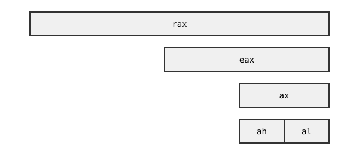

# 9. Johdatus konekieleen

## Konekielen yleiskuva

Konekielinen koodi muodostuu _komennoista_ (_instructions_), jotka ovat sellaisenaan tietokoneen prosessorin suoritettavissa. Yksittäinen konekielinen komento toteuttaa jonkin yksinkertaisen operaation, kuten kopioi luvun muistissa, laskee kaksi lukua yhteen tai hyppää toiseen kohtaan koodin suorituksessa.

Ohjelmoija käsittelee konekielistä koodia yleensä symbolisena konekielenä eli assembly-koodina, jossa konekielen komennoilla on helposti ihmisen muistettavissa olevat nimet (_mnemonics_). Tietokoneen prosessori puolestaan käsittelee konekieltä tavujonona, jossa tavut koodaavat konekielen komennot.

Esimerkiksi x86-konekielessä komento `mov rbx, rax` kopioi rekisterin `rax` sisällön rekisteriin `rbx`. Komennolla `mov` on kaksi _operandia_, joita voi ajatella komennon parametreina: ensimmäinen operandi (tässä `rbx`) ilmaisee, minne tietoa kopioidaan, ja toinen operandi (tässä `rax`) ilmaisee, mistä tietoa kopioidaan.

Tietokoneen prosessorille komento `mov rbx, rax` esitetään tavujonona `48 89 c3`.
Jokaiselle konekielen komennolle on tietty tavuesitys, jonka tietokoneen prosessori pystyy tulkitsemaan. Ihmiselle koodin kirjoittaminen ja lukeminen tavumuotoisina komentoina olisi vaivalloista.

Konekieli ei ole yksittäinen kieli, vaan eri prosessoreilla on erilaiset konekielet. Tämän takia tietyllä konekielellä toteutetun ohjelman voi suorittaa vain kyseistä konekieltä käyttävällä prosessorilla. Konekielet eroavat esimerkiksi siinä, millaisia komentoja on käytettävissä ja miten muistin käsittely on toteutettu.

<div class="note" markdown="1">
Konekielisen ohjelmoinnin merkittävä rajoitus on, että koodin suorittaminen vaatii tietynlaisen prosessorin. Jos ohjelma toteutetaan suoraan konekielellä, ohjelman siirtäminen uuteen ympäristöön saattaa käytännössä vaatia koko ohjelman kirjoittamisen uudestaan.

C-kielessä tilanne on toinen, koska C-kielinen ohjelma käännetään konekielelle. Tämän ansiosta C-kielisen ohjelman voi suorittaa millä tahansa prosessorilla, kunhan on olemassa kääntäjä, joka pystyy kääntämään ohjelman kyseisen prosessorin konekielelle.

Ennen C-kieltä Unix-käyttöjärjestelmä oli toteutettu konekielellä, mikä teki sen kehityksestä hankalaa. C-kielen alkuperäinen tavoite olikin tarjota riittävän tehokas korkeamman tason ohjelmointikieli, jolla käyttöjärjestelmän pystyy toteuttamaan siirrettävästi eri alustoille.
</div>

### Konekielen ominaisuudet

Vaikka eri prosessorien konekielet eroavat toisistaan, niissä on kuitenkin yhteisiä piirteitä. Tavallisia konekielten ominaisuuksia ovat:

- Ohjelman käytettävissä on rekistereitä, jotka ovat tehokkaita muistipaikkoja. Konekielessä on komentoja, joiden avulla voidaan siirtää tietoa rekisterien ja tietokoneen muistin välillä.

- Konekielessä ei voi käyttää monimutkaisia lausekkeita, vaan esimerkiksi laskulausekkeet tulee esittää jonona yksittäisiä laskutoimituksia. Esimerkiksi `a = b * c + d` voidaan laskea osissa `a = b`, `a = a * c` ja `a = a + d`.

- Ehdot ja silmukat toteutetaan ehdollisen hyppykomennon avulla, joka siirtää suorituksen toiseen kohtaan koodia halutussa tilanteessa. Konekielessä ei ole esimerkiksi korkeamman tason if- ja while-rakenteita.

- Ohjelman käytettävissä on muistialue pino, jossa olevaa tietoa voidaan käsitellä konekielen komennoilla tai suoraan pinorekisterin avulla. Pinon avulla voidaan toteuttaa aliohjelmien kutsuminen ja muistinkäsittely.

### Konekieliarkkitehtuurit

Tutustumme tällä kurssilla x86-konekieleen, jota käytetään Intelin ja AMD:n prosessoreissa. Tämä konekieliarkkitehtuuri on laajasti käytössä tietokoneissa, joiden käyttöjärjestelmä on Linux tai Windows. Tutustumme erityisesti x86-konekielen käyttämiseen 64-bittisessä Linux-ympäristössä.

Toinen merkittävä konekieliarkkitehtuuri on ARM, jota käytetään erityisesti pienemmissä laitteissa kuten puhelimissa ja tableteissa. Myös uudemmat Mac-tietokoneet käyttävät ARM-konekieltä. ARM-prosessorien etuna on, että niiden sähkönkulutus ja lämmöntuotto on vähäistä.

Yksi tapa luokitella konekieliä on käyttää termejä CISC ja RISC:

- CISC (_Complex Instruction Set Computer_) viittaa konekieliin, joissa komennot ovat "monimutkaisia" ja yksittäinen komento voi tehdä useita asioita. Tähän luokkaan kuuluvat x86-konekielet.

- RISC (_Reduced Instruction Set Computer_) viittaa konekieliin, joissa komennot ovat "yksinkertaisia" ja yksittäinen komento tekee vain yhden asian. Tähän luokkaan kuuluvat ARM-konekielet.

Esimerkiksi x86-konekielen komento

```nasm
    add [rax], rbx
```

kasvattaa rekisterin `rax` osoittamassa muistipaikassa olevaa arvoa rekisterin `rbx` arvolla. Tämä komento tekee useita asioita, koska se sekä suorittaa yhteenlaskun että käsittelee muistin sisältöä. Vastaava perinteinen ARM-toteutus on:

```nasm
    ldr x2, [x0]
    add x2, x2, x1
    str x2, [x0]
```

Tässä rekisteri `x0` osoittaa muistipaikkaan ja rekistereitä `x1` ja `x2` käytetään laskutoimituksessa. Komento `ldr` hakee arvon muistista rekisteriin `x2`, komento `add` kasvattaa rekisterin `x2` arvoa rekisterin `x1` arvolla ja komento `str` vie uuden arvon muistiin rekisteristä `x2`.

<div class="note" markdown="1">
Termit CISC ja RISC antavat yleiskäsityksen konekielen suunnittelutavasta, mutta luokittelua ei kannata ajatella mustavalkoisesti. Käytännössä konekielissä on yleensä sekä CISC- että RISC-piirteitä.

Vaikka x86-konekieli kuuluu CISC-luokkaan, modernit x86-prosessorit jakavat monimutkaiset komennot sisäisesti pienemmiksi _mikro-operaatioiksi_, jotka muistuttavat RISC-komentoja. Esimerkiksi komento `add [rax], rbx` voisi jakautua sisäisesti useammaksi pienemmäksi komennoksi.

Toisaalta vaikka ARM-konekieli kuuluu RISC-luokkaan, uudemmissa ARM-prosessoreissa on käytettävissä komento `stadd`, joka samaan aikaan suorittaa yhteenlaskun ja käsittelee muistia. Esimerkiksi ARM-komento `stadd x1, [x0]` vastaa x86-komentoa `add [rax], rbx`.
</div>

Mahdollinen tulevaisuuden konekieliarkkitehturi on Berkeleyn yliopistossa kehitetty avoin RISC V -arkkitehtuuri. Toisin kuin kaupalliset x86- ja ARM-arkkitehtuurit, RISC V on kenen tahansa vapaasti käytettävissä. RISC V on nimensä mukaisesti RISC-arkkitehtuuri, joka muodostuu pienestä peruskomentojen joukosta ja eri tarkoituksiin suunnatuista laajennusosista.

## x86-konekieli

Tällä kurssilla käsiteltävä x86-konekieli perustuu Intelin vuonna 1978 julkaisemaan 8086-prosessoriin ja sen seuraajiin. Nimitys "x86" tulee siitä, että prosessorin ensimmäiset seuraajat olivat 80186, 80286, 80386 ja 80486, joissa kaikissa prosessorin nimi päättyy numeroihin "86".

Intelin x86-arkkitehtuurissa on erityistä, että uudemmat prosessorit ovat hyvin yhteensopivia aiempien prosessorien kanssa. Kun arkkitehtuuria on laajennettu, uudet ominaisuudet on usein lisätty konekieleen niin, etteivät ne aiheuta muutoksia aiempien ominaisuuksien käyttämiseen.

Erityisen hyvin x86-konekielen historia näkyy rekistereissä. Alkuperäisessä 8086-prosessorissa rekisterit (esimerkiksi `ax`) olivat 16-bittisiä. Vuonna 1985 julkaistu 80386-prosessori laajensi rekistereitä 32-bittisiksi lisäämällä alkuun `e`-etuliitteen (esimerkiksi `eax`). Vuonna 2003 AMD esitteli 64-bittisen laajennoksen, jossa rekisterit ovat 64-bittisiä ja niissä on `r`-etuliite (esimerkiksi `rax`).

Seuraava kuva näyttää, miten 64-bittinen rekisteri `rax` muodostuu pienemmistä rekistereistä. Rekisteri `eax` vastaa rekisterin `rax` 32-bittistä loppupuoliskoa, ja rekisteri `ax` vastaa rekisterin `eax` 16-bittistä loppupuoliskoa. Rekisteri `ax` muodostuu 8-bittisistä alku- ja loppupuoliskoista `ah` ja `al`.



Nämä rekisterit jakavat yhteisen muistialueen, ja tietyn rekisterin päivitys vaikuttaa muihin rekistereihin. Esimerkiksi kun rekisteri `al` nollataan, myös rekisterien `ax`, `eax` ja `rax` viimeinen tavu nollataan.

Tavallisimmat x86-konekielessä käytettävät 64-bittiset rekisterit ovat:

- Perusrekisterit `rax`, `rbx`, `rcx`, `rdx`, `rsi` ja `rdi`
- Pinorekisterit `rsp` ja `rbp`
- Lisärekisterit `r8`, `r9`, `r10`, `r11`, `r12`, `r13`, `r14` ja `r15`

Näiden rekisterien lisäksi olennaisia rekisterejä ovat:

- Komentorekisteri `rip` (_instruction pointer_) osoittaa seuraavaksi suoritettavaan komentoon muistissa.
- Lippurekisteri `rflags` muodostuu biteistä, jotka antavat tietoa viimeksi suoritetun komennon tuloksesta.

Komento- ja lippurekisteriä ei ole mahdollista käsitellä suoraan koodissa, mutta konekielen komennot käyttävät niitä sisäisesti.

Lisäksi x86-konekielessä on omat rekisterinsä liukulukujen ja vektorien käsittelyyn (SSE ja AVX), joita emme käsittele tällä kurssilla.

<div class="note" markdown="1">
Koska x86-konekieli on muodostunut historiallisesti useissa vaiheissa vuosikymmenten kuluessa, se on nykyisellään varsin sekava. Konekielessä on monia epäloogisuuksia sekä paljon komentoja, joita ei nykyään yleensä käytetä mutta jotka ovat edelleen mukana yhteensopivuuden vuoksi.

Vaikka modernit prosessorit pystyvät suorittamaan vuosikymmenten takaista koodia, ne eivät tee sitä samalla tavalla kuin silloiset prosessorit. Komennot jakautuvat nykyään mikro-operaatioiksi, joita voidaan suorittaa liukuhihnoilla rinnakkain monimutkaisilla tavoilla.

Voikin ajatella, että x86-konekieli on _ohjelmointirajapinta_, jonka kautta koodi annetaan prosessorin suoritettavaksi, eikä kuvasta hyvin modernien prosessorien sisäistä toimintaa.
</div>

### Intel- ja AT&T-syntaksit

Tavalliset tavat esittää x86-konekieltä assembly-koodina ovat Intel- ja AT&T-syntaksit. Seuraavassa on esimerkkinä sama koodi molemmilla syntakseilla:

{: .code-title }
Intel
```nasm
    mov rcx, 42
    mov rax, rbx
    add rax, rcx
    mov rbx, rax
```

{: .code-title }
AT&T
```nasm
    movq $42, %rcx
    movq %rbx, %rax
    addq %rcx, %rax
    movq %rax, %rbx
```

Tämä esimerkki tuo esille seuraavia eroja syntakseissa:

- Intel-syntaksissa rekisterien nimet annetaan sellaisenaan (kuten `rax`), kun taas AT&T-syntaksissa nimen alussa on `%`-merkki (kuten `%rax`).

- Intel-syntaksissa lukuvakion voi antaa sellaisenaan (kuten `42`), kun taas AT&T-syntaksissa vakion alussa on `$`-merkki (kuten `$42`).

- AT&T-syntaksissa komennon lopussa oleva merkki ilmaisee käsiteltävän tiedon koon (esimerkiksi `movq` kopioi 64-bittisen arvon, koska lopussa on merkki `q`).

- Komentojen parametrien järjestys on päinvastainen: Intel-syntaksin komento `mov rax, rbx` vastaa AT&T-syntaksin komentoa `movq %rbx, %rax`.

Käytämme tämän kurssin esimerkeissä lähinnä Intel-syntaksia. Tämä syntaksi on käytössä esimerkiksi NASM-kääntäjässä, jota käytämme kurssilla konekielisen ohjelman kääntämiseen. Kuitenkin myös AT&T-syntaksi on hyvä tuntea, koska se on yleisesti käytössä esimerkiksi Linux-työkaluissa.

### Ohjelmointi Linuxissa

Käytetyn prosessorin lisäksi konekielellä ohjelmoimiseen vaikuttaa käyttöjärjestelmä, jossa koodi suoritetaan. Konekielisellä koodilla ei ole suoraa pääsyä tietokoneen laitteistoon, vaan sen täytyy käyttää käyttöjärjestelmän palveluita esimerkiksi silloin, kun se näyttää tietoa ohjelman käyttäjälle.

Käyttöjärjestelmän rooli on tärkeä, koska tietokoneessa samaan aikaan käynnissä olevat ohjelmat eivät saa häiritä toisiaan. Käyttöjärjestelmä esimerkiksi hallinnoi ohjelmien käytössä olevaa muistia, jakaa suoritusaikaa ohjelmille sekä toimii rajapintana laitteiston ja ohjelmien välillä.

Eri käyttöjärjestelmissä on omat tapansa kutsua käyttöjärjestelmän palveluja konekielisestä koodista, ja myös palvelut on toteutettu eri tavalla. Tämän takia Linuxille toteutettu konekielinen koodi ei toimi Windowsissa, vaikka molemmat käyttöjärjestelmät käyttävät x86-arkkitehtuuria.

Tutustumme tällä kurssilla 64-bittiseen Linux-ohjelmointiin, jossa koodi kutsuu käyttöjärjestelmän palvelua suorittamalla _systeemikutsun_ (_system call_). Tämä tapahtuu käytännössä asettamalla koodissa ensin rekisterien arvot oikealla tavalla ja suorittamalla sitten komento `syscall`.

Käyttöjärjestelmä vaikuttaa myös esimerkiksi siihen, mitä käytäntöjä aliohjelmien kutsumiseen liittyy. 64-bittisessä Linux-ohjelmoinnissa käytäntönä on toteuttaa aliohjelmat System V ABI -mallin mukaisesti, joka määrittelee esimerkiksi, miten aliohjelmien parametrit ja paluuarvot välitetään muistissa.

## Esimerkkiohjelma

Seuraavassa on yksinkertainen 64-bittinen konekielinen Linux-ohjelma, joka tulostaa rivin tekstiä komentoriville:

{: .code-title }
test.asm
```nasm
global _start

section .data
    message db "All your base are belong to us", 10

section .text
_start:
    mov rax, 1               ; write
    mov rdi, 1               ; stdout
    mov rsi, message
    mov rdx, 31              ; message length
    syscall

    mov rax, 60              ; exit
    mov rdi, 0               ; return value
    syscall
```

Ohjelma muodostuu kahdesta osiosta, jotka molemmat ensin valmistelevat rekisterit systeemikutsua varten ja sitten suorittavat systeemikutsun:

- Ensimmäinen osio tulostaa viestin kutsumalla systeemikutsua 1 (write).
- Toinen osio sulkee ohjelman kutsumalla systeemikutsua 60 (exit).

Rivin lopussa merkki `;` aloittaa kommentin, joka selventää rivin merkitystä.

Käytämme tällä kurssilla NASM-kääntäjää konekieliohjelmien kääntämiseen. Seuraavat komennot kääntävät ja linkittävät ohjelman:

```console
$ nasm -f elf64 test.asm -o test.o
$ ld test.o -o test
```

Ensimmäinen komento `nasm` kääntää tiedostossa `test.asm` olevan assembly-koodin 64-bittiseksi Linux-objektitiedostoksi `test.o`. Toinen komento `ld` linkittää objektitiedoston suoritettavaksi ohjelmaksi `test`.

Tämän jälkeen voimme suorittaa ohjelman seuraavasti:

```console
$ ./test
All your base are belong to us
```

<div class="note" markdown="1">
NASM on _assembleri_ eli kääntäjä, joka kääntää assembly-koodin suoritettavaksi binääritiedostoksi. Käännetty tiedosto sisältää ohjelman konekielisen koodin tavumuodossa. Lippu `-f elf64` tarkoittaa, että kääntäjä tuottaa 64-bittisen tiedoston ELF-formaatissa.

Käytännössä voi olla kätevää yhdistää käännös ja linkitys seuraavasti, jolloin ohjelman pystyy kääntämään ja linkittämään samalla komennolla:

```console
$ nasm -f elf64 test.asm -o test.o && ld test.o -o test
```
</div>

### Ohjelman toiminta

Nimiö `_start` tarkoittaa ohjelman alkukohtaa. Tämä on erityinen nimiö, jonka perusteella kääntäjä tietää, mistä ohjelman suoritus alkaa.

Koodin alussa on osio `.data`, joka varaa staattisesti muistia ohjelmassa käsiteltävälle tiedolle. Tässä tapauksessa koodi varaa muistia merkkijonolle:

```nasm
    message db "All your base are belong to us", 10
```

Nimellä `message` voidaan viitata varatun muistialueen alkukohtaan eli  muistiosoitteeseen, johon merkkijono on tallennettu. Merkkijonon lopussa on rivinvaihto, joka on esitetty tavuna 10.

Varsinainen ohjelman koodi on osiossa `.text`. Koodi muodostuu kahdesta osasta:

**Tekstin tulostaminen:**

```nasm
    mov rax, 1               ; write
    mov rdi, 1               ; stdout
    mov rsi, message
    mov rdx, 31              ; message length
    syscall
```

Tämä koodi tulostaa tekstiä komentoriville. Koodi sijoittaa komennolla `mov` rekistereihin seuraavat arvot systeemikutsua varten:

Rekisteri | Arvo | Selitys
--- | --- | ---
`rax` | `1` | Systeemikutsun numero (1 = `write`)
`rdi` | `1` | Mihin tulostetaan (1 = standarditulostusvirta)
`rsi` | `message` | Tulostettavan tekstin muistiosoite
`rdx` | `31` | Tulostettavan tekstin pituus tavuina

Tämän jälkeen koodi suorittaa systeemikutsun komennolla `syscall`.

**Ohjelman lopetus:**

```nasm
    mov rax, 60              ; exit
    mov rdi, 0               ; return value
    syscall
```

Tämä koodi lopettaa ohjelman suorituksen. Koodi sijoittaa rekistereihin seuraavat arvot:

Rekisteri | Arvo | Selitys
--- | --- | ---
`rax` | `60` | Systeemikutsun numero (60 = `exit`)
`rdi` | `0` | Ohjelman palautusarvo

Kun koodi suorittaa tämän systeemikutsun, ohjelman suoritus päättyy.

## Konekieli tavutasolla

Linuxissa suoritettava ohjelmatiedosto on ELF-muotoinen binääritiedosto, joka sisältää tarvittavat tiedot ohjelman suorittamiseen. Tiedosto sisältää esimerkiksi ohjelman konekielisen koodin tavumuodossa sekä tiedot staattisesti varattavista muistialueista ja niiden alkusisällöstä.

Voimme tarkastella ELF-tiedostoa esimerkiksi `objdump`-työkalulla. Esimerkiksi seuraava komento näyttää ohjelman `test` muistialueet:

```console
$ objdump -s test

test:     file format elf64-x86-64

Contents of section .text:
 401000 b8010000 00bf0100 000048be 00204000  ..........H.. @.
 401010 00000000 ba1f0000 000f05b8 3c000000  ............<...
 401020 bf000000 000f05                      .......
Contents of section .data:
 402000 416c6c20 796f7572 20626173 65206172  All your base ar
 402010 65206265 6c6f6e67 20746f20 75730a    e belong to us.
```

Tässä osio `.text` sisältää ohjelman konekielisen koodin ja osio `.data` sisältää staattisen muistialueen alkusisällön. Kun käyttöjärjestelmä suorittaa ohjelman, se kopioi ensin osioiden sisällöt muistiin ja siirtää sitten suorituksen ohjelman alkuosoitteeseen. Tässä tapauksessa ohjelman koodi tulee sijaitsemaan muistissa osoitteesta `401000` alkaen ja tietosisältö osoitteesta `402000`alkaen.

<div class="note" markdown="1">
Ohjelman suoritettava koodi ja tietosisältö esitetään muistissa varsin samalla tavalla tavuista muodostuvina muistialueina. Kuitenkin muistialueiden käyttämiseen liittyy yleensä rajoituksia, kuten:

- Osiossa `.text` olevia tavuja voidaan lukea ja niitä voidaan suorittaa konekielisinä komentoina, mutta ohjelma ei voi muuttaa niitä. Ohjelma ei siis voi muuttaa omaa koodiaan suorituksen aikana.

- Osiossa `.data` olevia tavuja voidaan lukea ja muuttaa, mutta niitä ei voida suorittaa konekielisinä komentoina. Ohjelma ei siis voi siirtää suoritustaan osiossa `.data` esitettyihin komentoihin.

Kuten yleensäkin, muistiosoitteet `401000` ja `402000` ovat käyttöjärjestelmän ohjelmalle antamia virtuaalisia muistiosoitteita eivätkä todellisia tietokoneen muistin fyysisiä osoitteita.
</div>

### Koodin disassemblointi

Voimme käyttää `objdump`-työkalua myös _disassemblerina_, jolloin se palauttaa tavumuodossa esitetyn konekielisen koodin helpommin luettavaksi assembly-koodiksi. Seuraava komento näyttää rinnakkain ohjelman komennot tavumuodossa ja vastaavat assembly-komennot:

```console
$ objdump -d test

test:     file format elf64-x86-64


Disassembly of section .text:

0000000000401000 <_start>:
  401000:	b8 01 00 00 00       	mov    $0x1,%eax
  401005:	bf 01 00 00 00       	mov    $0x1,%edi
  40100a:	48 be 00 20 40 00 00 	movabs $0x402000,%rsi
  401011:	00 00 00
  401014:	ba 1f 00 00 00       	mov    $0x1f,%edx
  401019:	0f 05                	syscall
  40101b:	b8 3c 00 00 00       	mov    $0x3c,%eax
  401020:	bf 00 00 00 00       	mov    $0x0,%edi
  401025:	0f 05                	syscall
```

<div class="note" markdown="1">
Tässä `objdump` muodostaa koodin assembly-esityksen suoraan tiedostossa olevasta koodin tavuesityksestä. Assembly-koodi ja käännetty tavukoodi ovat niin lähellä toisiaan, että konekielisen ohjelman assembly-koodin pystyy palauttamaan käännetystä koodista varsin tarkasti.
</div>

Seuraava taulukko näyttää, miten konekielinen koodi muodostuu tavuista. Jokaisella konekielen komennolla on _komentotunnus_ (_opcode_), joka muodostuu yhdestä tai useammasta tavusta. Komentotunnuksen jälkeen muut tavut ilmaisevat komentoon liittyvät lisätiedot.

Tavut | Komentotunnus | Lisätiedot
--- | --- | ---
`b8 01 00 00 00` | `b8` <br> (siirrä 32-bittinen vakioarvo rekisteriin `eax`) | `01 00 00 00` <br> (1 = systeemikutsu `write`)
`bf 01 00 00 00` | `bf` <br> (siirrä 32-bittinen vakioarvo rekisteriin `edi`) | `01 00 00 00` <br> (1 = standarditulostusvirta)
`48 be 00 20 40 00 00 00 00 00` | `48 be` <br> (siirrä 64-bittinen vakioarvo rekisteriin `rsi`) | `00 20 40 00 00 00 00 00` <br> (muistiosoite `402000`, joka osoittaa tulostettavan merkkijonon alkuun)
`ba 1f 00 00 00` | `ba` <br> (siirrä 32-bittinen vakioarvo rekisteriin `edx`) | `1f 00 00 00` <br> (merkkijonon pituus 31)
`0f 05` | `0f 05` <br> (suorita systeemikutsu) | --
`b8 3c 00 00 00` | `b8` <br> (siirrä 32-bittinen vakioarvo rekisteriin `eax`) | `3c 00 00 00` <br> (60 = systeemikutsu `exit`)
`bf 00 00 00 00` | `bf` <br> (siirrä 32-bittinen vakioarvo rekisteriin `edi`) | `00 00 00 00` <br> (0 = ohjelman palautusarvo)
`0f 05` | `0f 05` <br> (suorita systeemikutsu) | --

Tästä näkee, että kääntäjä on hieman muuttanut useita koodissa olevia `mov`-komentoja: tietoa ei siirretä 64-bittiseen rekisteriin vaan 32-bittiseen rekisteriin. Esimerkiksi koodin ensimmäinen komento `mov rax, 1` on korvattu käännöksessä komennolla `mov eax, 1`.

Syynä tähän on x86-konekielen ominaisuus: kun 32-bittiseen rekisteriin sijoitetaan arvo, vastaavan 64-bittisen rekisterin yläpuolisko nollautuu automaattisesti. Esimerkiksi kun rekisteriin `eax` sijoitetaan arvo `01 00 00 00`, rekisterin `rax` arvoksi tulee `01 00 00 00 00 00 00 00`.

Tällainen muutos käännöksessä on järkevä, koska koodin toiminta ei muutu mutta sen tavuesityksen koko pienenee. Komento `mov eax, 1` vie tavumuodossa vain 5 tavua (`b8 01 00 00 00`), kun taas alkuperäinen komento `mov rax, 1` veisi 10 tavua (`48 b8 01 00 00 00 00 00 00 00`).
