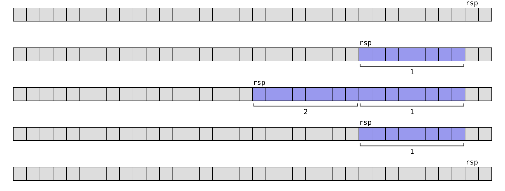
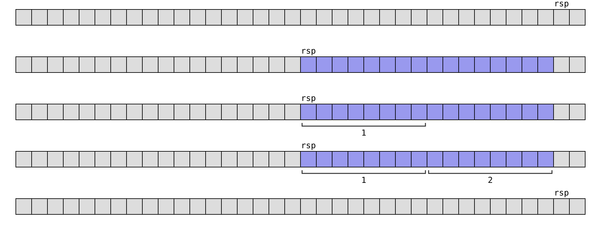
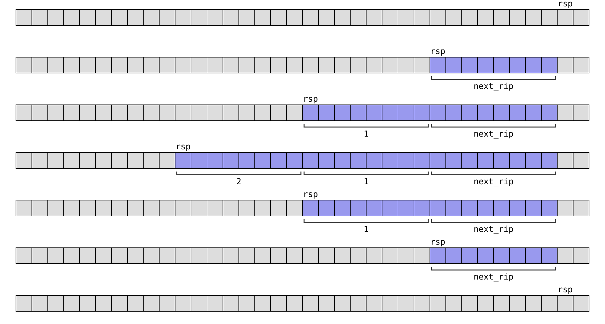
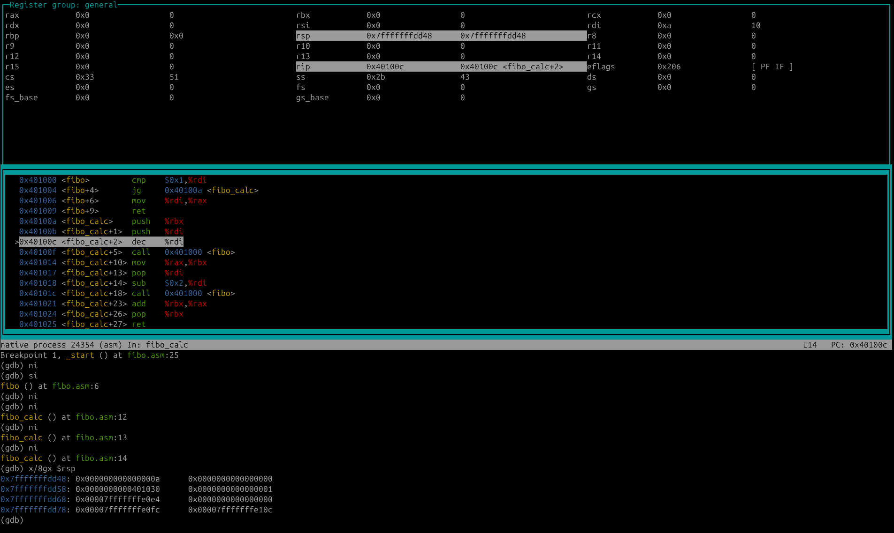

# 11. Pino ja aliohjelma

## Pinon toiminta

_Pino_ (_stack_) on muistialue, jota käytetään aliohjelmakutsujen toteuttamiseen sekä aliohjelmien paikalliseen tilanvaraukseen. Ohjelman käynnistyessä käyttöjärjestelmä varaa ohjelmalle muistialueen, jota se voi käyttää pinona.

Konekieli tarjoaa tukea pinon käyttämiseen rekisterien ja komentojen kautta. Rekisteri `rsp` on _pinorekisteri_ (_stack pointer_), joka osoittaa pinon päälle. Pinoon voi lisätä tietoa komennolla `push` ja pinosta voi poistaa tietoa komennolla `pop`.

Pino kasvaa muistissa oikealta vasemmalle: rekisteri `rsp` liikkuu vasemmalle, kun pinoon lisätään tietoa, ja oikealle, kun pinosta poistetaan tietoa. Esimerkiksi seuraava kuva esittää muistissa olevaa pinoa, johon on lisätty 64-bittiset luvut 1, 2 ja 3. Tässä rekisteri `rsp` osoittaa pinon päälle luvun 3 muistiosoitteeseen.


### Pinokomennot

Komento `push` lisää arvon pinon päälle ja komento `pop` hakee ja poistaa arvon pinon päältä. Komentoja voidaan käyttää esimerkiksi seuraavasti:

```nasm
    mov rax, 1
    mov rbx, 2

    push rax
    push rbx
    pop rax
    pop rbx
```

Tämä koodi vaihtaa keskenään rekisterien `rax` ja `rbx` arvot:

1. `push rax` lisää pinon päälle rekisterin `rax` arvon.
2. `push rbx` lisää pinon päälle rekisterin `rbx` arvon.
3. `pop rax` hakee pinon päältä arvon rekisteriin `rax`.
4. `pop rbx` hakee pinon päältä arvon rekisteriin `rbx`.

Pinon vaiheet koodin suorituksen aikana:



### Pinorekisteri

Pinoa voidaan käsitellä myös suoraan pinorekisterin `rsp` kautta. Pinosta voidaan varata ja vapauttaa tilaa vähentämällä (`sub`) ja kasvattamalla (`add`) rekisterin arvoa. Komennolla `mov` voi kopioida tietoa esimerkiksi pinon ja rekisterien välillä.

Esimerkiksi seuraava koodi varaa pinosta 16 tavua tilaa, kopioi rekisterien `rax` ja `rbx` arvot varatulle alueelle ja vapauttaa sitten varatun muistin.

```nasm
    mov rax, 1
    mov rbx, 2

    sub rsp, 16
    mov [rsp], rax
    mov [rsp+8], rbx
    add rsp, 16
```

Pinon vaiheet koodin suorituksen aikana:



<div class="note" markdown="1">
Pinomuistin varaaminen ja vapauttaminen on hyvin tehokasta, koska riittää muuttaa rekisterin `rsp` arvoa. Tässä varattua muistialuetta ei nollata, vaan se sisältää muistissa aiemmin ollutta sisältöä.

Tämä selittää, miksi C-kielessä funktion paikallisen muuttujan alkuarvo on määrittelemätön. Vaatisi ylimääräistä työtä nollata pinosta varattu muistialue, minkä takia sitä ei tehdä automaattisesti.
</div>

Komennot `push` ja `pop` voidaan myös korvata pinorekisterin käsittelyllä. Esimerkiksi seuraava koodi vastaa komentoa `push rax`:

```nasm
    sub rsp, 8
    mov [rsp], rax
```

Seuraava koodi puolestaan vasta komentoa `pop rax`:

```nasm
    mov rax, [rsp]
    add rsp, 8
```

### Aliohjelman toteutus

Aliohjelman toteutus komennoilla `call` ja `ret` käyttää pinoa. Komento `call` lisää ensin pinoon koodin _seuraavan_ komennon muistiosoitteen ja siirtää sitten koodin suorituksen aliohjelmaan. Komento `ret` puolestaan hakee tämän muistiosoitteen pinosta ja siirtää koodin suorituksen sinne.

Tarkastellaan esimerkkinä seuraavaa ohjelmaa:

```nasm
swap_regs:
    push rax
    push rbx
    pop rax
    pop rbx
    ret

_start:
    mov rax, 1
    mov rbx, 2
    call swap_regs
    add rax, rbx
```

Tässä komento `call swap_regs` lisää pinoon komennon `add rax, rbx` muistiosoitteen ja siirtää koodin suorituksen nimiöön `swap_regs`. Komento `ret` puolestaan hakee pinosta muistiosoitteen ja siirtää koodin suorituksen sinne.

Pinon vaiheet koodin suorituksen aikana:



## Aliohjelman käytännöt

Komentojen `call` ja `ret` avulla aliohjelman tiedonvälityksen voisi toteuttaa useilla tavoilla, mutta käyttöjärjestelmissä on tiettyjä käytäntöjä tähän liittyen. Tällaisia käytäntöjä ovat esimerkiksi, miten parametrit välitetään aliohjelmalle ja miten aliohjelma välittää palautusarvon kutsuvalle koodille.

64-bittisessä Linux-ohjelmoinnissa aliohjelmien toteutuksen käytäntönä on System V ABI -malli, johon tutustumme seuraavaksi. Tämän mallin seuraaminen omissa aliohjelmissa on hyödyllistä, koska silloin aliohjelmia pystyy kutsumaan odotetulla tavalla myös oman koodin ulkopuolelta.

### Parametrit ja palautusarvo

Aliohjelman kuusi ensimmäistä parametria välitetään rekistereissä `rdi`, `rsi`, `rdx`, `rcx`, `r8` ja `r9` tässä järjestyksessä. Jos aliohjelmalla on yli kuusi parametria, loput parametrit välitetään pinon kautta käänteisessä järjestyksessä.

<div class="note" markdown="1">
TODO: usein kaikki pinon kautta
</div>

Esimerkiksi jos aliohjelmalla on kaksi parametria, ensimmäinen parametri välitetään rekisterissä `rdi` ja toinen parametri välitetään rekisterissä `rsi`.

Jos aliohjelmalla on palautusarvo, se välitetään kutsuvalle koodille rekisterissä `rax`.

Tarkastellaan esimerkkinä seuraavaa C-kielistä koodia, joka laskee lukuvälin lukujen summan kutsumalla funktiota `calc_sum`:

```c
int calc_sum(int a, int b) {
    int sum = 0;
    for (int i = a; i <= b; i++) {
        sum += i;
    }
    return sum;
}

int main(void) {
    int sum = calc_sum(1, 100);
}
```

Tässä on vastaava konekielinen toteutus:

```nasm
calc_sum:
    mov rax, 0
calc_loop:
    add rax, rdi
    cmp rdi, rsi
    je calc_end
    inc rdi
    jmp calc_loop
calc_end:
    ret

_start:
    mov rdi, 1
    mov rsi, 100
    call calc_sum
```

Tässä aliohjelman ensimmäinen parametri (`1`)  välitetään rekisterissä `rdi` ja toinen parametri (`100`) välitetään rekisterissä `rsi`. Aliohjelma laskee lukuvälin summan rekisteriin `rax`, josta tulee aliohjelman palautusarvo.

### Rekisterien säilytys

Rekisterit `rbx`, `rsp`, `rbp`, `r12`, `r13`, `r14` ja `r15` ovat _säilytettäviä_, mikä tarkoittaa, ettei aliohjelma saa muuttaa pysyvästi näiden rekisterien sisältöä. Ideana on, että aliohjelmaa kutsuva koodi voi luottaa siihen, että näiden rekistereiden sisältö on aliohjelman kutsumisen jälkeen sama kuin ennen aliohjelman kutsumista.

Aliohjelma saa kuitenkin muuttaa vapaasti muita rekistereitä. Esimerkiksi äskeisessä aliohjelmassa `calc_sum` rekisterin `rdi` sisältö muuttuu aliohjelmassa, koska rekisteriä käytetään silmukan toteuttamiseen. Tämä ei ole ongelma, koska `rdi` ei ole säilytettävä rekisteri.

Jos aliohjelma muuttaa säilytettävää rekisteriä suorituksensa aikana, sen tulee palauttaa rekisterin sisältö ennalleen ennen aliohjelman päättymistä eli komennon `ret` suorittamista. Yleinen tapa toteuttaa tämä on kopioida rekisterin sisältö alussa pinoon ja palauttaa se pinosta lopuksi.

Esimerkiksi seuraava aliohjelma muuttaa sisäisesti rekisterin `rbx` sisältöä mutta säilyttää sen kutsuvan koodin kannalta oikealla tavalla, koska aliohjelma lisää aluksi rekisterin arvon pinoon ja hakee lopuksi rekisterin alkuperäisen arvon pinosta.

```nasm
modify_test:
    push rbx
    mov rbx, 42
    pop rbx
    ret
```

### Pinokehys ja muuttujat

Aliohjelman _pinokehys_ (_stack frame_) muodostuu pinossa säilytettävästä tiedosta, joka liittyy aliohjelman suoritukseen. Pinokehys sisältää ainakin aliohjelman kutsukohdan paluuosoitteen, ja se voi sisältää lisäksi esimerkiksi rekisterien arvojen kopioita sekä paikallisten muuttujien sisältöä.

Yleinen käytäntö on, että aliohjelma kopioi rekisteriin `rbp` rekisterin `rsp` sisällön aliohjelman alussa. Tällöin aliohjelma pystyy viittaamaan kätevästi pinossa oleviin paikallisiin muuttujiin rekisterin `rbp` kautta. Koska rekisteri `rbp` on säilytettävä rekisteri, tähän liittyen yleinen käytäntö on lisätä aliohjelman alussa pinoon kopio rekisterin `rbp` sisällöstä ja palauttaa se aliohjelman lopussa.

Tarkastellaan esimerkkinä C-kielistä funktiota, joka suorittaa laskutoimituksen:

```c
int calc_value(void) {
    int a = 42;
    int b = 1337;
    return a * b;
}
```

Seuraavassa on vastaava konekielinen aliohjelmaa, joka käyttää rekisteriä `rbp` ja varaa pinosta tilaa muuttujille `a` ja `b`:

```nasm
calc_value:
    push rbp
    mov rbp, rsp
    sub rsp, 16

    mov qword [rbp-16], 42
    mov qword [rbp-8], 1337

    mov rax, [rbp-16]
    mov rcx, [rbp-8]
    mul rcx

    add rsp, 16
    pop rbp
    ret
```

Aluksi koodi kopioi rekisterin `rbp` arvon pinoon, siirtää rekisteriin `rbp` rekisterin `rsp` arvon sekä varaa pinosta muistia 16 tavua muuttujille.

Koodi muodostaa muuttujien osoitteet suhteessa rekisterin `rbp` arvoon: muuttuja `a` on pinossa kohdassa `rbp-16` ja muuttuja `b` on pinossa kohdassa `rbp-8`. Näiden osoitteiden avulla koodi tallentaa tietoa pinoon ja hakee tietoa pinosta.

Lopuksi koodi vapauttaa muuttujille varatut 16 tavua pinosta ja palauttaa rekisterin `rbp` sisällön alkuperäiseksi.

<div class="note" markdown="1">
Tässä aliohjelmassa muuttujiin `a` ja `b` voisi viitata yhtä helposti rekisterin `rsp` kautta, koska `rsp` on sama kuin `rbp-16` koko aliohjelman suorituksen ajan. Aliohjelmassa voi luottaa siihen, että muuttuja `a` on kohdassa `rsp` (eli `rbp-16`) ja muuttuja `b` on kohdassa `rsp+8` (eli `rbp-8`).

Yleisemmässä tapauksessa rekisterin `rbp` hyötynä on kuitenkin, että muuttujien osoitteet suhteessa rekisteriin `rbp` säilyvät samoina koko aliohjelman suorituksen ajan riippumatta siitä, miten aliohjelma käyttää pinoa. Esimerkiksi jos aliohjelma suorittaa komentoja `push` ja `pop`, rekisterin `rsp` sisältö muuttuu ja voisi olla sekavaa viitata sen kautta muuttujiin.
</div>

Huomaa, että edellisessä koodissa ja usein muutenkaan pinomuistin varaaminen muuttujille ei ole mitenkään pakollista, vaan samalla tavalla toimivan koodin voisi toteuttaa myös käyttämällä pelkkiä rekistereitä esimerkiksi seuraavasti:

```nasm
calc_value:
    mov rax, 42
    mov rcx, 1337
    mul rcx
    ret
```

Kuitenkin pinomuistista on todellista hyötyä silloin, kun kaikkea aliohjelman käsittelemää tietoa ei voi säilyttää rekistereissä tai johonkin tietoon täytyy pystyä viittaamaan muistiosoitteen kautta (esimerkiksi systeemikutsun yhteydessä), jolloin se ei voi olla rekisterissä.

### Pinon tasaaminen

System V ABI -mallissa aliohjelman kutsuessa toista aliohjelmaa
pinon tulee olla tasattu niin, että pinorekisteri `rsp` osoittaa muistissa 16 tavun tavurajaan. Tämä tarkoittaa, että aliohjelman tulee lisätä pinoon tavuja jokin luvun 16 moninkerta ennen toisen aliohjelman kutsumista.

<div class="note" markdown="1">
TODO: miksi näin?
</div>

Aliohjelman suorituksen alkaessa pino ei ole tasattu, koska pinossa on vain 8-tavuinen kutsukohdan paluuosoite. Kuitenkin jos aliohjelma lisää pinoon kopion 8-tavuisen rekisterin `rbp` sisällöstä, tämä tasaa pinon sisällön.

Esimerkiksi seuraavan koodin suorituksen jälkeen pino on myös tasattu:

```nasm
    push rbp
    mov rbp, rsp
    sub rsp, 16
```

Tässä komento `push` lisää ensin pinoon 8 tavua tietoa, minkä jälkeen koodi varaa pinosta 16 tavua tilaa. Tämän koodin jälkeen rekisteri `rsp` osoittaa 16 tavun tavurajaan ja koodi voi kutsua turvallisesti toista aliohjelmaa.

Jos aliohjelma ei kutsu mitään aliohjelmaa tai kutsuttava aliohjelma ei oleta tasattua pinoa, aliohjelman ei tarvitse välittää pinon tasaamisesta.

## Esimerkkejä

### Rekursiivinen aliohjelma

Tehdään seuraavaksi rekursiivinen konekielinen aliohjelma, joka laskee halutun Fibonaccin luvun seuraavan C-funktion tyylisesti:

```c
long fibo(int n) {
    if (n <= 1) return n;
    return fibo(n - 1) + fibo(n - 2);
}
```

Ensimmäiset Fibonaccin luvut ovat:

`n` | 0 | 1 | 2 | 3 | 4 | 5 | 6 | 7 | 8 | 9 | 10
`fibo(n)` | 0 | 1 | 1 | 2 | 3 | 5 | 8 | 13 | 21 | 34 | 55

Voimme toteuttaa aliohjelman seuraavasti:

```nasm
fibo:
    cmp rdi, 1
    jg fibo_calc
    mov rax, rdi
    ret
fibo_calc:
    push rbx
    push rdi
    dec rdi
    call fibo
    mov rbx, rax
    pop rdi
    sub rdi, 2
    call fibo
    add rax, rbx
    pop rbx
    ret
```

Koodi tarkastaa alussa, onko rekisterissä `rdi` annettu parametri enintään 1. Jos on, kyseessä on pohjatapaus, jossa riittää palauttaa suoraan annettu parametri rekisterissä `rax`. Jos ei ole, koodin tulee laskea tulos rekursiivisesti.

Koodin rekursiivinen osuus alkaa nimiöstä `fibo_calc`. Koodi kopioi ensin pinoon talteen rekisterit `rbx` ja `rdi`. Rekisteriä `rbx` käytetään apuna tuloksen laskemisessa, ja rekisteri `rdi` sisältää aliohjelman parametrin.

Koodi kutsuu ensin itseään rekursiivisesti, niin että `rdi`:n arvoa on vähennetty yhdellä. Tämä vastaa C-koodin kutsua `fibo(n - 1)`. Kutsun tulos tulee rekisteriin `rax`, josta koodi kopioi sen rekisteriin `rbx`.

Tämän jälkeen koodi palauttaa pinosta rekisterin `rdi` alkuperäisen arvon ja vähentää sitä kahdella. Tämä on parametri toiselle rekursiiviselle kutsulle, joka vastaa C-koodin kutsua `fibo(n - 2)`. Tämän kutsun tulos tulee taas rekisteriin `rax`.

Lopuksi koodi laskee yhteen rekisterien `rax` ja `rbx` arvot, joista tulee aliohjelman palautusarvo rekisteriin `rax`. Sen jälkeen täytyy vielä palauttaa rekisterin `rbx` alkuperäinen sisältö pinosta.

### Aliohjelmakutsu C-kielessä

Kun konekielinen aliohjelma on toteutettu System V ABI -mallin mukaisesti, voimme kutsua aliohjelmaa suoraan esimerkiksi C-kielisestä ohjelmasta.

Esimerkiksi seuraava koodi toteuttaa aliohjelman `calc_sum`, joka laskee lukujen summan annetulta väliltä:

{: .code-title }
calc_sum.asm
```nasm
global calc_sum

section .text
calc_sum:
    mov rax, 0
calc_loop:
    add rax, rdi
    cmp rdi, rsi
    je calc_end
    inc rdi
    jmp calc_loop
calc_end:
    ret
```

Tässä tiedoston alussa merkintä `global calc_sum` tarkoittaa, että aliohjelma `calc_sum` on kutsuttavissa tiedoston ulkopuolelta.

Voimme käyttää aliohjelmaa C-funktiona seuraavasti:

{: .code-title }
main.c
```c
#include <stdio.h>

int calc_sum(int a, int b);

int main(void) {
    printf("%d\n", calc_sum(1, 100)); // 5050
}
```

Tässä funktion `calc_sum` esittely kertoo, että koodin käytettävissä on tällainen funktio. Koodilla ei ole tietoa siitä, että funktio on toteutettu konekielisenä aliohjelmana, mutta se kuitenkin tietää, miten funktiota voi kutsua. Funktion varsinainen toteutus linkitetään mukaan ohjelman käännösvaiheessa.

Seuraavat komennot kääntävät ja linkittävät ohjelman:

```console
$ nasm -f elf64 calc_sum.asm -o calc_sum.o
$ gcc main.c calc_sum.o -o main
```

## Ohjelman debuggaus

Konekielisen ohjelman toimintaa voi tutkia käyttäen GDB-debuggeria. Debuggerin avulla pystyy suorittamaan koodin komento kerrallaan sekä tarkkailemaan samalla rekisterien ja muistin sisältöä.

Ennen debuggerin käyttämistä ohjelma kannattaa kääntää `-g`-lipulla, jolloin NASM lisää mukaan debug-tietoa:

```console
$ nasm -f elf64 -g test.asm -o test.o && ld test.o -o test
```

Seuraava komento käynnistää debuggerin:

```console
$ gdb ./test
```

Aluksi voimme antaa debuggerille seuraavat komennot, jotka avaavat näkymän koodiin ja rekistereihin sekä määrittelevät ohjelman alkukohdan:

```console
layout asm
layout regs
break _start
```

Tämän jälkeen voimme käynnistää ohjelman seuraavasti:

```console
run
```

Debuggerissa komento `ni` liikkuu koodissa eteenpäin yhden komennon. Komento `si` puolestaan siirtyy tarkastelemaan aliohjelman koodia. Näiden komentojen avulla voimme käydä koodin läpi komento kerrallaan.

Voimme tutkia pinon sisältöä esimerkiksi seuraavasti:

```console
x/10gx $rsp
```

Tämä komento näyttää pinon 10 ylintä 64-bittistä arvoa.

Käytännössä ohjelman debuggaus voi näyttää seuraavalta:


