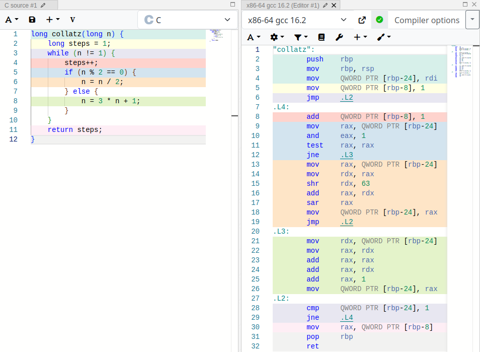

# 12. Käännöksen analyysi

Nyt meillä on tarvittava pohja siihen, että pystymme analysoimaan tarkasti C-kielisen koodin konekielistä käännöstä. Käytämme esimerkkinä seuraavaa koodia, joka laskee [Collatz-lukujonojen](../osa1/#ohjausrakenteet) yhteispituuden annettuun rajaan asti.

```c
#include <stdio.h>

long collatz(long n) {
    long steps = 1;
    while (n != 1) {
        steps++;
        if (n % 2 == 0) {
            n = n / 2;
        } else {
            n = 3 * n + 1;
        }
    }
    return steps;
}

int main(void) {
    int t;
    scanf("%d", &t);
    long total = 0;
    for (int i = 1; i <= t; i++) {
        total += collatz(i);
    }
    printf("%ld\n", total);
}
```

Esimerkiksi kun koodille annetaan rajaksi 5, koodi laskee seuraavasti:

- `collatz(1)` tuottaa arvon 1
- `collatz(2)` tuottaa arvon 2 (2 → 1)
- `collatz(3)` tuottaa arvon 8 (3 → 10 → 5 → 16 → 8 → 4 → 2 → 1)
- `collatz(4)` tuottaa arvon 3 (4 → 2 → 1)
- `collatz(5)` tuottaa arvon 6 (5 → 16 → 8 → 4 → 2 → 1)

Tästä tulee yhteispituudeksi 1 + 2 + 8 + 3 + 6 = 20.

## Käännös 1 (ilman optimointia)

Tarkastellaan ensin koodin käännöstä ilman erityistä kääntäjän optimointia eli tilanteessa, jossa käännöskomennossa ei ole käytetty optimointilippua. Voimme käyttää seuraavaa komentoa tuottamaan käännöksen assembly-version:

```console
$ gcc -S collatz.c -o collatz.s -masm=intel
```

Tässä lippu `-S` tarkoittaa assembly-käännöstä ja lippu `-masm=intel` määrittää Intel-syntaksin. Seuraavassa on käännöksen tulos hieman siistityssä muodossa:

```nasm
section .text
collatz:
    endbr64
    push rbp
    mov rbp, rsp
    mov [rbp-24], rdi
    mov qword [rbp-8], 1
    jmp .L2
.L5:
    add qword [rbp-8], 1
    mov rax, [rbp-24]
    and eax, 1
    test rax, rax
    jne .L3
    mov rax, [rbp-24]
    mov rdx, rax
    shr rdx, 63
    add rax, rdx
    sar rax, 1
    mov [rbp-24], rax
    jmp .L2
.L3:
    mov rdx, [rbp-24]
    mov rax, rdx
    add rax, rax
    add rax, rdx
    add rax, 1
    mov [rbp-24], rax
.L2:
    cmp qword [rbp-24], 1
    jne .L5
    mov rax, [rbp-8]
    pop rbp
    ret

section .rodata
.LC0:
    db "%d"
.LC1:
    db "%ld\n"

section .text
main:
    endbr64
    push rbp
    mov rbp, rsp
    sub rsp, 32
    mov rax, [fs:40]
    mov [rbp-8], rax
    xor eax, eax
    lea rax, [rbp-24]
    mov rsi, rax
    lea rax, [rel .LC0]
    mov rdi, rax
    mov eax, 0
    call __isoc99_scanf@PLT
    mov qword [rbp-16], 0
    mov dword [rbp-20], 1
    jmp .L8
.L9:
    mov eax, [rbp-20]
    cdqe
    mov rdi, rax
    call collatz
    add [rbp-16], rax
    add dword [rbp-20], 1
.L8:
    mov eax, [rbp-24]
    cmp [rbp-20], eax
    jle .L9
    mov rax, [rbp-16]
    mov rsi, rax
    lea rax, [rel .LC1]
    mov rdi, rax
    mov eax, 0
    call printf@PLT
    mov eax, 0
    mov rdx, [rbp-8]
    sub rdx, [fs:40]
    je .L11
    call __stack_chk_fail@PLT
.L11:
    leave
    ret
```

Koodi muodostuu kahdesta aliohjelmasta `collatz` ja `main`, jotka vastaavat melko suoraan alkuperäisen C-koodin funktioita. Aliohjelmat varaavat pinosta muistia C-koodia vastaaville muuttujille, tekevät laskutoimituksia rekisterien avulla ja käyttävät hyppykomentoja ehtojen ja silmukoiden toteuttamiseen.

### Osio .rodata

Koodissa käytettävät merkkijonoliteraalit `"%d"` ja `"%ld\n"` on määritelty osiossa `.rodata`. Tämä osio tarkoittaa muistialuetta, jossa olevaa tietoa saa lukea mutta sitä ei saa muuttaa (`ro` tulee sanoista _read only_).

### Koodin turvallisuus

Kummankin aliohjelman alussa komento `endbr64` ilmaisee, että kyseinen kohta on sallittu aliohjelman aloituskohta. Komento liittyy prosessorin IBT-ominaisuuteen (_Indirect Branch Tracking_), joka valvoo epäsuoria aliohjelmakutsuja. Tarkoituksena on estää tilanne, jossa koodi hyppää virheellisesti aliohjelman keskelle.

Jos IBT-ominaisuus on käytössä, prosessori sallii epäsuoran aliohjelmakutsun vain siinä tapauksessa, että ensimmäinen komento hypyn kohdeosoitteessa on `endbr64`. Esimerkiksi komento `call rax` on epäsuora aliohjelmakutsu, jossa rekisteri `rax` sisältää aliohjelman kohdeosoitteen.

Koodin turvallisuuteen liittyy myös _kanarialintu_ (_stack canary_) eli salainen arvo, joka lisätään pinoon ennen aliohjelman paikallista muistialuetta. Jos koodissa on pinon sisältöön kohdistuva puskuriylivuoto, se peittää kanarialinnun ennen pinon alempaa sisältöä, mikä voidaan havaita aliohjelman lopussa.

Seuraava koodi laittaa kanarialinnun pinoon aliohjelman alussa. Tässä `[fs:40]` on käyttöjärjestelmän asettama satunnainen arvo, jota käytetään kanarialintuna.

```nasm
    mov rax, [fs:40]
    mov [rbp-8], rax
```

Seuraava koodi puolestaan tarkastaa, että kanarialintu on edelleen pinossa aliohjelman lopussa.

```nasm
    mov rdx, [rbp-8]
    sub rdx, [fs:40]
    je .L11
    call __stack_chk_fail@PLT
```

Jos kanarialintu on muuttunut, kutsutaan aliohjelmaa `__stack_chk_fail`, joka käytännössä lopettaa ohjelman suorituksen välittömästi.

Koodin muistinkäsittely on toteutettu PIE-tekniikan (_Position Independent Executable_) mukaisesti, mikä näkyy siinä, että muistiosoitteet on annettu `rel`-syntaksilla (muistiosoite suhteessa ohjelmarekisterin `rip` arvoon) sekä C-funktioiden nimissä on loppuliite `@PLT`.

### Pinon käsittely

Molemmat aliohjelmat sisältävät paikallisia muuttujia, jotka on tallennettu pinoon. Tavallisen käytännön mukaisesti aliohjelmat lisäävät alussa rekisterin `rbp` sisällön pinoon ja palauttavat sen lopuksi pinosta. Aliohjelmat eroavat kuitenkin siinä, miten ne käsittelevät rekisteriä `rsp`.

Aliohjelma `main` varaa pinosta 32 tavua tilaa komennolla `sub rsp, 32`, joka siirtää rekisterin `rsp` pinon päälle. Lopuksi aliohjelma kutsuu komentoa `leave`, joka palauttaa rekisterit `rsp` ja `rbp` ennalleen. Komento `leave`on käytännössä tehokkaampi tapa toteuttaa seuraavat komennot:

```nasm
    mov rsp, rbp
    pop rbp
```

<div class="note" markdown="1">
Komennon `leave` lisäksi x86-konekielessä on myös komento `enter`. Ideana on, että komento `enter` voidaan suorittaa aliohjelman alussa ja komento `leave` voidaan suorittaa aliohjelman lopussa.

Komento `enter` hoitaa rekisterin `rbp` alkukäsittelyn sekä varaa muistia pinosta paikallisille muuttujille. Komennolle annetaan varattavan muistin määrä sekä toisena parametrina aliohjelman taso, jota ei yleensä käytetä. Esimerkiksi seuraavat koodit tarkoittavat samaa:

```nasm
    enter 16, 0
```

```nasm
    push rbp
    mov rbp, rsp
    sub rsp, 16
```

Komentoa `enter` ei kuitenkaan nykyään yleensä käytetä, koska prosessorit suorittavat komennon hitaasti ja on tehokkaampaa kutsua erillisiä komentoja yllä olevalla tavalla. Komento `leave` sen sijaan on tehokas ja käyttökelpoinen.
</div>

Aliohjelma `collatz` _ei_ päivitä rekisteriä `rsp` osoittamaan pinon päälle, vaikka se säilyttää pinossa paikallisia muuttujia. Aliohjelma voi menetellä näin, koska 64-bittisessä Linuxissa pinon päällä on 128 tavun kokoinen _punainen alue_ (_red zone_), jossa olevaa muistia on sallittua käyttää muuttamatta rekisteriä `rsp`. Tämä tehostaa koodin toimintaa, koska ei tarvita rekisteriä `rsp` käsitteleviä komentoja.

Punaista aluetta voi käyttää, kun aliohjelma ei kutsu muita aliohjelmia, jolloin ei haittaa, ettei rekisteri `rsp` osoita pinon päälle. Tämän takia punaista aluetta voi käyttää aliohjelmassa `collatz`, joka ei kutsu muita aliohjelmia, mutta sitä ei voi käyttää aliohjelmassa `main`, joka kutsuu aliohjelmaa `collatz`.

### Parillisuustarkastus

Seuraava koodi vastaa parillisuustarkastusta `n % 2 == 0`:

```nasm
    and eax, 1
    test rax, rax
    jne .L3
```

Koodi tutkii rekisterissä `rax` olevan luvun parillisuuden ja hyppää nimiöön `.L3` luvun ollessa pariton. Koodin toiminta perustuu siihen, että luku on parillinen tarkalleen silloin, kun sen viimeinen bitti on 0.

Ensin koodi suorittaa and-operaation, jonka seurauksena rekisterin `rax` sisältö on joko 0 (parillinen) tai 1 (pariton). Tämän jälkeen koodissa on komento `test`, joka muistuttaa aiemmin käsiteltyä komentoa `cmp` mutta on tässä tilanteessa tehokkaampi tapa valmistella ehdollinen hyppy.

Komento `test` suorittaa and-operaation ja päivittää lippurekisteriä tämän komennon tuloksen mukaisesti. Koska rekisterin `rax` sisältö on joko 0 tai 1, komennon `test` tulos on sama kuin rekisterin `rax` sisältö ja komento `jne` suorittaa hypyn rekisterin sisällön ollessa 1 eli alkuperäisen luvun ollessa pariton.

### Kahdella jakaminen

Seuraava koodi vastaa lauseketta `n = n / 2`:

```nasm
    mov rdx, rax
    shr rdx, 63
    add rax, rdx
    sar rax, 1
```

Tässä rekisteri `rax` sisältää jaettavan luvun. Koodi suorittaa bittisiirron oikealle komennolla `sar`, mikä on tehokas tapa jakaa luku kahdella. Tätä ennen koodissa on kuitenkin monimutkaisuutta sen takia, että koodi ottaa huomioon tilanteen, jossa jaettava luku on negatiivinen.

C-kielessä jakolaskun `n / 2` tulos vastaa komentoa `sar rax, 1` positiivisilla luvuilla, mutta negatiivisilla luvuilla tulos voi erota. Esimerkiksi C-kielen lausekkeen `-5 / 2` arvo on `-2`, koska jakolaskun tulos pyöristyy nollan suuntaan. Komento `sar` antaisi kuitenkin tässä tilanteessa tuloksen `-3`. Tämän takia koodi varautuu seuraavasti tilanteeseen, jossa jaettavana on negatiivinen pariton luku:

- Koodi laittaa ensin bittisiirron avulla rekisterin `rdx` sisällöksi rekisterin `rax` luvun etumerkin (0 = positiivinen, 1 = negatiivinen). Koodi siirtää bittejä 63 askelta oikealle, koska luvussa on 64 bittiä.

- Tämän jälkeen koodi lisää rekisterissä `rdx` olevan etumerkin rekisterin `rax` arvoon eli käytännössä säilyttää rekisterin `rax` arvon entisellään, jos arvo on positiivinen, ja kasvattaa rekisterin arvoa yhdellä, jos arvo on negatiivinen.

- Lopuksi koodi suorittaa aritmeettisen bittisiirron (`sar`), joka jakaa luvun kahdella ja antaa nyt C-kielen toimintaa vastaavan tuloksen myös negatiiviselle parittomalle luvulle.

<div class="note" markdown="1">
Vaikka Collatzin lukujonon luvut ovat positiivisia, negatiivinen luku on tässä mahdollinen sen takia, että suurella alkuarvolla lukujonon luku saattaa olla niin suuri, ettei se mahdu 64-bittiseen muuttujaan, ja luvusta tulee negatiivinen ylivuodon seurauksena.

Koodin taustaoletuksena on, ettei näin käy, ja koodi toimisi tässä tapauksessa selkeästi väärin. Kääntäjä kuitenkin kääntää konekielisen koodin toimimaan C-koodia vastaavasti myös tässä tilanteessa.

Tässä tapauksessa on kuitenkin oikeastaan tarpeetonta varautua negatiiviseen parittomaan lukuun, koska jako kahdella tehdään vain siinä tapauksessa, että luku on parillinen. Tässä kääntäjä ei ole hyödyntänyt tietoa siitä, että edeltävä koodi on varmistanut luvun olevan parillinen.
</div>

### Kertolasku ja kasvatus

Seuraava koodi vastaa lauseketta `n = 3 * n + 1`:

```nasm
    mov rax, rdx
    add rax, rax
    add rax, rdx
    add rax, 1
```

Alussa rekisteri `rdx` sisältää käsiteltävän luvun, ja tulos lasketaan rekisteriin `rax`. Koodin toiminta vastaa lauseketta `n + n + n + 1`, jossa kertolasku on korvattu yhteenlaskulla. Tämä on tässä tilanteessa järkevää, koska yhteenlasku on kertolaskua yksinkertaisempi operaatio.

<div class="note" markdown="1">
Miksi koodi käyttää komentoa `add rax, 1` rekisterin arvon kasvattamiseen yhdellä, vaikka konekielessä olisi myös tähän räätälöity komento `inc rax`?

Kääntäjä saattaa toimia näin, koska komennot `add` ja `inc` eroavat sisäisesti siinä, miten ne päivittävät prosessorin lippurekisteriä. Komento `inc` päivittää lippurekisterin vain osittain, minkä takia komento soveltuu huonommin rinnakkaisesti suoritettavaksi kuin komento `add`.
</div>

## Käännös 2 (optimoinnin kanssa)

Tarkastellaan seuraavaksi saman koodin käännöstä optimointilipun `-O2` kanssa. Nyt kääntäjä tuottaa seuraavan assembly-koodin:

```nasm
section .text
collatz:
    endbr64
    mov eax, 1
    cmp rdi, 1
    je .L1
.L5:
    add rax, 1
    test dil, 1
    jne .L3
    mov rdx, rdi
    shr rdx, 63
    add rdi, rdx
    sar rdi, 1
    cmp rdi, 1
    jne .L5
.L1:
    ret
.L3:
    lea rdi, [rdi+2*rdi+1]
    add rax, 1
    test dil, 1
    jne .L3
    mov rdx, rdi
    shr rdx, 63
    add rdi, rdx
    sar rdi, 1
    jmp .L5

section .rodata
.LC0:
    .string "%d"
.LC1:
    .string "%ld\n"

section .text
main:
.LFB24:
    endbr64
    sub rsp, 24
    lea rdi, [rel .LC0]
    mov rax, [fs:40]
    mov [rsp+8], rax
    xor eax, eax
    lea rsi, [rsp+4]
    call __isoc99_scanf@PLT
    mov eax, [rsp+4]
    test eax, eax
    jle .L18
    lea r8d, [rax+1]
    mov ecx, 1
    xor edi, edi
    jmp .L16
.L24:
    mov rsi, rax
    shr rsi, 63
    add rax, rsi
    sar rax, 1
    cmp rax, 1
    jne .L15
.L12:
    add rcx, 1
    add rdi, rdx
    cmp r8, rcx
    je .L11
.L16:
    mov rax, rcx
    mov edx, 1
    cmp rcx, 1
    je .L12
.L15:
    add rdx, 1
    test al, 1
    je .L24
.L13:
    lea rax, [rax+2*rax+1]
    add rdx, 1
    test al, 1
    jne .L13
    mov rsi, rax
    shr rsi, 63
    add rax, rsi
    sar rax, 1
    jmp .L15
.L18:
    xor edi, edi
.L11:
    mov rdx, rdi
    xor eax, eax
    lea rsi, [rel .LC1]
    mov edi, 2
    call __printf_chk@PLT
    mov rax, [rsp+8]
    sub rax, [fs:40]
    jne .L25
    xor eax, eax
    add rsp, 24
    ret
.L25:
    call __stack_chk_fail@PLT
```

Optimoinnin ansiosta käännetty koodi toimii selvästi nopeammin. Suoritusajat testikoneella, kun laskennan rajana on 10<sup>7</sup>:

Alkuperäinen koodi (ilman optimointia) | 9.3 s
Alkuperäinen koodi (optimoinnin kanssa) | 4.6 s

Tämä koodi eroaa melko paljon alkuperäisestä koodista, ja koodin seuraaminen on vaikeampaa. Aliohjelmat säilyttävät tietoa enimmäkseen rekistereissä pinon sijasta, mikä on tehokkaampaa. Koodi suorittaa myös Collatz-lukujonon laskemiseen tarvittavat operaatiot tehokkaammin.

### Pinon käsittely

Aliohjelma `main` käyttää rekisterien lisäksi myös pinoa, mutta se ei käytä rekisteriä `rbp` pinoon viittaamiseen, vaan viittaa pinoon suoraan rekisterin `rsp` kautta. Esimerkiksi osoite `rsp+4` viittaa pinon kohtaan, johon sijoitetaan funktion `scanf` lukema luku käyttäjältä.

Rekisteristä `rbp` onkin enemmän hyötyä konekieltä ohjelmoivalle ihmiselle kuin kääntäjälle. Ihmisen kannalta on kätevää, että rekisteri `rbp` osoittaa aina samaan kohtaan pinossa riippumatta pinon käsittelystä aliohjelman aikana. Kääntäjä pystyy kuitenkin yhtä hyvin viittaamaan pinon kohtiin rekisterin `rsp` kautta.

### Aliohjelman upotus

Koodia tutkiessa voi hämmentää, että koodissa on aliohjelma `collatz` mutta aliohjelma `main` ei kutsu sitä, vaan aliohjelman `main` sisällä on käytännössä uudestaan upotettuna aliohjelman `collatz` logiikka.

Syynä tähän on, että koodin suoritus on tehokkaampaa ilman aliohjelmakutsuja, mutta toisaalta aliohjelma `collatz` tulee kuitenkin olla olemassa, koska sitä voitaisiin kutsua itsenäisenä aliohjelmana käännösyksikön ulkopuolelta.

<div class="note" markdown="1">
Tämän ohjelman tapauksessa on tarpeetonta varautua siihen, että aliohjelmaa `collatz` kutsuttaisiin jostain muualta. Kääntäjä ei kuitenkaan tiedä tätä asiaa, koska se kääntää koodia tiedostoa kerrallaan eikä sillä ole tietoa siitä, miten käännetyt objektitiedostot linkitetään.
</div>

### Optimoitu laskutoimitus

Collatz-lukujonon laskemista on optimoitu koodissa seuraavasti:

```nasm
.L3:
    lea rdi, [rdi+2*rdi+1]
    add rax, 1
    test dil, 1
    jne .L3
    mov rdx, rdi
    shr rdx, 63
    add rdi, rdx
    sar rdi, 1
```

Tässä lauseke `n = 3 * n + 1` on toteutettu `lea`-trikillä, jolloin sen pystyy laskemaan yksittäisellä komennolla. Tämä operaatio on silmukassa, jota toistetaan niin kauan kuin luku säilyy parittomana. Tämän jälkeen luku on parillinen, jolloin koodi jakaa sen kahdella samalla tavalla kuin aiemmassa versiossa.

Sen sijaan jakolasku `n / 2` on toteutettu samalla tavalla kuin ennenkin optimoidusta käännöksestä huolimatta. Koodi varautuu edelleen tilanteeseen, jossa `n` on negatiivinen pariton luku, vaikka näin ei käytännössä voi tapahtua koodissa. Lisäksi koodissa oleva silmukka on kyseenalainen, koska `n`:n ollessa pariton luku lausekkeen `3 * n + 1` arvo on varmasti parillinen. Niinpä silmukkaa ei pitäisi koskaan suorittaa useita kertoja peräkkäin.

<div class="note" markdown="1">
Tästä näkee, ettei kääntäjä ole täydellinen ja sen tuottamassa konekielessä voi olla parantamisen varaa. Toisaalta nyt kun tiedämme, miten kääntäjä tekee käännöksen, voimme koettaa auttaa kääntäjää parantamaan käännöstä muuttamalla sopivasti alkuperäisestä C-koodia.
</div>

## Käännös 3 (muutettu koodi)

Seuraavassa on hieman muutettu `collatz`-funktio, jossa tarkoituksena on auttaa kääntäjää tekemään parempi käännös. Muutokset ovat:

- Funktio on määritelty staattiseksi, eli funktiota ei voi kutsua muista tiedostoista. Tämän tarkoituksena on antaa kääntäjälle viesti siitä, että ei ole tarvetta sisällyttää erillistä funktiota käännökseen.

- Funktion parametrin tyyppi on `unsigned long` eikä `long`. Tämän tarkoituksena on auttaa kääntäjää toteuttamaan jakolasku kahdella tehokkaammin, koska ei tarvitse varautua luvun negatiivisuuteen.

- Parittoman `n`:n tapauksessa lauseke on `(3 * n + 1) / 2` eli tulos jaetaan saman tien kahdella, koska se on varmasti parillinen. Tämän tarkoituksena on estää kääntäjää tekemästä silmukka, jossa toistetaan lauseketta `3 * n + 1`.

```c
static long collatz(unsigned long n) {
    long steps = 1;
    while (n != 1) {
        steps++;
        if (n % 2 == 0) {
            n = n / 2;
        } else {
            n = (3 * n + 1) / 2;
            steps++;
        }
    }
    return steps;
}
```

Kääntäjä tuottaa koodista seuraavan käännöksen (optimointilipulla `-O2`):

```nasm
section .rodata
.LC0:
    db "%d"
.LC1:
    db "%ld\n"

section .text
main:
    endbr64
    sub rsp, 24
    lea rdi, [rel .LC0]
    mov rax, [fs:40]
    mov [rsp+8], rax
    xor eax, eax
    lea rsi, [rsp+4]
    call __isoc99_scanf@PLT
    mov eax, [rsp+4]
    test eax, eax
    jle .L8
    lea edi, [rax+1]
    xor esi, esi
    mov ecx, 1
    mov edx, 1
.L3:
    add rcx, 1
    add rsi, rdx
    cmp rcx, rdi
    je .L2
    mov rax, rcx
    mov edx, 1
    jmp .L6
.L13:
    add rdx, 1
    shr rax, 1
.L5:
    cmp rax, 1
    je .L3
.L6:
    test al, 1
    je .L13
    lea rax, [rax+2*rax+1]
    add rdx, 2
    shr rax, 1
    jmp .L5
.L8:
    xor esi, esi
.L2:
    mov rdx, rsi
    xor eax, eax
    mov edi, 2
    lea rsi, [rel .LC1]
    call __printf_chk@PLT
    mov rax, [rsp+8]
    sub rax, [fs:40]
    jne .L14
    xor eax, eax
    add rsp, 24
    ret
.L14:
    call __stack_chk_fail@PLT
```

Käännös on onnistunut, koska siinä ei ole enää aliohjelmaa `collatz`, jakolasku on toteutettu yksinkertaisesti komennolla `shr` eikä koodissa ole enää silmukkaa, jossa toistetaan lauseketta `3 * n + 1`.

Koodien suoritusajat testikoneella, kun laskennan rajana on 10<sup>7</sup>:

Alkuperäinen koodi (ilman optimointia) | 9.3 s
Alkuperäinen koodi (optimoinnin kanssa) | 4.6 s
Muutettu koodi (optimoinnin kanssa) | 3.8 s

Tekemämme muutokset koodiin olivat siis hyödyllisiä, koska niiden ansiosta saimme koodin toimimaan vielä 0.8 s nopeammin.

## Compiler Explorer -työkalu

[Compiler Explorer](https://godbolt.org/) on verkkosivusto, jonka avulla voi tutkia havainnollisesti eri kääntäjien tuottamaa konekielistä koodia.

Esimerkiksi funktion `collatz` tutkiminen voi näyttää seuraavalta:


